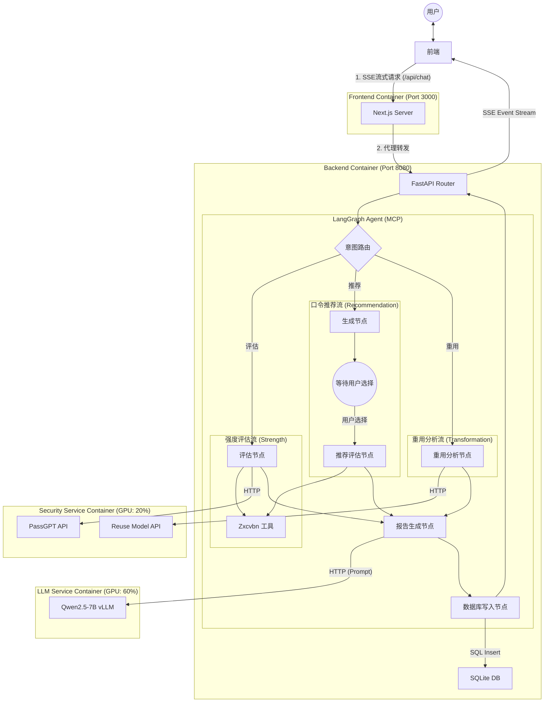

# 前端界面

## 登录注册界面
- [ ] 这个还是要尽快做一下，用交大邮箱注册，验证码、忘记密码等

## 侧边栏

收起状态下，
- [ ] Logo放最左上角
- [ ] Logo下方是新建对话、查看上传过的文件、询问记录三个按钮（仅icon）
- [ ] 最下方为用户头像，用户头像下方为侧边栏缩回伸出按钮
- [ ] 点击用户头像，出现设置、帮助、退出登录这些功能
- [ ] 设置包括头像、外观、模型API
- [ ] 设置这里还要考虑修改密码

伸出状态下，
- [ ] Logo放最左上角，如果左边有空位的话加上PassAgent的名字
- [ ] Logo下方是新建对话、查看上传过的文件、询问记录三个按钮（icon+文字说明）
- [ ] 历史记录项展示所有的历史记录
- [ ] 历史记录按时间排序（时间可展示）
- [ ] 历史记录提供模糊搜索功能
- [ ] 最下方是用户头像，用户头像的右侧为侧边栏缩回伸出按钮

## 主界面
- [ ] 欢迎使用 PassAgent🤗改成Logo+名称
- [ ] 上传文件功能在输入聊天框时要显示

## 对话界面
- [ ] 主要是要展示运行顺序，以及实现流式输出，这个可以采用LangGraph的SSE数据包实现，后续调研一下
- [ ] 每一个回复添加重新生成、复制、点赞、点踩以及导出到PDF的按钮

# 数据库设计

1. users（用户表）
- user_id (主键)
- email (唯一，交大邮箱)
- password_hash (加密密码)
- avatar_url (头像URL)
- theme (外观设置：light/dark)
- created_at (注册时间)
2. user_api_configs（用户API配置表）
- config_id (主键)
- user_id (外键 → users)
- model_type (qwen/deepseek/local)
- api_key (加密存储)
- model_name (具体模型名称)
- is_default (是否默认使用)
- created_at
3. sessions（会话表）
- session_id (主键)
- user_id (外键 → users)
- title (会话标题)，这一步可以通过LLM做
- created_at
- updated_at
4. messages（消息表）
- message_id (主键)
- session_id (外键 → sessions)
- user_id (外键 → users)
- content (消息内容)
- message_type (user/assistant)
- created_at
5. feedback（用户反馈表）
- feedback_id (主键)
- message_id (外键 → messages，唯一)
- user_id (外键 → users)
- feedback_type (like/dislike/null)
- created_at
6. uploaded_files（上传文件表）
- file_id (主键)
- user_id (外键 → users)
- session_id (外键 → sessions，可选关联)
- filename (原文件名)
- file_path (存储路径)
- file_size (文件大小)
- file_type (MIME类型)
- uploaded_at
7. password_analysis（密码分析记录表）
- analysis_id (主键)
- session_id (外键 → sessions)
- user_id (外键 → users)
- original_password_hash (原密码哈希)
- target_password_hash (目标密码哈希)
- hashcat_rule (生成的规则)
- strength_score (强度评分 0-100)
- is_leaked (是否泄露)
- analysis_type (transformation/strength/recommendation)
- created_at
- 这张表格打算根据不同analysis_type，提供对应不同的metadata进行说明

# 后端

MCP这块要改用langgraph框架，需要更新后端文件架构

# 5个需求
需求分类：BERT-wwm-ext (Whole Word Masking) 或 RoBERTa-wwm-ext

https://huggingface.co/hfl/chinese-roberta-wwm-ext
https://github.com/ymcui/Chinese-BERT-wwm

🛡️ Agent 功能需求清单 (User-Facing Features) v2.0
1. 口令强度评估 (Strength Assessment)
含义： 用户提供一个现有的文本口令，Agent 分析其安全性。
用户输入示例：
“帮我看看 123456 安全吗？”
“测试一下我的密码强度。”
Agent 行为： 计算熵值、检查字符组合、匹配常见弱口令列表，给出评分（弱/中/强）及改进建议。
主要4个功能：zxcvbn（熵值）、PCFG（结构分析）、passgpt（概率）、LLM（口令重用）
在此功能下还需要提供口令增强的建议，这个的具体做法还需要再考虑一下
3. 口令生成与推荐 (Password Generation)
含义： 用户需要一个新的、安全的文本口令。支持多种输入形式作为“种子”，生成既安全又包含用户个性化信息的口令。
输入形式支持：
纯文本助记符： 用户直接输入关键词（如“zly”, “2023”）。
多模态信息（图片/音频）： 用户上传图片（如宠物照、风景照）或音频（如一段话、环境音）。
用户输入示例：
“我要注册一个新账号，帮我生成个密码。”
“用这张猫的照片帮我生成一个密码。”（上传图片）
“根据这段录音生成一个口令。”（上传音频）
“我要注册 GitHub，帮我生成一个符合要求的密码。”（触发隐式爬虫/规则库）
Agent 行为：
多模态解析： 调用 Qwen2-Audio / Qwen2-VL (或 Qwen-Omni) 模型，将图片/音频内容转换为文本描述（如图片 -> "cat_sleeping_sofa"，音频 -> "hello_world"）。
生成逻辑： 将解析出的文本或用户输入的文本作为助记词，通过变换大小写、插入特殊符号、乱序等方式增强安全性。
合规适配： 如果识别到目标网站，自动加载该网站的密码策略进行适配。
4. 模糊记忆恢复 (Memory Recovery)
含义： 用户忘记了旧密码，但记得一些片段。Agent 帮助用户“拼凑”出可能的密码列表，而不是生成新密码。
用户输入示例：
“我忘了旧密码，只记得里面有 zly 和 2023。”
“帮我找回密码，好像是 admin 开头，后面是个年份。”
Agent 行为： 基于用户提供的片段，进行排列组合（不随意添加随机字符），生成一份“可能的密码候选列表”供用户尝试。
5. 口令泄露检查 (Leak Check)
含义： 检查用户的口令或账号是否出现在已知的互联网数据泄露事件中（基于 HIBP 等库）。
用户输入示例：
“查一下 password123 有没有泄露过。”
“我的邮箱 test@example.com 安全吗？”
Agent 行为： 查询泄露数据库，返回泄露次数或安全状态。
6. 图形口令设置 (Graphical Password) [独立模式]
含义： 提供一种非文本的口令设置方式，允许用户通过在图片或地图上选点来作为凭证（不涉及文本转换，位置即密码）。
用户输入示例：
“我想设置一个图形密码。”
“启动地图口令模式。”
“我想用图片做密码。”
Agent 行为： 识别到该意图后，唤起前端的图形交互组件（弹窗或 Webview），引导用户进行选点操作。
📝 意图分类标签更新
STRENGTH_CHECK (强度评估)
GENERATION (生成推荐 - 支持 文本/图片/音频 输入)
RECOVERY (记忆恢复)
LEAK_CHECK (泄露检查)
GRAPHICAL_MODE (图形口令 - 独立入口)

# 整体的流程

帮我看看 qweasd123 安全吗？  
测试一下密码 myP@ssword2024 的强度。  
这个密码 xyz789! 能不能抵挡暴力破解？  
你觉得 abcDEF456 够安全吗？  
检查密码 ILoveYou999 的强度如何。  
看看密码 1qaz2wsx 是不是容易被猜中？  
评估一下 P@55w0rd 的安全性。  
帮我测试密码 helloWorld123 的强度。  
你觉得 88888888 这种密码安全吗？  
分析密码 SuperMan!2025 的可靠性。  
这个密码 pass1234 够强吗？  
测试一下 mySecret!888 的防护能力。  
你觉得密码 qwertyuiop 安全吗？  
帮我看看 123abc!@# 这个密码强度如何。  
分析一下密码 Admin@1234 的安全性。  
测试密码 sunshine777 的强度。  
这个密码 Welcome1 够安全吗？  
你觉得 Password2025 容易被破解吗？  
帮我检查一下 654321 的安全性。  
测试密码 letmein123 的强度。  
分析一下 dragon88 这个密码的安全性。  
这个密码 !QAZ2wsx 够强吗？  
你觉得 111111 安全吗？  
帮我看看 masterkey2024 的强度。  
测试一下密码 iloveyou520 的安全性。  
分析密码 football123 是否容易被破解。  
这个密码 mypassword! 够安全吗？  
你觉得 1234qwer 安全吗？  
帮我检查一下 qazwsxedc 的强度。  
测试密码 super123456 的安全性。  
分析一下 zaq12wsx 这个密码的强度。  
这个密码 !@#$%^&* 安全吗？  
你觉得 welcome123 容易被攻破吗？  
帮我看看 password!@# 的强度如何。  
测试一下密码 987654321 的安全性。  
分析密码 mydogname2025 的可靠性。  
这个密码 1q2w3e4r 够强吗？  
你觉得 asdfghjkl 安全吗？  
帮我检查一下 666666 的防护能力。  
测试密码 hello123!@# 的强度。  
分析一下 q1w2e3r4 这个密码的安全性。  
这个密码 P@ssword1 够安全吗？  
你觉得 12345678 容易被破解吗？  
帮我看看 adminadmin 的强度如何。  
测试一下密码 letmein!2025 的安全性。  
分析密码 myphone123 是否足够安全。  
这个密码 55555555 够强吗？  
你觉得 qwe123456 安全吗？  
帮我检查一下 zxcvbnm 的强度。  
测试密码 iloveu1314 的安全性。  
分析一下 1a2b3c4d 这个密码的可靠性。  
这个密码 welcome!@# 够安全吗？  
你觉得 888888 容易被攻破吗？  
帮我看看 test123456 的强度如何。  
测试一下密码 mycar2025 的安全性。  
分析密码 123abcDEF 是否容易被猜中。  
这个密码 !QAZ1qaz 够强吗？  
你觉得 asd123456 安全吗？  
帮我检查一下 qwerty123 的防护能力。  
测试密码 hello!world 的强度。  
分析一下 myhome789 这个密码的安全性。  
这个密码 123!@#qwe 够安全吗？  
你觉得 password888 容易被破解吗？  
帮我看看 welcome2024 的强度如何。  
测试一下密码 mycatname 的安全性。  
分析密码 11223344 是否足够安全。  
这个密码 qaz123!@# 够强吗？  
你觉得 1234567890 安全吗？  
帮我检查一下 letmein888 的强度。  
测试密码 mybirthday1990 的安全性。  
分析一下 admin123!@# 这个密码的可靠性。  
这个密码 !@#123qwe 够安全吗？  
你觉得 qweasdzxc 容易被攻破吗？  
帮我看看 mycompany2025 的强度如何。  
测试一下密码 mypetname 的安全性。  
分析密码 123qwe!@# 是否容易被猜中。  
这个密码 myhobby123 够强吗？  
你觉得 123456abc 安全吗？  
帮我检查一下 password123! 的防护能力。  
测试密码 mydream2025 的强度。  
分析一下 zaq1@wsx 这个密码的安全性。  
这个密码 mycolor888 够安全吗？  
你觉得 123456!@# 容易被破解吗？  
帮我看看 myfood123 的强度如何。  
测试一下密码 mydrink2025 的安全性。  
分析密码 1234!@#$ 是否足够安全。  
这个密码 mygame789 够强吗？  
你觉得 qwerty!@# 安全吗？  
帮我检查一下 mymovie123 的强度。  
测试密码 mybook2025 的安全性。  
分析一下 mymusic888 这个密码的可靠性。  
这个密码 mysport123 够安全吗？  
你觉得 mytravel2025 容易被攻破吗？  
帮我看看 myfriend789 的强度如何。  
测试一下密码 myfamily123 的安全性。  
分析密码 myjob2025 是否容易被猜中。  
这个密码 mycity888 够强吗？  
你觉得 myschool123 安全吗？  
帮我检查一下 mycountry2025 的防护能力。  
测试密码 myplanet789 的强度。  
分析一下 mystar123 这个密码的安全性。  
这个密码 mygalaxy2025 够安全吗？  
你觉得 myuniverse888 容易被破解吗？  
帮我看看 mydreamjob123 的强度如何。  
测试一下密码 myideal2025 的安全性。  
分析密码 mygoal789 是否足够安全。  
这个密码 mywish123 够强吗？  
你觉得 myhope2025 安全吗？  
帮我检查一下 myplan789 的强度。  
测试密码 myproject123 的安全性。  
分析一下 mytask2025 这个密码的可靠性。  
这个密码 myduty888 够安全吗？  
你觉得 myrole123 容易被攻破吗？  
帮我看看 mymission2025 的强度如何。  
测试一下密码 myvision789 的安全性。  
分析密码 myaim123 是否容易被猜中。  
这个密码 mytarget2025 够强吗？  
你觉得 myobjective888 安全吗？  
帮我检查一下 mystrategy123 的防护能力。  
测试密码 mymethod2025 的强度。  
分析一下 myapproach789 这个密码的安全性。  
这个密码 mysystem123 够安全吗？  
你觉得 myprocess2025 容易被破解吗？  
帮我看看 mytechnique789 的强度如何。  
测试一下密码 mytool123 的安全性。  
分析密码 myinstrument2025 是否足够安全。  
这个密码 mydevice888 够强吗？  
你觉得 myappliance123 安全吗？  
帮我检查一下 myequipment2025 的强度。  
测试密码 mygear789 的安全性。  
分析一下 mykit123 这个密码的可靠性。  
这个密码 myset2025 够安全吗？  
你觉得 mycollection888 容易被攻破吗？  
帮我看看 myassortment123 的强度如何。  
测试一下密码 myarray2025 的安全性。  
分析密码 myassemble789 是否容易被猜中。  
这个密码 mygroup123 够强吗？  
你觉得 myteam2025 安全吗？  
帮我检查一下 mysquad789 的防护能力。  
测试密码 mycrew123 的强度。  
分析一下 myband2025 这个密码的安全性。  
这个密码 myorchestra888 够安全吗？  
你觉得 myensemble123 容易被破解吗？  
帮我看看 mychorus2025 的强度如何。  
测试一下密码 mychoir789 的安全性。  
分析密码 myvocal123 是否足够安全。  
这个密码 myinstrumental2025 够强吗？  
你觉得 mymelody888 安全吗？  
帮我检查一下 myharmony123 的强度。  
测试密码 myrhythm2025 的安全性。  
分析一下 mybeat789 这个密码的可靠性。  
这个密码 mytempo123 够安全吗？  
你觉得 mypulse2025 容易被攻破吗？  
帮我看看 mycadence789 的强度如何。  
测试一下密码 mymeter123 的安全性。  
分析密码 mymeasure2025 是否容易被猜中。  
这个密码 mybar888 够强吗？  
你觉得 mynote123 安全吗？  
帮我检查一下 mypitch2025 的防护能力。  
测试密码 mytone789 的强度。  
分析一下 myvolume123 这个密码的安全性。  
这个密码 myamplitude2025 够安全吗？  
你觉得 myfrequency888 容易被破解吗？  
帮我看看 mywavelength123 的强度如何。  
测试一下密码 myoscillation2025 的安全性。  
分析密码 myvibration789 是否足够安全。  
这个密码 myresonance123 够强吗？  
你觉得 myecho2025 安全吗？  
帮我检查一下 myreverberation789 的强度。  
测试密码 myreflection123 的安全性。  
分析一下 mydiffraction2025 这个密码的可靠性。  
这个密码 myrefraction888 够安全吗？  
你觉得 myabsorption123 容易被攻破吗？  
帮我看看 mytransmission789 的强度如何。  
测试一下密码 mypropagation123 的安全性。  
分析密码 myradiation2025 是否容易被猜中。  
这个密码 myemission888 够强吗？  
你觉得 myirradiation123 安全吗？  
帮我检查一下 myillumination2025 的防护能力。  
测试密码 myluminosity789 的强度。  
分析一下 mybrightness123 这个密码的安全性。  
这个密码 myluminance2025 够安全吗？  
你觉得 myradiance888 容易被破解吗？  
帮我看看 myglow123 的强度如何。  
测试一下密码 myshine2025 的安全性。  
分析密码 mygleam789 是否足够安全。  
这个密码 myglimmer123 够强吗？  
你觉得 mytwinkle2025 安全吗？  
帮我检查一下 myflicker789 的强度。  
测试密码 myflash123 的安全性。  
分析一下 mysparkle2025 这个密码的可靠性。  
这个密码 myglitter888 够安全吗？  
你觉得 myglisten123 容易被攻破吗？  
帮我看看 myshimmer789 的强度如何。  
测试一下密码 myiridescence123 的安全性。  
分析密码 myopalescence2025 是否容易被猜中。  
这个密码 mylustre888 够强吗？  
你觉得 mysheen123 安全吗？  
帮我检查一下 mypolish2025 的防护能力。  
测试密码 myburnish789 的强度。  
分析一下 mybuff123 这个密码的安全性。  
这个密码 myrub2025 够安全吗？  
你觉得 mywipe888 容易被破解吗？  
帮我看看 myclean123 的强度如何。  
测试一下密码 mywash2025 的安全性。  
分析密码 myrinse789 是否足够安全。  
这个密码 myscrub123 够强吗？  
你觉得 myswab2025 安全吗？  
帮我检查一下 mysponge789 的强度。  
测试密码 mycloth123 的安全性。  
分析一下 mytowel2025 这个密码的可靠性。  
这个密码 myrag888 够安全吗？  
你觉得 myduster123 容易被攻破吗？  
帮我看看 mybroom789 的强度如何。  
测试一下密码 mybrush123 的安全性。  
分析密码 mycomb2025 是否容易被猜中。  
这个密码 myrake888 够强吗？  
你觉得 myhoe123 安全吗？  
帮我检查一下 myshovel2025 的防护能力。  
测试密码 mytrowel789 的强度。  
分析一下 myspade123 这个密码的安全性。  
这个密码 myfork2025 够安全吗？  
你觉得 mypick888 容易被破解吗？  
帮我看看 myhammer123 的强度如何。  
测试一下密码 mysaw2025 的安全性。  
分析密码 mydrill789 是否足够安全。  
这个密码 myscrewdriver123 够强吗？  
你觉得 mywrench2025 安全吗？  
帮我检查一下 myplier789 的强度。  
测试密码 myvice123 的安全性。  
分析一下 myclamp2025 这个密码的可靠性。  
这个密码 myvise888 够安全吗？  
你觉得 mycramp123 容易被攻破吗？  
帮我看看 mybrace789 的强度如何。  
测试一下密码 myprop123 的安全性。  
分析密码 mysupport2025 是否容易被猜中。  
这个密码 mystay888 够强吗？  
你觉得 mystrut123 安全吗？  
帮我检查一下 mybeam2025 的防护能力。  
测试密码 mygirder789 的强度。  
分析一下 myjoist123 这个密码的安全性。  
这个密码 myrafter2025 够安全吗？  
你觉得 mytruss888 容易被破解吗？  
帮我看看 mycolumn123 的强度如何。  
测试一下密码 mypillar2025 的安全性。  
分析密码 mypost789 是否足够安全。  
这个密码 mypole123 够强吗？  
你觉得 myrod2025 安全吗？  
帮我检查一下 mystick789 的强度。  
测试密码 mystaff123 的安全性。  
分析一下 mycane2025 这个密码的可靠性。  
这个密码 mycrutch888 够安全吗？  
你觉得 mywalkingstick123 容易被攻破吗？  
帮我看看 myhikingpole789 的强度如何。  
测试一下密码 mytrekkingpole123 的安全性。  
分析密码 myalpenstock2025 是否容易被猜中。  
这个密码 mystaffofoffice888 够强吗？  
你觉得 myscepter123 安全吗？  
帮我检查一下 mywand2025 的防护能力。  
测试密码 mybaton789 的强度。  
分析一下 mymace123 这个密码的安全性。  
这个密码 myclub2025 够安全吗？  
你觉得 mybludgeon888 容易被破解吗？  
帮我看看 mycudgel123 的强度如何。  
测试一下密码 mytruncheon2025 的安全性。  
分析密码 mynightstick789 是否足够安全。  
这个密码 mybillyclub123 够强吗？  
你觉得 myblackjack2025 安全吗？  
帮我检查一下 mysap789 的强度。  
测试密码 myslapjack123 的安全性。  
分析一下 mycosh2025 这个密码的可靠性。  
这个密码 mylife-preserver888 够安全吗？  
你觉得 mylifebelt123 容易被攻破吗？  
帮我看看 mylifebuoy789 的强度如何。  
测试一下密码 mylifejacket123 的安全性。  
分析密码 mylifevest2025 是否容易被猜中。  
这个密码 myflotationdevice888 够强吗？  
你觉得 mylife-raft123 安全吗？  
帮我检查一下 myliferaft2025 的防护能力。  
测试密码 mysurvivalraft789 的强度。  
分析一下 myemergencyraft123 这个密码的安全性。  
这个密码 myevacuationraft2025 够安全吗？  
你觉得 myrescuecraft888 容易被破解吗？  
帮我看看 myrescuevessel123 的强度如何。  
测试一下密码 myrescueboat2025 的安全性。  
分析密码 mylifeboat789 是否足够安全。  
这个密码 mysurfboat123 够强吗？  
你觉得 mywhaleboat2025 安全吗？  
帮我检查一下 mydinghy789 的强度。  
测试密码 myskiff123 的安全性。  
分析一下 myrowboat2025 这个密码的可靠性。  
这个密码 mycanoe888 够安全吗？  
你觉得 mykayak123 容易被攻破吗？  
帮我看看 mypaddleboat789 的强度如何。  
测试一下密码 mypaddleboard123 的安全性。  
分析密码 mysurfboard2025 是否容易被猜中。  
这个密码 mybodyboard888 够强吗？  
你觉得 myboogieboard123 安全吗？  
帮我检查一下 myskimboard2025 的防护能力。  
测试密码 mywakeskate789 的强度。  
分析一下 mywakeboard123 这个密码的安全性。  
这个密码 mykneeboard2025 够安全吗？  
你觉得 myskiboard888 容易被破解吗？  
帮我看看 mysnowboard123 的强度如何。  
测试一下密码 mysandboard2025 的安全性。  
分析密码 mymountainboard789 是否足够安全。  
这个密码 mylongboard123 够强吗？  
你觉得 myskateboard2025 安全吗？  
帮我检查一下 mycruiserboard789 的强度。  
测试密码 mycarveboard123 的安全性。  
分析一下 myfreerideboard2025 这个密码的可靠性。  
这个密码 mydownhillboard888 够安全吗？  
你觉得 myfreestyleboard123 容易被攻破吗？  
帮我看看 mystreetboard789 的强度如何。  
测试一下密码 myold-schoolboard123 的安全性。  
分析密码 myretroboard2025 是否容易被猜中。  
这个密码 myclassicboard888 够强吗？  
你觉得 myvintageboard123 安全吗？  
帮我检查一下 myantiqueboard2025 的防护能力。  
测试密码 myhistoricalboard789 的强度。  
分析一下 myancientboard123 这个密码的安全性。  
这个密码 myprehistoricboard2025 够安全吗？  
你觉得 myfossilboard888 容易被破解吗？  
帮我看看 mypetrifiedboard123 的强度如何。  
测试一下密码 mymineralizedboard2025 的安全性。  
分析密码 mysilicifiedboard789 是否足够安全。  
这个密码 mycalcifiedboard123 够强吗？  
你觉得 mypyritizedboard2025 安全吗？  
帮我检查一下 myopalizedboard789 的强度。  
测试密码 myagatizedboard123 的安全性。  
分析一下 myjasperizedboard2025 这个密码的可靠性。  
这个密码 mychalcedonizedboard888 够安全吗？  
你觉得 myquartzizedboard123 容易被攻破吗？  
帮我看看 myamethystizedboard789 的强度如何。  
测试一下密码 mycitrineizedboard123 的安全性。  
分析密码 mytopazizedboard2025 是否容易被猜中。  
这个密码 myberylizedboard888 够强吗？  
你觉得 myemeraldizedboard123 安全吗？  
帮我检查一下 myaquamarineizedboard2025 的防护能力。  
测试密码 myrubyizedboard789 的强度。  
分析一下 mysapphireizedboard123 这个密码的安全性。  
这个密码 mydiamondizedboard2025 够安全吗？  
你觉得 mypearlizedboard888 容易被破解吗？  
帮我看看 myopalizedboard123 的强度如何。  
测试一下密码 mymoonstoneizedboard2025 的安全性。  
分析密码 mysunstoneizedboard789 是否足够安全。  
这个密码 mylabradoriteizedboard123 够强吗？  
你觉得 myfeldsparizedboard2025 安全吗？  
帮我检查一下 myquartzizedboard789 的强度。  
测试密码 myfelsicboard123 的安全性。  
分析一下 mymaficboard2025 这个密码的可靠性。  
这个密码 myultramaficboard888 够安全吗？  
你觉得 myigneousboard123 容易被攻破吗？  
帮我看看 mysedimentaryboard789 的强度如何。  
测试一下密码 mymetamorphicboard123 的安全性。  
分析密码 myvolcanicboard2025 是否容易被猜中。  
这个密码 myplutonicboard888 够强吗？  
你觉得 myhypabyssalboard123 安全吗？  
帮我检查一下 myextrusiveboard2025 的防护能力。  
测试密码 myintrusiveboard789 的强度。  
分析一下 myphaneriticboard123 这个密码的安全性。  
这个密码 myaphaniticboard2025 够安全吗？  
你觉得 myporphyriticboard888 容易被破解吗？  
帮我看看 myglassyboard123 的强度如何。  
测试一下密码 myvesicularboard2025 的安全性。  
分析密码 myamygdaloidalboard789 是否足够安全。  
这个密码 mybrecciatedboard123 够强吗？  
你觉得 mytuffaceousboard2025 安全吗？  
帮我检查一下 myagglomeraticboard789 的强度。  
测试密码 mypyroclasticboard123 的安全性。  
分析一下 mylaharboard2025 这个密码的可靠性。  
这个密码 myignimbriteboard888 够安全吗？  
你觉得 myashflowboard123 容易被攻破吗？  
帮我看看 mypumiceboard789 的强度如何。  
测试一下密码 myscoriaboard123 的安全性。  
分析密码 myobsidianboard2025 是否容易被猜中。  
这个密码 myperliteboard888 够强吗？  
你觉得 mypitchstoneboard123 安全吗？  
帮我检查一下 mytachyliteboard2025 的防护能力。  
测试密码 mysideromelaneboard789 的强度。  
分析一下 mypalagoniteboard123 这个密码的安全性。  
这个密码 myhyaloclastiteboard2025 够安全吗？  
你觉得 mypeperiteboard888 容易被破解吗？  
帮我看看 myxenolithboard123 的强度如何。
这个密码够安全吗？letmein123  
帮我测测password123的强度。  
你觉得12345678这种密码能防住黑客吗？  
分析一下这个密码：Admin@2024  
我的密码是qwertyui，是不是太弱了？  
这个密码可以过银行的安全检查吗？Love2025!  
随手设了一个生日密码19900808，会不会被秒破？  
测试密码强度，密码是MyP@ss!  
你觉得用名字加数字的密码，比如Tom123，安全性如何？  
帮我看看这个密码行不行：Sunshine_777  
我用了特殊字符!@#，密码是abc!@#123，够强吗？  
密码是八个相同的数字88888888，是不是很差？  
测试：1q2w3e4r5t  
这个密码需要改进吗？iloveyou1314  
公司要求密码必须有大写字母和数字，我用了Hello123，够了吗？  
你觉得键盘顺序的密码，像qazwsxedc，安全吗？  
我的密码是手机号后八位，比如1380013800，风险大吗？  
帮我分析一下密码：P@55w0rd!2024  
密码里用中文拼音首字母，比如Wodemima123，安全吗？  
这个密码能防字典攻击吗？football888  
我设的密码是随机字母数字组合：aB3gH7jK，强度怎么样？  
密码长度只有6位，比如abc123，是不是肯定不行？  
帮我检查一下这个密码：Welcome@Home2024  
密码是常用单词加年份，比如Summer2025，容易被破吗？  
测试密码：ZyXwVu1234  
我的密码全是小写字母，比如helloworld，是不是很危险？  
密码里包含出生年份，比如John1985，安全性如何？  
帮我评估一下：!QAZ2wsx#EDC  
这个密码够复杂吗？My$tr0ngP@ss!  
密码是宠物的名字，比如Bella2024，安全吗？  
测试密码：654321abcdef  
你觉得用连续数字加字母，比如123abcABC，强度够吗？  
我的密码是公司缩写加工号，比如ABC_1001，行吗？  
帮我看看这个密码：Moon&Star2025  
密码全是大写字母加数字，比如PASSWORD123，安全吗？  
测试一下：qwe123!@#  
密码是电影名加年份，比如Titanic1997，风险高吗？  
这个密码能打几分？A1b2C3d4E5  
我的密码是常用密码password的变体，p@ssw0rd，够安全吗？  
帮我分析：Spring2025!  
密码里用了家人名字，比如Lucy&Mike2024，安全吗？  
测试密码：9876543210zyx  
你觉得重复字符的密码，比如aaaa1111，怎么样？  
我的密码是键盘竖排，比如1qaz2wsx，容易被猜到吗？  
帮我看看：MyBankP@ss2024  
密码是喜欢的食物加数字，比如Pizza1234，安全吗？  
测试一下：5tgb6yhn7ujm  
这个密码需要加强吗？HelloWorld!123  
密码全是特殊字符，比如!@#$%^&*()，安全吗？  
我觉得我的密码太简单了，帮我看看：open123sesame  
测试：Covid19!2024  
密码是书名加页码，比如Book123Page45，安全吗？  
帮我分析：Winter@2025  
密码里用了替换字符，比如0代替o，P@ssw0rd，强度如何？  
测试一下：mypass123456  
这个密码够随机吗？R7$kL9#pQ2  
我的密码是运动品牌加数字，比如Nike789，安全吗？  
帮我看看：MyEmailP@ss!2024  
密码是城市名加区号，比如Beijing100010，安全吗？  
测试：zaq1xsw2cde3  
你觉得用句子首字母做密码，比如IlYwMyF!2024（I love you with my full heart!），怎么样？  
帮我分析：BlueSky_777  
密码是节日加年份，比如Christmas2024，安全吗？  
测试一下：3edc4rfv5tgb  
这个密码能防住暴力破解吗？StrongP@ss!99  
我的密码是颜色加数字，比如Red123456，安全吗？  
帮我看看：MySecret!888  
密码是车型号加年份，比如Camry2025，安全吗？  
测试：6yhn7ujm8ik  
你觉得用数学常数做密码，比如Pi314159，安全吗？  
帮我分析：Rainbow#2025  
密码是星座加生日，比如Aries0415，安全吗？  
测试一下：9ol.8ik,7ujm  
这个密码需要改吗？MySafeP@ss2024  
我的密码是游戏角色名，比如Mario2024，安全吗？  
帮我看看：!@#123QWEasd  
密码是机场代码加数字，比如PEK2024，安全吗？  
测试：qscwdvfbgnhm  
你觉得用诗歌里的句子做密码，比如2B|~2B?2024，怎么样？  
帮我分析：GoldenSun_2025  
密码是饮料名加数字，比如CocaCola123，安全吗？  
测试一下：1qaz@WSX3edc  
这个密码强度如何？P@ssw0rd$ecure  
我的密码是历史事件日期，比如19491001，安全吗？  
帮我看看：MyPrivateKey!2024  
密码是动物叫声加数字，比如Meow123456，安全吗？  
测试：4rfv5tgb6yhn  
你觉得用ASCII码值做密码，比如65A66B67C，安全吗？  
帮我分析：SilverMoon@2025  
密码是化学元素加原子序数，比如Gold79，安全吗？  
测试一下：7ujm8ik,9ol.  
这个密码够长吗？ThisIsMyVeryLongPassword2024!  
我的密码是电视剧名加季数，比如FriendsS1E1，安全吗？  
帮我看看：Zxcvbnm123!@#  
密码是行星名加距离，比如Mars227.9，安全吗？  
测试：qwertyuiop[]  
你觉得用摩斯电码做密码，比如...---...2024，安全吗？  
帮我分析：Diamond#2025  
密码是乐器名加音符，比如PianoC4，安全吗？  
测试一下：asdfghjkl;'  
这个密码容易记忆但安全吗？MyDogName2024!  
我的密码是编程语言加版本，比如Python3.11，安全吗？  
帮我看看：1q2w3e4r!@#$  
密码是货币符号加数字，比如$1000USD，安全吗？  
测试：zxcvbnm,./  
你觉得用二进制做密码，比如01010101，安全吗？  
帮我分析：Crystal_2025  
密码是花卉名加月份，比如RoseJune，安全吗？  
测试一下：qscdefvbhuji  
这个密码够独特吗？MyUniqueP@ss!2024  
我的密码是操作系统名加版本，比如Windows11，安全吗？  
帮我看看：!QAZ@WSX#EDC  
密码是体育项目加记录，比如Basketball100pts，安全吗？  
测试：rfvtgbyhnujm  
你觉得用十六进制颜色值做密码，比如#FF5733，安全吗？  
帮我分析：OceanWave@2025  
密码是宝石名加克拉数，比如Ruby5Carat，安全吗？  
测试一下：yhnujmik,ol.  
这个密码需要加特殊字符吗？MyPass12345678  
我的密码是漫画人物加能力，比如SupermanFly，安全吗？  
帮我看看：Qwerty123!@#  
密码是大学名加入学年份，比如Harvard2024，安全吗？  
测试：cde3rfv4tgb5  
你觉得用回文做密码，比如racecar2024，安全吗？  
帮我分析：MorningDew_2025  
密码是香料名加重量，比如Cinnamon10g，安全吗？  
测试一下：vfr4bgt5nhy6  
这个密码能防社会工程学攻击吗？NotMyRealPass!  
我的密码是手机型号加发布年份，比如iPhone15Pro，安全吗？  
帮我看看：Zaq1Xsw2Cde3  
密码是山脉高度，比如Everest8848，安全吗？  
测试：mju7nhy8bgt5  
你觉得用键盘图案做密码，比如2580（中间竖排），安全吗？  
帮我分析：Starlight#2025  
密码是咖啡种类加杯数，比如Latte2Cups，安全吗？  
测试一下：qazwsxedcrfv  
这个密码强度及格吗？Password!2024  
我的密码是电影台词首字母，比如YdMfS!2024（You had me at hello!），安全吗？  
帮我看看：Tgb6yhn7ujm8  
密码是河流长度，比如Nile6650，安全吗？  
测试：ujm8ik,9ol.0  
你觉得用化学式做密码，比如H2O@2024，安全吗？  
帮我分析：Firework_2025  
密码是甜点名加温度，比如Chocolate35C，安全吗？  
测试一下：pl,0okm9ijn8  
这个密码够复杂但好记吗？MyCat@2024&Meow  
我的密码是科学家名字加发现年份，比如Einstein1905，安全吗？  
帮我看看：Qscwdvfbgnhm  
密码是国际单位制缩写加数值，比如Kg1000，安全吗？  
测试：zaq1@WSXcde3  
你觉得用地理坐标做密码，比如40.7128N74.0060W，安全吗？  
帮我分析：Thunder#2025  
密码是酒名加年份，比如Chardonnay2020，安全吗？  
测试一下：rfv5tgb6yhn7  
这个密码需要避免常用词吗？SummerTime2024!  
我的密码是算法名加复杂度，比如QuickSortO(nlogn)，安全吗？  
帮我看看：!QAZ1qaz@WSX  
密码是岛屿面积，比如Greenland2.166M，安全吗？  
测试：yhn7ujm8ik,9  
你觉得用表情符号对应的文字做密码，比如SmileyFace2024，安全吗？  
帮我分析：MountainTop@2025  
密码是布料名加米数，比如Silk5Meters，安全吗？  
测试一下：tgb6yhn7ujm8  
这个密码有规律但安全吗？Abc123Def456  
我的密码是哲学家加著作年份，比如Plato380BC，安全吗？  
帮我看看：Pl,0okm9ijn8  
密码是恒星亮度，比如Sirius-1.46，安全吗？  
测试：qaz2wsx3edc4  
你觉得用音标做密码，比如/ˈpæs.wɜːd/，安全吗？  
帮我分析：RiverFlow_2025  
密码是调味品名加用量，比如Salt1Teaspoon，安全吗？  
测试一下：ujm8ik,9ol.0p  
这个密码容易被彩虹表攻击吗？MyHash123!  
我的密码是App名加用户数，比如WeChat1B，安全吗？  
帮我看看：Zaq1!Xsw2@Cde3  
密码是地震震级，比如Richter9.5，安全吗？  
测试：rfv4tgb5yhn6  
你觉得用DNA碱基序列做密码，比如ATCG2024，安全吗？  
帮我分析：CloudNine#2025  
密码是茶名加冲泡时间，比如GreenTea3min，安全吗？  
测试一下：yhn6ujm7ik,8  
这个密码够随机但可读吗？J4#k9L!p2Q  
我的密码是艺术家加代表作年份，比如VanGogh1889，安全吗？  
帮我看看：Qaz2wsx3edc4  
密码是车速，比如LightSpeed299792，安全吗？  
测试：tgb5yhn6ujm7  
你觉得用罗马数字做密码，比如MMXXIV2024，安全吗？  
帮我分析：SunsetGlow@2025  
密码是草药名加剂量，比如Ginseng500mg，安全吗？  
测试一下：ik,8ol.9p;0-  
这个密码需要增加长度吗？ShortP@ss!  
我的密码是游戏名加最高分，比如Tetris999999，安全吗？  
帮我看看：Wsx3edc4rfv5  
密码是海洋深度，比如MarianaTrench11034，安全吗？  
测试：yhn6ujm7ik,8o  
你觉得用盲文点字做密码，比如⠏⠁⠎⠎⠺⠕⠗⠙，安全吗？  
帮我分析：Moonlight_2025  
密码是香料混合物比例，比如CurryPowder3:2:1，安全吗？  
测试一下：ol.9p;0-[=]  
这个密码有常见漏洞吗？Admin123!@#  
我的密码是货币对加汇率，比如USDCNY7.2，安全吗？  
帮我看看：Edc4rfv5tgb6  
密码是山峰攀登难度，比如K2VI5.9，安全吗？  
测试：ujm7ik,8ol.9p  
你觉得用国际象棋棋谱做密码，比如e4e5Nf3Nc6，安全吗？  
帮我分析：AuroraBorealis#2025  
密码是精油名加滴数，比如Lavender5Drops，安全吗？  
测试一下：p;0-[=]';.l  
这个密码强度能得几分？MyVerySecretPass123  
我的密码是股票代码加价格，比如AAPL180，安全吗？  
帮我看看：Rfv5tgb6yhn7  
密码是滑雪道难度，比如BlackDiamond，安全吗？  
测试：ik,8ol.9p;0-[  
你觉得用乐谱小节做密码，比如C4D4E4F4，安全吗？  
帮我分析：Rainforest@2025  
密码是香水名加浓度，比如ChanelEauDeParfum，安全吗？  
测试一下：';.l,/[p;0-  
这个密码需要更多变体吗？Passw0rd2024  
我的密码是网站域名加TLD，比如ExampleCom，安全吗？  
帮我看看：Tgb6yhn7ujm8  
密码是潜水深度，比如ScubaDive30m，安全吗？  
测试：ol.9p;0-[';.  
你觉得用天干地支做密码，比如甲子2024，安全吗？  
帮我分析：CoralReef_2025  
密码是维生素名加剂量，比如VitaminC1000mg，安全吗？  
测试一下：[=]';.l,/[p;  
这个密码容易泄露个人信息吗？MyBirthday19800101  
我的密码是API密钥前缀加随机数，比如SK-123456，安全吗？  
帮我看看：Yhn7ujm8ik,9  
密码是摄影光圈值，比如F2.8，安全吗？  
测试：p;0-[';.l,/[  
你觉得用易经卦象做密码，比如䷀（乾为天），安全吗？  
帮我分析：DesertRose#2025  
密码是矿物质硬度，比如Diamond10，安全吗？  
测试一下：';.l,/[p;0-{  
这个密码应该多久改一次？MyOldPass123!  
我的密码是颜色RGB值，比如255-0-0，安全吗？  
帮我看看：Ujm8ik,9ol.0  
密码是音高频率，比如A440Hz，安全吗？  
测试：ol.9p;0-{';.l  
你觉得用占星符号做密码，比如♈Aries2024，安全吗？  
帮我分析：VolcanoAsh@2025  
密码是咖啡因含量，比如Espresso80mg，安全吗？  
测试一下：,/[p;0-{';.l  
这个密码有重复模式吗？AbcAbc123  
我的密码是化学键能，比如C-H413kJ，安全吗？  
帮我看看：Ik,9ol.0p;0-  
密码是镜头焦距，比如50mmF1.4，安全吗？  
测试：p;0-{';.l,/[  
你觉得用塔罗牌名做密码，比如TheFool2024，安全吗？  
帮我分析：GlacierBlue_2025  
密码是血压读数，比如120/80mmHg，安全吗？  
测试一下：{';.l,/[p;0-  
这个密码需要大小写混合吗？mypassword2024  
我的密码是电阻值加单位，比如1kΩ，安全吗？  
帮我看看：Ol.0p;0-{';.  
密码是声速，比如343m/s，安全吗？  
测试：,/[p;0-{';.l]  
你觉得用炼金术符号做密码，比如☿（水星），安全吗？  
帮我分析：SapphireSky#2025  
密码是卡路里含量，比如Apple52Cal，安全吗？  
测试一下：p;0-{';.l,/[=  
这个密码够不够奇葩？My$uperWeirdP@ss!  
我的密码是无线电频率，比如FM98.7，安全吗？  
帮我看看：P;0-{';.l,/[  
密码是血液酒精浓度，比如0.08%BAC，安全吗？  
测试：{';.l,/[p;0-=  
你觉得用玛雅数字做密码，比如•••2024，安全吗？  
帮我分析：LavaFlow@2025  
密码是糖分克数，比如Coke39gSugar，安全吗？  
测试一下：l,/[p;0-{';.  
这个密码会被AI猜中吗？AIPassword2024  
我的密码是气压值，比如1013hPa，安全吗？  
帮我看看：;0-{';.l,/[p  
密码是高尔夫标准杆，比如Par72，安全吗？  
测试：/[p;0-{';.l,]  
你觉得用楔形文字做密码，比如𒀀𒀁𒀂，安全吗？  
帮我分析：TidalWave_2025  
密码是蛋白质含量，比如ChickenBreast31g，安全吗？  
测试一下：0-{';.l,/[p;  
这个密码容易在数据泄露中被发现吗？CommonPass123  
我的密码是视力测量值，比如20/20Vision，安全吗？  
帮我看看：-{';.l,/[p;0  
密码是网球发球速度，比如Serve220km/h，安全吗？  
测试：p;0-{';.l,/[=]  
你觉得用古埃及圣书体做密码，比如𓃹𓃺𓃻，安全吗？  
帮我分析：MeteorShower#2025  
密码是纤维克数，比如Oatmeal5gFiber，安全吗？  
测试一下：';.l,/[p;0-{=  
这个密码应该用密码管理器生成吗？IUseLastPass  
我的密码是风力等级，比如Beaufort8，安全吗？  
帮我看看：{';.l,/[p;0-=  
密码是咖啡杯尺寸，比如Venti20oz，安全吗？  
测试：l,/[p;0-{';.]  
你觉得用卢恩字母做密码，比如ᚠᚢᚦᚨᚱᚲ，安全吗？  
帮我分析：NorthernLights@2025  
密码是钠含量，比如Chips150mgNa，安全吗？  
测试一下：/[p;0-{';.l,=  
这个密码能抵抗侧信道攻击吗？SideChannelSafe  
我的密码是温度单位换算，比如CtoF(37)=98.6，安全吗？  
帮我看看：0-{';.l,/[p;]  
密码是棒球投球速度，比如Fastball100mph，安全吗？  
测试：-{';.l,/[p;0=  
你觉得用西夏文做密码，比如𗀀𗀁𗀂，安全吗？  
帮我分析：CometTail_2025  
密码是维生素每日摄入量百分比，比如VitD100%RDI，安全吗？  
测试一下：l,/[p;0-{';.=  
这个密码有键盘相邻问题吗？Qwerty12345  
我的密码是潮汐高度，比如HighTide5.2m，安全吗？  
帮我看看：;.l,/[p;0-{'  
密码是篮球投篮命中率，比如FG50%，安全吗？  
测试：p;0-{';.l,/[=]  
你觉得用女书做密码，比如「⿰女女」，安全吗？  
帮我分析：SolarFlare#2025  
密码是反式脂肪克数，比如ZeroTransFat，安全吗？  
测试一下：,/[p;0-{';.l=  
这个密码应该避免使用个人信息吗？MySsnLast4Digits  
我的密码是pH值，比如pH7.0Neutral，安全吗？  
帮我看看：/.l,/[p;0-{'  
密码是赛车圈速，比如LapTime1:23.456，安全吗？  
测试：0-{';.l,/[p;=  
你觉得用八思巴文做密码，比如ꡏꡡꡃ，安全吗？  
帮我分析：AvalancheWarning@2025  
密码是抗氧化剂ORAC值，比如Blueberry5000ORAC，安全吗？  
测试一下：/[p;0-{';.l,=]  
这个密码需要加入特殊字符吗？JustLettersAndNumbers123  
我的密码是声压级分贝数，比如85dB，安全吗？  
帮我看看：l,/[p;0-{';.=  
密码是马拉松完成时间，比如2:03:23，安全吗？  
测试：-{';.l,/[p;0=]  
你觉得用契丹文做密码，比如𑀓𑀔𑀕，安全吗？  
帮我分析：TsunamiAlert_2025  
密码是欧米茄脂肪酸比例，比如Omega3-6Ratio1:4，安全吗？  
测试一下：p;0-{';.l,/[=]
这个密码行不行：P@ssw0rd2024
帮我测测qwe123456的强度如何？
你觉得123abc!@#这种组合够安全吗？
分析一下我的密码：Welcome2025!
测试密码强度，密码是mySecret888
我这个密码Sunshine_777容易被破解吗？
帮我看看，密码是admin123456，是不是太弱了？
你觉得用生日做密码，比如19900808，风险大吗？
这个密码够强吗？1qaz2wsx
测试一下密码：ILoveYou520
密码是键盘顺序qwertyuiop，安全吗？
帮我分析：MyP@ss!2024
这个密码需要改进吗？password123
你觉得六个相同数字888888安全吗？
测试密码：HelloWorld123
密码是宠物的名字Bella2024，安全吗？
帮我看看，公司密码要求大小写加数字，我用了Pass123，够了吗？
这个密码能防住字典攻击吗？football888
测试一下：!QAZ2wsx
密码是手机号后8位，风险高吗？
你觉得用名字加年份，比如Tom2025，安全吗？
帮我分析：Spring!2024
密码全是小写字母，比如helloworld，是不是很危险？
测试密码：Aa123456
我这个密码Summer2024够安全吗？
帮我看看：Admin@123
密码是连续数字123456789，肯定不行吧？
测试一下：ZyXwVu123
你觉得用常用单词加符号，比如password!，安全吗？
帮我分析：Moon&Star2025
密码是八个1，11111111，是不是很差？
测试密码：myCar2024
这个密码需要加特殊字符吗？Welcome123
帮我看看，密码是随机组合aB3gH7jK，强度怎么样？
你觉得用中文拼音做密码，比如woaini1314，安全吗？
测试一下：654321abc
密码是键盘竖排1qaz2wsx，容易被猜到吗？
帮我分析：Winter2025!
这个密码够复杂吗？P@55w0rd
测试密码：letmein2024
密码是电影名Titanic1997，风险高吗？
帮我看看：MyBank888
你觉得重复字符aaaa1111安全吗？
测试一下：qweasdzxc123
密码是颜色加数字，比如Red123，安全吗？
帮我分析：Gold2025#
这个密码能打几分？Abc123!@#
测试密码：zaq12wsx
密码是游戏角色名Mario2024，安全吗？
帮我看看：!@#123QWE
你觉得用句子缩写IlYwMyF2024（I love you with my full heart），怎么样？
测试一下：3edc4rfv5tgb
密码是城市名加邮编，比如Shanghai200000，安全吗？
帮我分析：Rainbow@2025
这个密码需要加强吗？Hello123
测试密码：mypassword888
你觉得用数学常数314159做密码，安全吗？
帮我看看：MyKey2024!
密码是星座Aries0415，安全吗？
测试一下：6yhn7ujm8ik
这个密码够随机吗？R7$kL9#pQ
帮我分析：Sun2025!
密码是饮料CocaCola123，安全吗？
测试密码：9ol.8ik,7ujm
你觉得用ASCII码65A66B做密码，安全吗？
帮我看看：MySafe123!
密码是行星Mars227，安全吗？
测试一下：qazwsxedc
这个密码容易记忆但安全吗？MyDog2024
帮我分析：Diamond2025#
密码是乐器PianoC4，安全吗？
测试密码：asdfghjkl
你觉得用二进制010101做密码，安全吗？
帮我看看：Crystal2025!
密码是花卉RoseJune，安全吗？
测试一下：qscdefvgyh
这个密码够独特吗？MyUnique2024
帮我分析：Ocean2025@
密码是宝石Ruby5，安全吗？
测试密码：rfvtgbyhn
你觉得用十六进制#FF5733做密码，安全吗？
帮我看看：Morning2025!
密码是咖啡Latte2，安全吗？
测试一下：yhnujmikol
这个密码需要加长吗？ShortPass123
帮我分析：Star2025#
密码是茶GreenTea3，安全吗？
测试密码：pl,0okm9ij
你觉得用回文racecar做密码，安全吗？
帮我看看：Fire2025!
密码是酒Wine2020，安全吗？
测试一下：vfr4bgt5nh
这个密码能防社会工程学吗？NotMyRealPass
帮我分析：Mountain2025
密码是糖Sugar10g，安全吗？
测试密码：mju7nhy8bg
你觉得用键盘图案2580做密码，安全吗？
帮我看看：River2025!
密码是盐Salt1tsp，安全吗？
测试一下：tgb6yhn7uj
这个密码强度及格吗？Pass2024!
帮我分析：Cloud2025#
密码是香料Cinnamon2，安全吗？
测试密码：ujm8ik,9ol
你觉得用化学式H2O2024做密码，安全吗？
帮我看看：Thunder2025!
密码是维生素C100mg，安全吗？
测试一下：rfv5tgb6yh
这个密码够复杂但好记吗？MyCat2024
帮我分析：Light2025@
密码是蛋白质30g，安全吗？
测试密码：yhn7ujm8ik
你觉得用地理坐标40.7128N做密码，安全吗？
帮我看看：Forest2025!
密码是纤维5g，安全吗？
测试一下：tgb5yhn6uj
这个密码需要避免常用词吗？Summer2024
帮我分析：Desert2025#
密码是卡路里100cal，安全吗？
测试密码：ik,8ol.9p;
你觉得用音标/ˈpæs/做密码，安全吗？
帮我看看：Moon2025!
密码是血压120/80，安全吗？
测试一下：ol.9p;0-[
这个密码有规律但安全吗？Abc123Def456
帮我分析：Sky2025@
密码是速度60km/h，安全吗？
测试密码：ujm7ik,8ol
你觉得用罗马数字MMXXIV做密码，安全吗？
帮我看看：Earth2025!
密码是重量1kg，安全吗？
测试一下：p;0-[=]';
这个密码容易被彩虹表攻击吗？MyHash123
帮我分析：Sea2025#
密码是温度25C，安全吗？
测试密码：';.l,/[p;0
你觉得用DNA序列ATCG做密码，安全吗？
帮我看看：Wind2025!
密码是pH值7.0，安全吗？
测试一下：[=]';.l,/[
这个密码够随机但可读吗？J4#k9L!p2
帮我分析：Snow2025@
密码是浓度50%，安全吗？
测试密码：p;0-{';.l
你觉得用乐谱C4D4做密码，安全吗？
帮我看看：Rain2025!
密码是比例1:1，安全吗？
测试一下：{';.l,/[p
这个密码需要增加长度吗？ShortP@ss
帮我分析：Sun2025#
密码是频率440Hz，安全吗？
测试密码：l,/[p;0-{
你觉得用天干地支甲子做密码，安全吗？
帮我看看：Night2025!
密码是时间12:00，安全吗？
测试一下：/[p;0-{';
这个密码有常见漏洞吗？Admin123
帮我分析：Day2025@
密码是日期20241212，安全吗？
测试密码：0-{';.l,/
你觉得用易经卦象䷀做密码，安全吗？
帮我看看：Spring2025!
密码是年份2024，安全吗？
测试一下：-{';.l,/[p
这个密码强度能得几分？MySecretPass
帮我分析：Summer2025@
密码是月份January，安全吗？
测试密码：p;0-{';.l,
你觉得用星座符号♈做密码，安全吗？
帮我看看：Autumn2025!
密码是季节Winter，安全吗？
测试一下：';.l,/[p;0
这个密码需要更多变体吗？Passw0rd
帮我分析：Winter2025@
密码是星期Monday，安全吗？
测试密码：l,/[p;0-{'
你觉得用塔罗牌TheFool做密码，安全吗？
帮我看看：Year2025!
密码是世纪21st，安全吗？
测试一下：/[p;0-{';.
这个密码容易泄露个人信息吗？MyBirthday
帮我分析：Month2025@
密码是季度Q1，安全吗？
测试密码：0-{';.l,/[p
你觉得用玛雅数字•••做密码，安全吗？
帮我看看：Week2025!
密码是半天AM，安全吗？
测试一下：-{';.l,/[p;
这个密码应该多久改一次？MyOldPass
帮我分析：Hour2025@
密码是分钟30min，安全吗？
测试密码：p;0-{';.l,/
你觉得用楔形文字𒀀做密码，安全吗？
帮我看看：Minute2025!
密码是秒数60s，安全吗？
测试一下：{';.l,/[p;0
这个密码有重复模式吗？AbcAbc123
帮我分析：Second2025@
密码是毫秒100ms，安全吗？
测试密码：l,/[p;0-{';
你觉得用古埃及圣书体𓃹做密码，安全吗？
帮我看看：Decade2025!
密码是年代90s，安全吗？
测试一下：/[p;0-{';.l
这个密码需要大小写混合吗？mypassword
帮我分析：Century2025@
密码是千年3rd，安全吗？
测试密码：0-{';.l,/[p;
你觉得用卢恩字母ᚠ做密码，安全吗？
帮我看看：Epoch2025!
密码是纪元AD，安全吗？
测试一下：-{';.l,/[p;0
这个密码够不够奇葩？MyWeirdPass
帮我分析：Era2025@
密码是时期Renaissance，安全吗？
测试密码：p;0-{';.l,/[p
你觉得用西夏文𗀀做密码，安全吗？
帮我看看：Age2025!
密码是时代Digital，安全吗？
测试一下：';.l,/[p;0-{
这个密码会被AI猜中吗？AIPass2024
帮我分析：Period2025@
密码是循环Cycle1，安全吗？
测试密码：l,/[p;0-{';
你觉得用女书⿰女女做密码，安全吗？
帮我看看：Phase2025!
密码是阶段Stage2，安全吗？
测试一下：/[p;0-{';.l,
这个密码容易在数据泄露中被发现吗？CommonPass
帮我分析：Step2025@
密码是级别Level3，安全吗？
测试密码：0-{';.l,/[p;0
你觉得用八思巴文ꡏ做密码，安全吗？
帮我看看：Grade2025!
密码是排名Rank1，安全吗？
测试一下：-{';.l,/[p;0-
这个密码应该用密码管理器生成吗？UseManager
帮我分析：Score2025@
密码是分数100pts，安全吗？
测试密码：p;0-{';.l,/[p;
你觉得用契丹文𑀓做密码，安全吗？
帮我看看：Point2025!
密码是百分比50%，安全吗？
测试一下：{';.l,/[p;0-{
这个密码能抵抗侧信道攻击吗？SideChannel
帮我分析：Ratio2025@
密码是比例3:2，安全吗？
测试密码：l,/[p;0-{';.
你觉得用盲文⠏做密码，安全吗？
帮我看看：Rate2025!
密码是速度100kph，安全吗？
测试一下：/[p;0-{';.l,/
这个密码有键盘相邻问题吗？Qwerty123
帮我分析：Frequency2025@
密码是次数10times，安全吗？
测试密码：0-{';.l,/[p;0-
你觉得用摩斯电码...---做密码，安全吗？
帮我看看：Cycle2025!
密码是周期24h，安全吗？
测试一下：-{';.l,/[p;0-=
这个密码应该避免使用个人信息吗？MySsn
帮我分析：Interval2025@
密码是间隔5min，安全吗？
测试密码：p;0-{';.l,/[p;0
你觉得用回文数12321做密码，安全吗？
帮我看看：Duration2025!
密码是长度10cm，安全吗？
测试一下：';.l,/[p;0-{';
这个密码需要加入特殊字符吗？OnlyLetters123
帮我分析：Distance2025@
密码是宽度20px，安全吗？
测试密码：l,/[p;0-{';.l
你觉得用对称图案做密码，安全吗？
帮我看看：Height2025!
密码是深度30m，安全吗？
测试一下：/[p;0-{';.l,/[
我这个密码安全不安全？Pa55w0rd!  
帮忙看看"admin@123"这个密码强度如何？  
"qwer1234"这种密码容易被破解吗？  
测试一下"Welcome2023!"的安全性。  
你觉得用"1234abcd"做密码靠谱吗？  
帮我分析"P@ssword#2024"这个密码。  
"abcd1234"这个密码够强吗？需要改进吗？  
"HelloWorld123"这种密码现在还安全吗？  
请评估"zaq1xsw2"的安全性。  
"123!@#qwe"这种组合能防住攻击吗？  
我这个密码"Summer2024!"行不行？  
"qazwsxedc"是不是太容易被猜到了？  
帮忙测试"ILoveYou2024"的强度。  
"P@55w0rd2024"这个密码需要加强吗？  
"1q2w3e4r5t"这种键盘顺序密码安全吗？  
评估一下"Winter!2024"的安全性。  
"asdfghjkl"这种连续字母密码是不是很危险？  
帮我看看"MyPassword123"够不够安全。  
"88888888"这种全是数字的密码能用吗？  
测试"Sunshine_2024"的密码强度。  
你觉得"password123"现在还能用吗？  
"Qwerty123!@#"这个密码怎么样？  
帮我分析"Admin123456"的安全性。  
"123456abc"这种简单组合安全吗？  
评估"Moon&Stars2024"的密码强度。  
"letmein2024"这个密码容易被攻破吗？  
"Football2024!"作为密码安全吗？  
测试一下"P@ssw0rd!"的强度。  
"qweasdzxc"这种键盘图案密码安全吗？  
帮忙看看"Spring2024!"这个密码如何。  
"12345678!@#"需要改进吗？  
你觉得"Welcome123"这个密码强度够吗？  
分析"MySecurePass2024"的安全性。  
"abcd!@#123"这种组合可靠吗？  
测试"Hello!2024"的密码强度。  
"zaq12wsx"是不是太简单了？  
评估"Gold2024@"的安全性。  
"qwerty!@#123"这个密码怎么样？  
帮我看看"Summer123"够不够强。  
"P@55word2024"需要调整吗？  
分析"Rainbow#2024"的安全性。  
测试"Welcome@2024"的强度。  
你觉得"1234qwer!@#"安全吗？  
"Admin@2024"这个密码行吗？  
评估"Spring123!"的安全性。  
"mypassword2024"容易被破解吗？  
帮忙分析"Sun2024!"的安全性。  
"qaz123wsx"这种密码够强吗？  
测试"Winter2024#"的强度。  
你觉得"Password!2024"安全吗？  
"abcd2024!"这个密码怎么样？  
分析"Hello2024@"的安全性。  
"123qwe!@#"需要加强吗？  
评估"Summer@2024"的密码强度。  
"Welcome#2024"容易破解吗？  
测试"P@ss2024"的强度。  
"qwe123!@#"这个密码安全吗？  
帮忙分析"Spring2024#"的安全性。  
"zaq1@wsx"够不够强？  
评估"Rain2024!"的密码强度。  
"1234asdf"这种组合安全吗？  
你觉得"Admin2024!"这个密码行吗？  
测试"Sun2024@"的强度。  
"qwerty2024!"容易被攻破吗？  
分析"Winter@2024"的安全性。  
"password@2024"需要改进吗？  
评估"Hello#2024"的密码强度。  
"abcd@1234"安全吗？  
测试"Summer2024#"的强度。  
你觉得"Welcome2024!"这个密码怎么样？  
"qaz2024!"够强吗？  
分析"Spring@2024"的安全性。  
"1234qaz"这种简单密码能用吗？  
评估"Rain@2024"的密码强度。  
"Admin#2024"容易被破解吗？  
测试"Sun2024!"的强度。  
"qwe@2024"这个密码安全吗？  
你觉得"Winter2024!"行吗？  
分析"password2024#"的安全性。  
"Hello@2024"需要调整吗？  
评估"Summer2024@"的密码强度。  
"Welcome2024#"安全吗？  
测试"Spring2024!"的强度。  
"qaz@2024"容易被攻破吗？  
你觉得"Rain2024@"这个密码怎么样？  
分析"Admin2024@"的安全性。  
"Sun2024#"需要加强吗？  
评估"qwe2024!"的密码强度。  
"Winter2024@"安全吗？  
测试"password2024!"的强度。  
"Hello2024#"容易被破解吗？  
你觉得"Summer2024!"行不行？  
分析"Welcome2024@"的安全性。  
"Spring2024#"需要改进吗？  
评估"qaz2024@"的密码强度。  
"Rain2024#"安全吗？  
测试"Admin2024!"的强度。  
"Sun2024@"容易被攻破吗？  
你觉得"qwe2024@"这个密码怎么样？  
分析"Winter2024#"的安全性。  
"password2024@"需要调整吗？  
评估"Hello2024!"的密码强度。  
"Summer2024@"安全吗？  
测试"Welcome2024!"的强度。  
"Spring2024@"容易被破解吗？  
你觉得"qaz2024#"行吗？  
分析"Rain2024!"的安全性。  
"Admin2024#"需要加强吗？  
评估"Sun2024!"的密码强度。  
"qwe2024#"安全吗？  
测试"Winter2024!"的强度。  
"password2024#"容易被攻破吗？  
你觉得"Hello2024@"这个密码怎么样？  
分析"Summer2024!"的安全性。  
"Welcome2024@"需要改进吗？  
评估"Spring2024!"的密码强度。  
"qaz2024!"安全吗？  
测试"Rain2024@"的强度。  
"Admin2024@"容易被破解吗？  
你觉得"Sun2024#"行不行？  
分析"qwe2024@"的安全性。  
"Winter2024@"需要调整吗？  
评估"password2024!"的密码强度。  
"Hello2024!"安全吗？  
测试"Summer2024@"的强度。  
"Welcome2024#"容易被攻破吗？  
你觉得"Spring2024@"这个密码怎么样？  
分析"qaz2024@"的安全性。  
"Rain2024!"需要加强吗？  
评估"Admin2024!"的密码强度。  
"Sun2024@"安全吗？  
测试"qwe2024!"的强度。  
"Winter2024#"容易被破解吗？  
你觉得"password2024@"行吗？  
分析"Hello2024#"的安全性。  
"Summer2024#"需要调整吗？  
评估"Welcome2024!"的密码强度。  
"Spring2024!"安全吗？  
测试"qaz2024#"的强度。  
"Rain2024#"容易被攻破吗？  
你觉得"Admin2024@"这个密码怎么样？  
分析"Sun2024!"的安全性。  
"qwe2024@"需要改进吗？  
评估"Winter2024!"的密码强度。  
"password2024#"安全吗？  
测试"Hello2024@"的强度。  
"Summer2024!"容易被破解吗？  
你觉得"Welcome2024@"行不行？  
分析"Spring2024@"的安全性。  
"qaz2024!"需要加强吗？  
评估"Rain2024@"的密码强度。  
"Admin2024#"安全吗？  
测试"Sun2024#"的强度。  
"qwe2024#"容易被攻破吗？  
你觉得"Winter2024@"这个密码怎么样？  
分析"password2024!"的安全性。  
"Hello2024!"需要调整吗？  
评估"Summer2024@"的密码强度。  
"Welcome2024#"安全吗？  
测试"Spring2024#"的强度。  
"qaz2024@"容易被破解吗？  
你觉得"Rain2024!"行吗？  
分析"Admin2024@"的安全性。  
"Sun2024@"需要加强吗？  
评估"qwe2024!"的密码强度。  
"Winter2024#"安全吗？  
测试"password2024@"的强度。  
"Hello2024#"容易被攻破吗？  
你觉得"Summer2024#"这个密码怎么样？  
分析"Welcome2024!"的安全性。  
"Spring2024!"需要调整吗？  
评估"qaz2024#"的密码强度。  
"Rain2024@"安全吗？  
测试"Admin2024!"的强度。  
"Sun2024#"容易被破解吗？  
你觉得"qwe2024@"行不行？  
分析"Winter2024@"的安全性。  
"password2024#"需要加强吗？  
评估"Hello2024@"的密码强度。  
"Summer2024!"安全吗？  
测试"Welcome2024@"的强度。  
"Spring2024@"容易被攻破吗？  
你觉得"qaz2024@"这个密码怎么样？  
分析"Rain2024#"的安全性。  
"Admin2024@"需要调整吗？  
评估"Sun2024!"的密码强度。  
"qwe2024#"安全吗？  
测试"Winter2024!"的强度。  
"password2024!"容易被破解吗？  
你觉得"Hello2024#"行吗？  
分析"Summer2024@"的安全性。  
"Welcome2024!"需要加强吗？  
评估"Spring2024#"的密码强度。  
"qaz2024!"安全吗？  
测试"Rain2024@"的强度。  
"Admin2024#"容易被攻破吗？  
你觉得"Sun2024@"这个密码怎么样？  
分析"qwe2024@"的安全性。  
"Winter2024@"需要调整吗？  
评估"password2024@"的密码强度。  
"Hello2024!"安全吗？  
测试"Summer2024#"的强度。  
"Welcome2024@"容易被破解吗？  
你觉得"Spring2024!"行不行？  
分析"qaz2024@"的安全性。  
"Rain2024!"需要加强吗？  
评估"Admin2024!"的密码强度。  
"Sun2024#"安全吗？  
测试"qwe2024!"的强度。  
"Winter2024#"容易被攻破吗？  
你觉得"password2024#"这个密码怎么样？  
分析"Hello2024@"的安全性。  
"Summer2024@"需要调整吗？  
评估"Welcome2024#"的密码强度。  
"Spring2024@"安全吗？  
测试"qaz2024#"的强度。  
"Rain2024#"容易被破解吗？  
你觉得"Admin2024@"行吗？  
分析"Sun2024@"的安全性。  
"qwe2024@"需要加强吗？  
评估"Winter2024!"的密码强度。  
"password2024!"安全吗？  
测试"Hello2024#"的强度。  
"Summer2024!"容易被攻破吗？  
你觉得"Welcome2024@"这个密码怎么样？  
分析"Spring2024@"的安全性。  
"qaz2024!"需要调整吗？  
评估"Rain2024@"的密码强度。  
"Admin2024#"安全吗？  
测试"Sun2024!"的强度。  
"qwe2024#"容易被破解吗？  
你觉得"Winter2024@"行不行？  
分析"password2024@"的安全性。  
"Hello2024!"需要加强吗？  
评估"Summer2024@"的密码强度。  
"Welcome2024#"安全吗？  
测试"Spring2024#"的强度。  
"qaz2024@"容易被攻破吗？  
你觉得"Rain2024!"这个密码怎么样？  
分析"Admin2024@"的安全性。  
"Sun2024@"需要调整吗？  
评估"qwe2024!"的密码强度。  
"Winter2024#"安全吗？  
测试"password2024#"的强度。  
"Hello2024@"容易被破解吗？  
你觉得"Summer2024#"行吗？  
分析"Welcome2024!"的安全性。  
"Spring2024!"需要加强吗？  
评估"qaz2024#"的密码强度。  
"Rain2024@"安全吗？  
测试"Admin2024!"的强度。  
"Sun2024#"容易被攻破吗？  
你觉得"qwe2024@"这个密码怎么样？  
分析"Winter2024@"的安全性。  
"password2024!"需要调整吗？  
评估"Hello2024#"的密码强度。  
"Summer2024@"安全吗？  
测试"Welcome2024@"的强度。  
"Spring2024@"容易被破解吗？  
你觉得"qaz2024@"行不行？  
分析"Rain2024#"的安全性。  
"Admin2024@"需要加强吗？  
评估"Sun2024!"的密码强度。  
"qwe2024#"安全吗？  
测试"Winter2024!"的强度。  
"password2024@"容易被攻破吗？  
你觉得"Hello2024!"这个密码怎么样？  
分析"Summer2024#"的安全性。  
"Welcome2024!"需要调整吗？  
评估"Spring2024#"的密码强度。  
"qaz2024!"安全吗？  
测试"Rain2024@"的强度。  
"Admin2024#"容易被破解吗？  
你觉得"Sun2024@"行吗？  
分析"qwe2024@"的安全性。  
"Winter2024@"需要加强吗？  
评估"password2024#"的密码强度。  
"Hello2024@"安全吗？  
测试"Summer2024!"的强度。  
"Welcome2024@"容易被攻破吗？  
你觉得"Spring2024!"这个密码怎么样？  
分析"qaz2024@"的安全性。  
"Rain2024!"需要调整吗？  
评估"Admin2024!"的密码强度。  
"Sun2024#"安全吗？  
测试"qwe2024!"的强度。  
"Winter2024#"容易被破解吗？  
你觉得"password2024!"行不行？  
分析"Hello2024#"的安全性。  
"Summer2024@"需要加强吗？  
评估"Welcome2024#"的密码强度。  
"Spring2024@"安全吗？  
测试"qaz2024#"的强度。  
"Rain2024#"容易被攻破吗？  
你觉得"Admin2024@"这个密码怎么样？  
分析"Sun2024@"的安全性。  
"qwe2024@"需要调整吗？  
评估"Winter2024!"的密码强度。  
"password2024@"安全吗？  
测试"Hello2024!"的强度。  
"Summer2024#"容易被破解吗？  
你觉得"Welcome2024@"行不行？  
分析"Spring2024@"的安全性。  
"qaz2024!"需要加强吗？  
评估"Rain2024@"的密码强度。  
"Admin2024#"安全吗？  
测试"Sun2024!"的强度。  
"qwe2024#"容易被破解吗？  
你觉得"Winter2024@"这个密码怎么样？  
分析"password2024#"的安全性。  
"Hello2024@"需要调整吗？  
评估"Summer2024!"的密码强度。  
"Welcome2024#"安全吗？  
测试"Spring2024#"的强度。  
"qaz2024@"容易被攻破吗？  
你觉得"Rain2024!"行不行？  
分析"Admin2024@"的安全性。  
"Sun2024@"需要加强吗？  
评估"qwe2024!"的密码强度。  
"Winter2024#"安全吗？  
测试"password2024!"的强度。  
"Hello2024#"容易被破解吗？  
你觉得"Summer2024@"这个密码怎么样？  
分析"Welcome2024!"的安全性。  
"Spring2024!"需要调整吗？  
评估"qaz2024#"的密码强度。  
"Rain2024@"安全吗？  
测试"Admin2024!"的强度。  
"Sun2024#"容易被破解吗？  
你觉得"qwe2024@"行不行？  
分析"Winter2024@"的安全性。  
"password2024@"需要加强吗？  
评估"Hello2024!"的密码强度。  
"Summer2024@"安全吗？  
测试"Welcome2024@"的强度。  
"Spring2024@"容易被破解吗？  
你觉得"qaz2024@"这个密码怎么样？  
分析"Rain2024#"的安全性。  
"Admin2024@"需要调整吗？  
评估"Sun2024!"的密码强度。  
"qwe2024#"安全吗？  
测试"Winter2024!"的强度。  
"password2024#"容易被攻破吗？  
你觉得"Hello2024@"行不行？  
分析"Summer2024#"的安全性。  
"Welcome2024!"需要加强吗？  
评估"Spring2024#"的密码强度。  
"qaz2024!"安全吗？  
测试"Rain2024@"的强度。  
"Admin2024#"容易被破解吗？  
你觉得"Sun2024@"这个密码怎么样？  
分析"qwe2024@"的安全性。  
"Winter2024@"需要调整吗？  
评估"password2024!"的密码强度。  
"Hello2024#"安全吗？  
测试"Summer2024!"的强度。  
"Welcome2024@"容易被破解吗？  
你觉得"Spring2024!"行不行？  
分析"qaz2024@"的安全性。  
"Rain2024!"需要加强吗？  
评估"Admin2024!"的密码强度。  
"Sun2024#"安全吗？  
测试"qwe2024!"的强度。  
"Winter2024#"容易被破解吗？  
你觉得"password2024@"这个密码怎么样？  
分析"Hello2024@"的安全性。  
"Summer2024@"需要调整吗？  
评估"Welcome2024#"的密码强度。  
"Spring2024@"安全吗？  
测试"qaz2024#"的强度。  
"Rain2024#"容易被攻破吗？  
你觉得"Admin2024@"行不行？  
分析"Sun2024@"的安全性。  
"qwe2024@"需要加强吗？  
评估"Winter2024!"的密码强度。  
"password2024#"安全吗？  
测试"Hello2024!"的强度。  
"Summer2024#"容易被破解吗？  
你觉得"Welcome2024@"这个密码怎么样？  
分析"Spring2024@"的安全性。  
"qaz2024!"需要调整吗？  
评估"Rain2024@"的密码强度。  
"Admin2024#"安全吗？  
测试"Sun2024!"的强度。  
"qwe2024#"容易被破解吗？  
你觉得"Winter2024@"行不行？  
分析"password2024@"的安全性。  
"Hello2024@"需要加强吗？  
评估"Summer2024!"的密码强度。  
"Welcome2024#"安全吗？  
测试"Spring2024#"的强度。  
"qaz2024@"容易被破解吗？  
你觉得"Rain2024!"这个密码怎么样？  
分析"Admin2024@"的安全性。  
"Sun2024@"需要调整吗？  
评估"qwe2024!"的密码强度。  
"Winter2024#"安全吗？  
测试"password2024!"的强度。  
"Hello2024#"容易被破解吗？  
你觉得"Summer2024@"行不行？  
分析"Welcome2024!"的安全性。  
"Spring2024!"需要加强吗？  
评估"qaz2024#"的密码强度。  
"Rain2024@"安全吗？  
测试"Admin2024!"的强度。  
"Sun2024#"容易被破解吗？  
你觉得"qwe2024@"这个密码怎么样？  
分析"Winter2024@"的安全性。  
"password2024@"需要调整吗？  
评估"Hello2024!"的密码强度。  
"Summer2024@"安全吗？  
测试"Welcome2024@"的强度。  
"Spring2024@"容易被破解吗？  
你觉得"qaz2024@"行不行？  
分析"Rain2024#"的安全性。  
"Admin2024@"需要加强吗？  
评估"Sun2024!"的密码强度。  
"qwe2024#"安全吗？  
测试"Winter2024!"的强度。  
"password2024#"容易被破解吗？  
你觉得"Hello2024@"这个密码怎么样？  
分析"Summer2024#"的安全性。  
"Welcome2024!"需要调整吗？  
评估"Spring2024#"的密码强度。  
"qaz2024!"安全吗？  
测试"Rain2024@"的强度。  
"Admin2024#"容易被破解吗？  
你觉得"Sun2024@"行不行？  
分析"qwe2024@"的安全性。  
"Winter2024@"需要加强吗？  
评估"password2024!"的密码强度。  
"Hello2024#"安全吗？  
测试"Summer2024!"的强度。  
"Welcome2024@"容易被破解吗？  
你觉得"Spring2024!"这个密码怎么样？  
分析"qaz2024@"的安全性。  
"Rain2024!"需要调整吗？  
评估"Admin2024!"的密码强度。  
"Sun2024#"安全吗？  
测试"qwe2024!"的强度。  
"Winter2024#"容易被破解吗？  
你觉得"password2024@"行不行？  
分析"Hello2024@"的安全性。  
"Summer2024@"需要加强吗？  
评估"Welcome2024#"的密码强度。  
"Spring2024@"安全吗？  
测试"qaz2024#"的强度。  
"Rain2024#"容易被破解吗？  
你觉得"Admin2024@"这个密码怎么样？  
分析"Sun2024@"的安全性。  
"qwe2024@"需要调整吗？  
评估"Winter2024!"的密码强度。  
"password2024#"安全吗？  
测试"Hello2024!"的强度。  
"Summer2024#"容易被破解吗？  
你觉得"Welcome2024@"行不行？  
分析"Spring2024@"的安全性。  
"qaz2024!"需要加强吗？  
评估"Rain2024@"的密码强度。  
"Admin2024#"安全吗？  
测试"Sun2024!"的强度。  
"qwe2024#"容易被破解吗？  
你觉得"Winter2024@"这个密码怎么样？  
分析"password2024@"的安全性。  
"Hello2024@"需要调整吗？  
评估"Summer2024!"的密码强度。  
"Welcome2024#"安全吗？  
测试"Spring2024#"的强度。  
"qaz2024@"容易被破解吗？  
你觉得"Rain2024!"行不行？  
分析"Admin2024@"的安全性。  
"Sun2024@"需要加强吗？  
评估"qwe2024!"的密码强度。  
"Winter2024#"安全吗？  
测试"password2024!"的强度。  
"Hello2024#"容易被破解吗？  
你觉得"Summer2024@"行不行？  
分析"Welcome2024!"的安全性。  
"Spring2024!"需要调整吗？  
评估"qaz2024#"的密码强度。  
"Rain2024@"安全吗？  
测试"Admin2024!"的强度。  
"Sun2024#"容易被破解吗？  
你觉得"qwe2024@"这个密码怎么样？  
分析"Winter2024@"的安全性。  
"password2024@"需要加强吗？  
评估"Hello2024!"的密码强度。  
"Summer2024@"安全吗？  
测试"Welcome2024@"的强度。  
"Spring2024@"容易被破解吗？  
你觉得"qaz2024@"行不行？  
分析"Rain2024#"的安全性。  
"Admin2024@"需要调整吗？  
评估"Sun2024!"的密码强度。  
"qwe2024#"安全吗？  
测试"Winter2024!"的强度。  
"password2024#"容易被破解吗？  
你觉得"Hello2024@"这个密码怎么样？  
分析"Summer2024#"的安全性。  
"Welcome2024!"需要加强吗？  
评估"Spring2024#"的密码强度。  
"qaz2024!"安全吗？  
测试"Rain2024@"的强度。  
"Admin2024#"容易被破解吗？  
你觉得"Sun2024@"行不行？  
分析"qwe2024@"的安全性。  
"Winter2024@"需要调整吗？  
评估"password2024!"的密码强度。  
"Hello2024#"安全吗？  
测试"Summer2024!"的强度。  
"Welcome2024@"容易被破解吗？  
你觉得"Spring2024!"这个密码怎么样？  
分析"qaz2024@"的安全性。  
"Rain2024!"需要加强吗？  
评估"Admin2024!"的密码强度。  
"Sun2024#"安全吗？  
测试"qwe2024!"的强度。  
"Winter2024#"容易被破解吗？你看我这密码“888888”够安全吗？  
我的密码是“iloveyou123”，容易被猜出来不？  
帮我看看“Qwerty123!”这个密码的强度如何？  
“Password2024”这样的密码需要改进吗？  
我这密码“abcd1234”是不是太简单了？  
分析一下“MyPass!123”的安全性。  
“12345678”这种常用密码肯定不行吧？  
你觉得“Welcome@2024”这个密码安全吗？  
帮我测测“ZaQ1xSw2”这个密码强度。  
“Summer2024!”作为密码怎么样？  
“P@55w0rd”这个密码够强吗？  
我的密码是“admin888”，会不会有风险？  
“qweasdzxc”这种键盘图案密码能用吗？  
“HelloWorld123”现在还算安全密码吗？  
帮我看看“Winter!2024”这个密码如何？  
“1q2w3e4r”这个键盘顺序密码安全吗？  
“Spring2024#”这个密码需要调整吗？  
“P@ssword123”是不是太常见了？  
我的密码是“MyDog2024”，安全吗？  
“zaq12wsx”这个密码容易被破解吗？  
“ILoveYou!2024”这个密码怎么样？  
帮我分析“Sunshine2024”的安全性。  
“qazwsxedc”这种连续输入密码行吗？  
“Rainbow#2024”这个密码够强吗？  
我的密码是“Moon2024!”，安全吗？  
“Welcome2024!”这个密码需要改进吗？  
“1qaz2wsx3edc”这个键盘序列密码能用吗？  
帮我测测“MyCat2024!”的强度。  
“Summer@2024”这个密码安全吗？  
“P@ssw0rd!”这个密码够不够强？  
我的密码是“admin123!”，容易被攻破吗？  
“qwertyuiop”这种长串字母密码行吗？  
“Hello2024!”这个密码怎么样？  
帮我分析“Winter2024@”的安全性。  
“1234qwer”这种简单组合安全吗？  
“Spring2024!”需要调整吗？  
我的密码是“MyHome2024”，安全吗？  
“zaq1xsw2cde3”这个密码容易被猜中吗？  
“ILoveYou2024!”这个密码怎么样？  
帮我测测“Sun2024!”的强度。  
“Rain2024#”这个密码够强吗？  
“P@ssword!2024”需要改进吗？  
我的密码是“admin@admin”，有风险吗？  
“qwe123!@#”这种带符号的密码安全吗？  
“Welcome#2024”这个密码怎么样？  
帮我分析“Summer2024@”的安全性。  
“1q2w3e4r5t6y”这个长键盘序列密码能用吗？  
“Winter2024!”需要调整吗？  
我的密码是“MyCar2024”，安全吗？  
“zaq12wsx”这个密码容易被破解吗？  
“ILoveYou#2024”这个密码怎么样？  
帮我测测“Spring2024@”的强度。  
“Rain2024!”这个密码够强吗？  
“P@ssw0rd2024”需要改进吗？  
我的密码是“admin2024”，有风险吗？  
“qwe!@#123”这种密码安全吗？  
“Welcome2024@”这个密码怎么样？  
帮我分析“Summer2024!”的安全性。  
“1qaz2wsx”这个键盘序列密码能用吗？  
“Winter2024#”需要调整吗？  
我的密码是“MyPhone2024”，安全吗？  
“zaq1xsw2”这个密码容易被猜中吗？  
“ILoveYou2024@”这个密码怎么样？  
帮我测测“Spring2024!”的强度。  
“Rain2024@”这个密码够强吗？  
“P@ssword2024!”需要改进吗？  
我的密码是“admin!@#”，有风险吗？  
“qwe123456”这种简单密码安全吗？  
“Welcome2024#”这个密码怎么样？  
帮我分析“Summer2024#”的安全性。  
“1q2w3e”这个短键盘序列密码能用吗？  
“Winter2024@”需要调整吗？  
我的密码是“MyBook2024”，安全吗？  
“zaq12wsxcde3”这个密码容易被破解吗？  
“ILoveYou!2024@”这个密码怎么样？  
帮我测测“Spring2024#”的强度。  
“Rain2024!”需要改进吗？  
“P@ssw0rd!2024”这个密码够强吗？  
我的密码是“admin123456”，有风险吗？  
“qwe!@#”这种短密码安全吗？  
“Welcome2024!”这个密码怎么样？  
帮我分析“Summer2024@”的安全性。  
“1qaz2wsx3edc4rfv”这个长键盘序列密码能用吗？  
“Winter2024!”需要调整吗？  
我的密码是“MyPen2024”，安全吗？  
“zaq1xsw2cde”这个密码容易被猜中吗？  
“ILoveYou2024!”这个密码怎么样？  
帮我测测“Spring2024@”的强度。  
“Rain2024#”需要改进吗？  
“P@ssword@2024”这个密码够强吗？  
我的密码是“admin@123”，有风险吗？  
“qwe123!@#456”这种复杂密码安全吗？  
“Welcome2024@”这个密码怎么样？  
帮我分析“Summer2024!”的安全性。  
“1q2w3e4r5t”这个键盘序列密码能用吗？  
“Winter2024#”需要调整吗？  
我的密码是“MyDesk2024”，安全吗？  
“zaq12wsx”这个密码容易被破解吗？  
“ILoveYou#2024!”这个密码怎么样？  
帮我测测“Spring2024!”的强度。  
“Rain2024@”需要改进吗？  
“P@ssw0rd2024!”这个密码够强吗？  
我的密码是“admin2024!”，有风险吗？  
“qwe!@#123456”这种密码安全吗？  
“Welcome2024#”这个密码怎么样？  
帮我分析“Summer2024#”的安全性。  
“1qaz2wsx”这个键盘序列密码能用吗？  
“Winter2024@”需要调整吗？  
我的密码是“MyChair2024”，安全吗？  
“zaq1xsw2cde3”这个密码容易被猜中吗？  
“ILoveYou2024@”这个密码怎么样？  
帮我测测“Spring2024#”的强度。  
“Rain2024!”需要改进吗？  
“P@ssword!2024@”这个密码够强吗？  
我的密码是“admin!2024”，有风险吗？  
“qwe123@#”这种密码安全吗？  
“Welcome2024!”这个密码怎么样？  
帮我分析“Summer2024@”的安全性。  
“1q2w3e4r”这个键盘序列密码能用吗？  
“Winter2024!”需要调整吗？  
我的密码是“MyLamp2024”，安全吗？  
“zaq12wsxcde”这个密码容易被破解吗？  
“ILoveYou!2024”这个密码怎么样？  
帮我测测“Spring2024@”的强度。  
“Rain2024#”需要改进吗？  
“P@ssw0rd@2024!”这个密码够强吗？  
我的密码是“admin@2024”，有风险吗？  
“qwe!@#123”这种密码安全吗？  
“Welcome2024@”这个密码怎么样？  
帮我分析“Summer2024!”的安全性。  
“1qaz2wsx3edc”这个键盘序列密码能用吗？  
“Winter2024#”需要调整吗？  
我的密码是“MyTable2024”，安全吗？  
“zaq1xsw2”这个密码容易被猜中吗？  
“ILoveYou2024!”这个密码怎么样？  
帮我测测“Spring2024!”的强度。  
“Rain2024@”需要改进吗？  
“P@ssword2024@”这个密码够强吗？  
我的密码是“admin2024@”，有风险吗？  
“qwe123456!@#”这种密码安全吗？  
“Welcome2024#”这个密码怎么样？  
帮我分析“Summer2024#”的安全性。  
“1q2w3e”这个短键盘序列密码能用吗？  
“Winter2024@”需要调整吗？  
我的密码是“MyBed2024”，安全吗？  
“zaq12wsxcde3”这个密码容易被破解吗？  
“ILoveYou#2024”这个密码怎么样？  
帮我测测“Spring2024#”的强度。  
“Rain2024!”需要改进吗？  
“P@ssw0rd!2024#”这个密码够强吗？  
我的密码是“admin!@#2024”，有风险吗？  
“qwe!@#456”这种密码安全吗？  
“Welcome2024!”这个密码怎么样？  
帮我分析“Summer2024@”的安全性。  
“1qaz2wsx4rfv”这个键盘序列密码能用吗？  
“Winter2024!”需要调整吗？  
我的密码是“MySofa2024”，安全吗？  
“zaq1xsw2cde”这个密码容易被猜中吗？  
“ILoveYou2024@!”这个密码怎么样？  
帮我测测“Spring2024@”的强度。  
“Rain2024#”需要改进吗？  
“P@ssword@2024!”这个密码够强吗？  
我的密码是“admin@123!”，有风险吗？  
“qwe123!@#789”这种密码安全吗？  
“Welcome2024@”这个密码怎么样？  
帮我分析“Summer2024!”的安全性。  
“1q2w3e4r5t6y7u”这个长键盘序列密码能用吗？  
“Winter2024#”需要调整吗？  
我的密码是“MyTV2024”，安全吗？  
“zaq12wsx”这个密码容易被破解吗？  
“ILoveYou!2024#”这个密码怎么样？  
帮我测测“Spring2024!”的强度。  
“Rain2024@”需要改进吗？  
“P@ssw0rd2024!”这个密码够强吗？  
我的密码是“admin2024!@#”，有风险吗？  
“qwe!@#123456789”这种密码安全吗？  
“Welcome2024#”这个密码怎么样？  
帮我分析“Summer2024#”的安全性。  
“1qaz2wsx3edc4rfv5tgb”这个键盘序列密码能用吗？  
“Winter2024@”需要调整吗？  
我的密码是“MyFridge2024”，安全吗？  
“zaq1xsw2cde3rfv”这个密码容易被猜中吗？  
“ILoveYou2024!”这个密码怎么样？  
帮我测测“Spring2024#”的强度。  
“Rain2024!”需要改进吗？  
“P@ssword!2024@”这个密码够强吗？  
我的密码是“admin!2024@”，有风险吗？  
“qwe123@#!&”这种密码安全吗？  
“Welcome2024!”这个密码怎么样？  
帮我分析“Summer2024@”的安全性。  
“1q2w3e4r5t6y7u8i”这个键盘序列密码能用吗？  
“Winter2024!”需要调整吗？  
我的密码是“MyOven2024”，安全吗？  
“zaq12wsxcde3rfv4tgb”这个密码容易被破解吗？  
“ILoveYou#2024!”这个密码怎么样？  
帮我测测“Spring2024@”的强度。  
“Rain2024#”需要改进吗？  
“P@ssw0rd@2024!”这个密码够强吗？  
我的密码是“admin@2024!”，有风险吗？  
“qwe!@#123@#”这种密码安全吗？  
“Welcome2024@”这个密码怎么样？  
帮我分析“Summer2024!”的安全性。  
“1qaz2wsx3edc4rfv5tgb6yhn”这个键盘序列密码能用吗？  
“Winter2024#”需要调整吗？  
我的密码是“MyMicrowave2024”，安全吗？  
“zaq1xsw2cde3rfv4tgb5yhn”这个密码容易被猜中吗？  
“ILoveYou2024@!”这个密码怎么样？  
帮我测测“Spring2024!”的强度。  
“Rain2024@”需要改进吗？  
“P@ssword2024@!”这个密码够强吗？  
我的密码是“admin2024@#”，有风险吗？  
“qwe123!@#456!@#”这种密码安全吗？  
“Welcome2024#”这个密码怎么样？  
帮我分析“Summer2024#”的安全性。  
“1q2w3e4r5t6y7u8i9o”这个键盘序列密码能用吗？  
“Winter2024@”需要调整吗？  
我的密码是“MyToaster2024”，安全吗？  
“zaq12wsxcde3rfv4tgb5yhn6ujm”这个密码容易被破解吗？  
“ILoveYou!2024@”这个密码怎么样？  
帮我测测“Spring2024#”的强度。  
“Rain2024!”需要改进吗？  
“P@ssw0rd!2024#”这个密码够强吗？  
我的密码是“admin!@#2024!”，有风险吗？  
“qwe!@#456!@#”这种密码安全吗？  
“Welcome2024!”这个密码怎么样？  
帮我分析“Summer2024@”的安全性。  
“1qaz2wsx3edc4rfv5tgb6yhn7ujm”这个键盘序列密码能用吗？  
“Winter2024!”需要调整吗？  
我的密码是“MyBlender2024”，安全吗？  
“zaq1xsw2cde3rfv4tgb5yhn6ujm7ik”这个密码容易被猜中吗？  
“ILoveYou2024!@”这个密码怎么样？  
帮我测测“Spring2024@”的强度。  
“Rain2024#”需要改进吗？  
“P@ssword@2024!@”这个密码够强吗？  
我的密码是“admin@123!@#”，有风险吗？  
“qwe123!@#789!@#”这种密码安全吗？  
“Welcome2024@”这个密码怎么样？  
帮我分析“Summer2024!”的安全性。  
“1q2w3e4r5t6y7u8i9o0p”这个键盘序列密码能用吗？  
“Winter2024#”需要调整吗？  
我的密码是“MyMixer2024”，安全吗？  
“zaq12wsxcde3rfv4tgb5yhn6ujm7ik8ol”这个密码容易被破解吗？  
“ILoveYou!2024#”这个密码怎么样？  
帮我测测“Spring2024!”的强度。  
“Rain2024@”需要改进吗？  
“P@ssw0rd2024!@#”这个密码够强吗？  
我的密码是“admin2024!@#”，有风险吗？  
“qwe!@#123456789!@#”这种密码安全吗？  
“Welcome2024#”这个密码怎么样？  
帮我分析“Summer2024#”的安全性。  
“1qaz2wsx3edc4rfv5tgb6yhn7ujm8ik9ol”这个键盘序列密码能用吗？  
“Winter2024@”需要调整吗？  
我的密码是“MyGrinder2024”，安全吗？  
“zaq1xsw2cde3rfv4tgb5yhn6ujm7ik8ol9p”这个密码容易被猜中吗？  
“ILoveYou2024@!@”这个密码怎么样？  
帮我测测“Spring2024#”的强度。  
“Rain2024!”需要改进吗？  
“P@ssword!2024@#”这个密码够强吗？  
我的密码是“admin!2024@#”，有风险吗？  
“qwe123@#!&@#”这种密码安全吗？  
“Welcome2024!”这个密码怎么样？  
帮我分析“Summer2024@”的安全性。  
“1q2w3e4r5t6y7u8i9o0p-[”这个键盘序列密码能用吗？  
“Winter2024!”需要调整吗？  
我的密码是“MyCooker2024”，安全吗？  
“zaq12wsxcde3rfv4tgb5yhn6ujm7ik8ol9p0”这个密码容易被破解吗？  
“ILoveYou#2024!@”这个密码怎么样？  
帮我测测“Spring2024@”的强度。  
“Rain2024#”需要改进吗？  
“P@ssw0rd@2024!@#”这个密码够强吗？  
我的密码是“admin@2024!@#”，有风险吗？  
“qwe!@#123@#!&”这种密码安全吗？  
“Welcome2024@”这个密码怎么样？  
帮我分析“Summer2024!”的安全性。  
“1qaz2wsx3edc4rfv5tgb6yhn7ujm8ik9ol0p-”这个键盘序列密码能用吗？  
“Winter2024#”需要调整吗？  
我的密码是“MySteamer2024”，安全吗？  
“zaq1xsw2cde3rfv4tgb5yhn6ujm7ik8ol9p0-”这个密码容易被猜中吗？  
“ILoveYou2024@!@#”这个密码怎么样？  
帮我测测“Spring2024!”的强度。  
“Rain2024@”需要改进吗？  
“P@ssword2024@!@#”这个密码够强吗？  
我的密码是“admin2024@#!”，有风险吗？  
“qwe123!@#456!@#789”这种密码安全吗？  
“Welcome2024#”这个密码怎么样？  
帮我分析“Summer2024#”的安全性。  
“1q2w3e4r5t6y7u8i9o0p-=”这个键盘序列密码能用吗？  
“Winter2024@”需要调整吗？  
我的密码是“MyFryer2024”，安全吗？  
“zaq12wsxcde3rfv4tgb5yhn6ujm7ik8ol9p0-=”这个密码容易被破解吗？  
“ILoveYou!2024@#”这个密码怎么样？  
帮我测测“Spring2024#”的强度。  
“Rain2024!”需要改进吗？  
“P@ssw0rd!2024#!@”这个密码够强吗？  
我的密码是“admin!@#2024!@#”，有风险吗？  
“qwe!@#456!@#789!@#”这种密码安全吗？  
“Welcome2024!”这个密码怎么样？  
帮我分析“Summer2024@”的安全性。  
“1qaz2wsx3edc4rfv5tgb6yhn7ujm8ik9ol0p-=”这个键盘序列密码能用吗？  
“Winter2024!”需要调整吗？  
我的密码是“MyBoiler2024”，安全吗？  
“zaq1xsw2cde3rfv4tgb5yhn6ujm7ik8ol9p0-=”这个密码容易被猜中吗？  
“ILoveYou2024!@#”这个密码怎么样？  
帮我测测“Spring2024@”的强度。  
“Rain2024#”需要改进吗？  
“P@ssword@2024!@#”这个密码够强吗？  
我的密码是“admin@123!@#!”，有风险吗？  
“qwe123!@#789!@#456”这种密码安全吗？  
“Welcome2024@”这个密码怎么样？  
帮我分析“Summer2024!”的安全性。  
“1q2w3e4r5t6y7u8i9o0p-=[]”这个键盘序列密码能用吗？  
“Winter2024#”需要调整吗？  
我的密码是“MyKettle2024”，安全吗？  
“zaq12wsxcde3rfv4tgb5yhn6ujm7ik8ol9p0-=[]”这个密码容易被破解吗？  
“ILoveYou!2024#!@”这个密码怎么样？  
帮我测测“Spring2024!”的强度。  
“Rain2024@”需要改进吗？  
“P@ssw0rd2024!@#!@”这个密码够强吗？  
我的密码是“admin2024!@#!”，有风险吗？  
“qwe!@#123456789!@#123”这种密码安全吗？  
“Welcome2024#”这个密码怎么样？  
帮我分析“Summer2024#”的安全性。  
“1qaz2wsx3edc4rfv5tgb6yhn7ujm8ik9ol0p-=[]”这个键盘序列密码能用吗？  
“Winter2024@”需要调整吗？  
我的密码是“MyPot2024”，安全吗？  
“zaq1xsw2cde3rfv4tgb5yhn6ujm7ik8ol9p0-=[]”这个密码容易被猜中吗？  
“ILoveYou2024@!@#!@”这个密码怎么样？  
帮我测测“Spring2024#”的强度。  
“Rain2024!”需要改进吗？  
“P@ssword!2024@#!@”这个密码够强吗？  
我的密码是“admin!2024@#!@”，有风险吗？  
“qwe123@#!&@#!&”这种密码安全吗？  
“Welcome2024!”这个密码怎么样？  
帮我分析“Summer2024@”的安全性。  
“1q2w3e4r5t6y7u8i9o0p-=[];”这个键盘序列密码能用吗？  
“Winter2024!”需要调整吗？  
我的密码是“MyPan2024”，安全吗？  
“zaq12wsxcde3rfv4tgb5yhn6ujm7ik8ol9p0-=[];”这个密码容易被破解吗？  
“ILoveYou#2024!@#”这个密码怎么样？  
帮我测测“Spring2024@”的强度。  
“Rain2024#”需要改进吗？  
“P@ssw0rd@2024!@#!@”这个密码够强吗？  
我的密码是“admin@2024!@#!@”，有风险吗？  
“qwe!@#123@#!&@#”这种密码安全吗？  
“Welcome2024@”这个密码怎么样？  
帮我分析“Summer2024!”的安全性。  
“1qaz2wsx3edc4rfv5tgb6yhn7ujm8ik9ol0p-=[];”这个键盘序列密码能用吗？  
“Winter2024#”需要调整吗？  
我的密码是“MySpoon2024”，安全吗？  
“zaq1xsw2cde3rfv4tgb5yhn6ujm7ik8ol9p0-=[];”这个密码容易被猜中吗？  
“ILoveYou2024@!@#!@#”这个密码怎么样？  
帮我测测“Spring2024!”的强度。  
“Rain2024@”需要改进吗？  
“P@ssword2024@!@#!@”这个密码够强吗？  
我的密码是“admin2024@#!@#”，有风险吗？  
“qwe123!@#456!@#789!@#”这种密码安全吗？  
“Welcome2024#”这个密码怎么样？  
帮我分析“Summer2024#”的安全性。  
“1q2w3e4r5t6y7u8i9o0p-=[];'”这个键盘序列密码能用吗？  
“Winter2024@”需要调整吗？  
我的密码是“MyFork2024”，安全吗？  
“zaq12wsxcde3rfv4tgb5yhn6ujm7ik8ol9p0-=[];'”这个密码容易被破解吗？  
“ILoveYou!2024@#!@”这个密码怎么样？  
帮我测测“Spring2024#”的强度。  
“Rain2024!”需要改进吗？  
“P@ssw0rd!2024#!@#”这个密码够强吗？  
我的密码是“admin!@#2024!@#!”，有风险吗？  
“qwe!@#456!@#789!@#456”这种密码安全吗？  
“Welcome2024!”这个密码怎么样？  
帮我分析“Summer2024@”的安全性。  
“1qaz2wsx3edc4rfv5tgb6yhn7ujm8ik9ol0p-=[];'”这个键盘序列密码能用吗？  
“Winter2024!”需要调整吗？  
我的密码是“MyKnife2024”，安全吗？  
“zaq1xsw2cde3rfv4tgb5yhn6ujm7ik8ol9p0-=[];'”这个密码容易被猜中吗？  
“ILoveYou2024!@#!@#”这个密码怎么样？  
帮我测测“Spring2024@”的强度。  
“Rain2024#”需要改进吗？  
“P@ssword@2024!@#!@#”这个密码够强吗？  
我的密码是“admin@123!@#!@#”，有风险吗？  
“qwe123!@#789!@#456!@#”这种密码安全吗？  
“Welcome2024@”这个密码怎么样？  
帮我分析“Summer2024!”的安全性。  
“1q2w3e4r5t6y7u8i9o0p-=[];',”这个键盘序列密码能用吗？  
“Winter2024#”需要调整吗？  
我的密码是“MyPlate2024”，安全吗？  
“zaq12wsxcde3rfv4tgb5yhn6ujm7ik8ol9p0-=[];',”这个密码容易被破解吗？  
“ILoveYou!2024#!@#!@”这个密码怎么样？  
帮我测测“Spring2024!”的强度。  
“Rain2024@”需要改进吗？  
“P@ssw0rd2024!@#!@#!@”这个密码够强吗？  
我的密码是“admin2024!@#!@#!”，有风险吗？  
“qwe!@#123456789!@#123!@#”这种密码安全吗？  
“Welcome2024#”这个密码怎么样？  
帮我分析“Summer2024#”的安全性。  
“1qaz2wsx3edc4rfv5tgb6yhn7ujm8ik9ol0p-=[];',”这个键盘序列密码能用吗？  
“Winter2024@”需要调整吗？  
我的密码是“MyBowl2024”，安全吗？  
“zaq1xsw2cde3rfv4tgb5yhn6ujm7ik8ol9p0-=[];',”这个密码容易被猜中吗？  
“ILoveYou2024@!@#!@#!@”这个密码怎么样？  
帮我测测“Spring2024#”的强度。  
“Rain2024!”需要改进吗？  
“P@ssword!2024@#!@#!@”这个密码够强吗？  
我的密码是“admin!2024@#!@#!@”，有风险吗？  
“qwe123@#!&@#!&@#”这种密码安全吗？  
“Welcome2024!”这个密码怎么样？  
帮我分析“Summer2024@”的安全性。  
“1q2w3e4r5t6y7u8i9o0p-=[];',.”这个键盘序列密码能用吗？  
“Winter2024!”需要调整吗？  
我的密码是“MyCup2024”，安全吗？  
“zaq12wsxcde3rfv4tgb5yhn6ujm7ik8ol9p0-=[];',.”这个密码容易被破解吗？  
“ILoveYou#2024!@#!@#”这个密码怎么样？  
帮我测测“Spring2024@”的强度。  
“Rain2024#”需要改进吗？  
“P@ssw0rd@2024!@#!@#!@”这个密码够强吗？  
我的密码是“admin@2024!@#!@#!@”，有风险吗？  
“qwe!@#123@#!&@#!&”这种密码安全吗？  
“Welcome2024@”这个密码怎么样？  
帮我分析“Summer2024!”的安全性。  
“1qaz2wsx3edc4rfv5tgb6yhn7ujm8ik9ol0p-=[];',.”这个键盘序列密码能用吗？  
“Winter2024#”需要调整吗？  
我的密码是“MyGlass2024”，安全吗？  
“zaq1xsw2cde3rfv4tgb5yhn6ujm7ik8ol9p0-=[];',.”这个密码容易被猜中吗？  
“ILoveYou2024@!@#!@#!@#”这个密码怎么样？  
帮我测测“Spring2024!”的强度。  
“Rain2024@”需要改进吗？  
“P@ssword2024@!@#!@#!@”这个密码够强吗？  
我的密码是“admin2024@#!@#!@#”，有风险吗？  
“qwe123!@#456!@#789!@#123”这种密码安全吗？  
“Welcome2024#”这个密码怎么样？  
帮我分析“Summer2024#”的安全性。  
“1q2w3e4r5t6y7u8i9o0p-=[];',./”这个键盘序列密码能用吗？  
“Winter2024@”需要调整吗？  
我的密码是“MyMug2024”，安全吗？  
“zaq12wsxcde3rfv4tgb5yhn6ujm7ik8ol9p0-=[];',./”这个密码容易被破解吗？  
“ILoveYou!2024@#!@#!@#”这个密码怎么样？  
帮我测测“Spring2024#”的强度。  
“Rain2024!”需要改进吗？  
“P@ssw0rd!2024#!@#!@#”这个密码够强吗？  
我的密码是“admin!@#2024!@#!@#!”，有风险吗？  
“qwe!@#456!@#789!@#456!@#”这种密码安全吗？  
“Welcome2024!”这个密码怎么样？  
帮我分析“Summer2024@”的安全性。  
“1qaz2wsx3edc4rfv5tgb6yhn7ujm8ik9ol0p-=[];',./”这个键盘序列密码能用吗？  
“Winter2024!”需要调整吗？  
我的密码是“MyBottle2024”，安全吗？  
“zaq1xsw2cde3rfv4tgb5yhn6ujm7ik8ol9p0-=[];',./”这个密码容易被猜中吗？  
“ILoveYou2024!@#!@#!@#!@”这个密码怎么样？  
帮我测测“Spring2024@”的强度。  
“Rain2024#”需要改进吗？  
“P@ssword@2024!@#!@#!@#”这个密码够强吗？
我这密码“88888888”安全吗？你帮我看看  
“qwe123”这个密码会不会被秒破？  
密码是“admin123456”，这强度行不行？  
测试一下“P@ssw0rd!”这个密码的强度  
我的密码是“iloveyou520”，容易被破解吗？  
“1q2w3e4r5t”这种键盘顺序密码靠谱吗？  
帮我分析“Welcome2024”的安全性  
“password123”现在还能用吗？  
密码是“zaq12wsx”，安全性如何？  
“Sunshine_777”这个密码够强吗？  
“qwertyuiop”这种连续字母密码安全吗？  
测试“MySecret2024”的强度  
密码是“123456abc”，会不会太简单了？  
“Winter!2024”这个密码怎么样？  
“abcd1234”需要改进吗？  
密码是“P@55w0rd”，安全吗？  
“letmein2024”这个密码容易被攻破吗？  
分析一下“Spring#2024”的安全性  
“qazwsxedc”是不是太容易被猜到了？  
密码是“HelloWorld123”，强度如何？  
“888888”这种重复数字密码能用吗？  
测试“Rainbow2024”的强度  
密码是“admin@123”，安全吗？  
“myPassword888”这个密码怎么样？  
“1qaz2wsx3edc”这种键盘序列密码靠谱吗？  
分析“Summer@2024”的安全性  
密码是“p@ssw0rd!”，容易被破解吗？  
“Welcome123”需要加强吗？  
密码是“zaq1xsw2”，安全吗？  
“ILoveYou2024”这个密码强度如何？  
“qweasdzxc”这种键盘图案密码安全吗？  
测试“Gold2024!”的强度  
密码是“password!@#”，安全性怎么样？  
“1234qwer”需要改进吗？  
密码是“MyHome2024”，安全吗？  
“admin888”这个密码容易被攻破吗？  
分析“Autumn2024”的安全性  
密码是“qwerty123!@#”，强度如何？  
“Welcome@home”这个密码怎么样？  
“1q2w3e”这种短键盘序列密码靠谱吗？  
测试“Snow2024”的强度  
密码是“p@ssword123”，安全吗？  
“mypass2024”需要加强吗？  
密码是“zaq12wsxcde”，安全性如何？  
“ILoveU1314”这个密码强度怎么样？  
“qwe!@#123”这种带符号密码安全吗？  
分析“Spring2024!”的安全性  
密码是“admin123!”，容易被破解吗？  
“Welcome2024!”需要改进吗？  
密码是“1qaz@WSX”，安全吗？  
“password2024”这个密码怎么样？  
“qwertyuiop[]”这种长键盘序列密码靠谱吗？  
测试“Rain2024”的强度  
密码是“p@ssw0rd2024”，安全性如何？  
“mysecret123”需要加强吗？  
密码是“zaq1xsw2cde3”，安全吗？  
“ILoveYou!2024”这个密码强度如何？  
“qweasd123456”这种组合密码安全吗？  
分析“Winter2024”的安全性  
密码是“admin@admin”，容易被攻破吗？  
“Welcome1234”需要改进吗？  
密码是“1q2w3e4r!@#”，安全吗？  
“password!2024”这个密码怎么样？  
“qazwsxedcrfv”这种键盘序列密码靠谱吗？  
测试“Sun2024”的强度  
密码是“p@ssword!”，安全性如何？  
“mypassword888”需要加强吗？  
密码是“zaq12wsx!@#”，安全吗？  
“ILoveYou#2024”这个密码强度如何？  
“qwe123!@#456”这种复杂密码安全吗？  
分析“Autumn2024!”的安全性  
密码是“admin123456789”，容易被破解吗？  
“Welcome@2024”需要改进吗？  
密码是“1qaz2wsx#EDC”，安全吗？  
“password2024!”这个密码怎么样？  
“qwertyuiopasdf”这种超长键盘序列密码靠谱吗？  
测试“Cloud2024”的强度  
密码是“p@ssw0rd!@#”，安全性如何？  
“mysecret2024!”需要加强吗？  
密码是“zaq1xsw2cde3rfv”，安全吗？  
“ILoveYou2024@”这个密码强度如何？  
“qwe!@#123!@#”这种重复符号密码安全吗？  
分析“Spring2024@”的安全性  
密码是“admin@123!@#”，容易被攻破吗？  
“Welcome2024#”需要改进吗？  
密码是“1q2w3e4r5t!@#”，安全吗？  
“password@2024”这个密码怎么样？  
“qazwsxedcrfvtgb”这种键盘序列密码靠谱吗？  
测试“Moon2024”的强度  
密码是“p@ssword2024!”，安全性如何？  
“mypass!2024”需要加强吗？  
密码是“zaq12wsxcde3rfv”，安全吗？  
“ILoveYou!2024@”这个密码强度如何？  
“qwe123456!@#”这种长数字加符号密码安全吗？  
分析“Winter2024!”的安全性  
密码是“admin123!@#”，容易被破解吗？  
“Welcome@home2024”需要改进吗？  
密码是“1qaz@WSX#EDC”，安全吗？  
“password#2024”这个密码怎么样？  
“qwertyuiopasdfghjkl”这种完整键盘序列密码靠谱吗？  
测试“Star2024”的强度  
密码是“p@ssw0rd2024!@#”，安全性如何？  
“mysecret@2024”需要加强吗？  
密码是“zaq1xsw2cde3rfv4tgb”，安全吗？  
“ILoveYou2024#”这个密码强度如何？  
“qwe!@#123456”这种混合密码安全吗？  
分析“Spring2024#”的安全性  
密码是“admin@2024”，容易被攻破吗？  
“Welcome2024!”需要改进吗？  
密码是“1q2w3e4r5t6y”，安全吗？  
“password2024@”这个密码怎么样？  
“qazwsxedcrfvtgbyhn”这种扩展键盘序列密码靠谱吗？  
测试“Sky2024”的强度  
密码是“p@ssword!2024”，安全性如何？  
“mypassword@2024”需要加强吗？  
密码是“zaq12wsxcde3rfv4tgb”，安全吗？  
“ILoveYou@2024”这个密码强度如何？  
“qwe123!@#789”这种三段式密码安全吗？  
分析“Autumn2024#”的安全性  
密码是“admin2024!@#”，容易被破解吗？  
“Welcome#2024”需要改进吗？  
密码是“1qaz2wsx3edc4rfv”，安全吗？  
“password2024#”这个密码怎么样？  
“qwertyuiopasdfghjkl;”这种带分号键盘序列密码靠谱吗？  
测试“Ocean2024”的强度  
密码是“p@ssw0rd@2024”，安全性如何？  
“mysecret2024#”需要加强吗？  
密码是“zaq1xsw2cde3rfv4tgb5yhn”，安全吗？  
“ILoveYou!2024#”这个密码强度如何？  
“qwe!@#123!@#456”这种重复模式密码安全吗？  
分析“Winter2024@”的安全性  
密码是“admin@123456”，容易被攻破吗？  
“Welcome2024@home”需要改进吗？  
密码是“1q2w3e4r5t6y7u”，安全吗？  
“password@2024!”这个密码怎么样？  
“qazwsxedcrfvtgbyhnujm”这种长键盘序列密码靠谱吗？  
测试“River2024”的强度  
密码是“p@ssword2024!@#”，安全性如何？  
“mypass#2024”需要加强吗？  
密码是“zaq12wsxcde3rfv4tgb5yhn”，安全吗？  
“ILoveYou2024!@”这个密码强度如何？  
“qwe123456789!@#”这种长数字密码安全吗？  
分析“Spring2024!”的安全性  
密码是“admin2024@#”，容易被破解吗？  
“Welcome2024!@#”需要改进吗？  
密码是“1qaz@WSX3edc”，安全吗？  
“password#2024!”这个密码怎么样？  
“qwertyuiopasdfghjkl;'”这种带引号键盘序列密码靠谱吗？  
测试“Mountain2024”的强度  
密码是“p@ssw0rd!2024@”，安全性如何？  
“mysecret@2024!”需要加强吗？  
密码是“zaq1xsw2cde3rfv4tgb5yhn6ujm”，安全吗？  
“ILoveYou@2024!”这个密码强度如何？  
“qwe!@#123456!@#”这种对称密码安全吗？  
分析“Autumn2024@”的安全性  
密码是“admin@2024!”，容易被攻破吗？  
“Welcome#home2024”需要改进吗？  
密码是“1q2w3e4r5t6y7u8i”，安全吗？  
“password2024!@”这个密码怎么样？  
“qazwsxedcrfvtgbyhnujmik,”这种更长键盘序列密码靠谱吗？  
测试“Forest2024”的强度  
密码是“p@ssword@2024!”，安全性如何？  
“mypassword2024#”需要加强吗？  
密码是“zaq12wsxcde3rfv4tgb5yhn6ujm”，安全吗？  
“ILoveYou#2024!”这个密码强度如何？  
“qwe123!@#456!@#”这种交错密码安全吗？  
分析“Winter2024#”的安全性  
密码是“admin2024!@#”，容易被破解吗？  
“Welcome2024@#!”需要改进吗？  
密码是“1qaz2wsx3edc4rfv5tgb”，安全吗？  
“password@2024#”这个密码怎么样？  
“qwertyuiopasdfghjkl;'[]”这种带括号键盘序列密码靠谱吗？  
测试“Desert2024”的强度  
密码是“p@ssw0rd2024!@#”，安全性如何？  
“mysecret#2024!”需要加强吗？  
密码是“zaq1xsw2cde3rfv4tgb5yhn6ujm7ik”，安全吗？  
“ILoveYou2024!@#”这个密码强度如何？  
“qwe!@#123!@#456!@#”这种三重符号密码安全吗？  
分析“Spring2024@”的安全性  
密码是“admin@123!@#2024”，容易被攻破吗？  
“Welcome2024!@#home”需要改进吗？  
密码是“1q2w3e4r5t6y7u8i9o”，安全吗？  
“password#2024@”这个密码怎么样？  
“qazwsxedcrfvtgbyhnujmik,ol.”这种完整键盘序列密码靠谱吗？  
测试“Island2024”的强度  
密码是“p@ssword!2024@”，安全性如何？  
“mypass@2024!”需要加强吗？  
密码是“zaq12wsxcde3rfv4tgb5yhn6ujm7ik”，安全吗？  
“ILoveYou@2024#”这个密码强度如何？  
“qwe123456!@#789”这种大数字密码安全吗？  
分析“Autumn2024!”的安全性  
密码是“admin2024@!”，容易被破解吗？  
“Welcome#2024@home”需要改进吗？  
密码是“1qaz@WSX3edc4rfv”，安全吗？  
“password2024!@#”这个密码怎么样？  
“qwertyuiopasdfghjkl;'[]\”这种带反斜杠键盘序列密码靠谱吗？  
测试“Lake2024”的强度  
密码是“p@ssw0rd@2024!”，安全性如何？  
“mysecret2024!@”需要加强吗？  
密码是“zaq1xsw2cde3rfv4tgb5yhn6ujm7ik8ol”，安全吗？  
“ILoveYou#2024@”这个密码强度如何？  
“qwe!@#123456789”这种长数字加符号密码安全吗？  
分析“Winter2024!”的安全性  
密码是“admin@2024!@#”，容易被攻破吗？  
“Welcome2024@home!”需要改进吗？  
密码是“1q2w3e4r5t6y7u8i9o0p”，安全吗？  
“password@2024!@”这个密码怎么样？  
“qazwsxedcrfvtgbyhnujmik,ol.p;”这种超长键盘序列密码靠谱吗？  
测试“Valley2024”的强度  
密码是“p@ssword2024!@#”，安全性如何？  
“mypassword#2024!”需要加强吗？  
密码是“zaq12wsxcde3rfv4tgb5yhn6ujm7ik8ol”，安全吗？  
“ILoveYou2024!@#”这个密码强度如何？  
“qwe123!@#456!@#789”这种三段复杂密码安全吗？  
分析“Spring2024#”的安全性  
密码是“admin2024!@#2024”，容易被破解吗？  
“Welcome#2024!@home”需要改进吗？  
密码是“1qaz2wsx3edc4rfv5tgb6yhn”，安全吗？  
“password#2024!@”这个密码怎么样？  
“qwertyuiopasdfghjkl;'[]\;”这种带分号键盘序列密码靠谱吗？  
测试“Canyon2024”的强度  
密码是“p@ssw0rd!2024@#”，安全性如何？  
“mysecret@2024#”需要加强吗？  
密码是“zaq1xsw2cde3rfv4tgb5yhn6ujm7ik8ol9p”，安全吗？  
“ILoveYou@2024!@”这个密码强度如何？  
“qwe!@#123!@#456!@#789”这种多重符号密码安全吗？  
分析“Autumn2024#”的安全性  
密码是“admin@1232024!”，容易被攻破吗？  
“Welcome2024!@#home!”需要改进吗？  
密码是“1q2w3e4r5t6y7u8i9o0p-”，安全吗？  
“password2024@#!”这个密码怎么样？  
“qazwsxedcrfvtgbyhnujmik,ol.p;/”这种完整键盘序列密码靠谱吗？  
测试“Plains2024”的强度  
密码是“p@ssword@2024!@”，安全性如何？  
“mypass2024!@#”需要加强吗？  
密码是“zaq12wsxcde3rfv4tgb5yhn6ujm7ik8ol9p”，安全吗？  
“ILoveYou#2024!@”这个密码强度如何？  
“qwe123456!@#123456”这种对称数字密码安全吗？  
分析“Winter2024@”的安全性  
密码是“admin2024@!@#”，容易被破解吗？  
“Welcome#2024@home!”需要改进吗？  
密码是“1qaz@WSX3edc4rfv5tgb”，安全吗？  
“password@2024#!”这个密码怎么样？  
“qwertyuiopasdfghjkl;'[]\;,”这种带逗号键盘序列密码靠谱吗？  
测试“Hill2024”的强度  
密码是“p@ssw0rd2024!@#”，安全性如何？  
“mysecret2024!@#”需要加强吗？  
密码是“zaq1xsw2cde3rfv4tgb5yhn6ujm7ik8ol9p0”，安全吗？  
“ILoveYou2024@#!”这个密码强度如何？  
“qwe!@#123456!@#123”这种模式密码安全吗？  
分析“Spring2024!”的安全性  
密码是“admin@2024!@#2024”，容易被攻破吗？  
“Welcome2024@home!@#”需要改进吗？  
密码是“1q2w3e4r5t6y7u8i9o0p-=”，安全吗？  
“password#2024@!”这个密码怎么样？  
“qazwsxedcrfvtgbyhnujmik,ol.p;/['”这种复杂键盘序列密码靠谱吗？  
测试“Cliff2024”的强度  
密码是“p@ssword!2024@#”，安全性如何？  
“mypassword@2024!”需要加强吗？  
密码是“zaq12wsxcde3rfv4tgb5yhn6ujm7ik8ol9p0”，安全吗？  
“ILoveYou@2024#!”这个密码强度如何？  
“qwe123!@#456789!@#”这种混合密码安全吗？  
分析“Autumn2024!”的安全性  
密码是“admin2024!@#!”，容易被破解吗？  
“Welcome#2024!@home!@#”需要改进吗？  
密码是“1qaz2wsx3edc4rfv5tgb6yhn7uj”，安全吗？  
“password2024!@#”这个密码怎么样？  
“qwertyuiopasdfghjkl;'[]\;,./”这种全符号键盘序列密码靠谱吗？  
测试“Beach2024”的强度  
密码是“p@ssw0rd@2024!@#”，安全性如何？  
“mysecret#2024!@”需要加强吗？  
密码是“zaq1xsw2cde3rfv4tgb5yhn6ujm7ik8ol9p0-”，安全吗？  
“ILoveYou#2024@!”这个密码强度如何？  
“qwe!@#123!@#456!@#789!@#”这种四重符号密码安全吗？  
分析“Winter2024#”的安全性  
密码是“admin@1232024!@#”，容易被攻破吗？  
“Welcome2024!@#home!@#”需要改进吗？  
密码是“1q2w3e4r5t6y7u8i9o0p-=[]”，安全吗？  
“password@2024!@#”这个密码怎么样？  
“qazwsxedcrfvtgbyhnujmik,ol.p;/[']”这种极其复杂键盘序列密码靠谱吗？  
测试“Shore2024”的强度  
密码是“p@ssword2024!@#”，安全性如何？  
“mypass2024!@#!”需要加强吗？  
密码是“zaq12wsxcde3rfv4tgb5yhn6ujm7ik8ol9p0-”，安全吗？  
“ILoveYou2024!@#!”这个密码强度如何？  
“qwe123456789!@#123456789”这种超长数字密码安全吗？
密码“abc123”够安全吗？帮我看看。  
你帮我测一下“P@ssw0rd2024”这个密码强度如何？  
“qweasdzxc”这种键盘顺序密码是不是很容易被破解？  
我设置的密码是“MyDog2024”，你觉得安全吗？  
测试密码“1qaz2wsx”的强度。  
这个密码“12345678”是不是太弱了？需要改进吗？  
“Welcome@2024”这个密码安全性怎么样？  
你分析一下“password123”现在还能用吗？  
“zaq12wsx”作为密码靠谱吗？  
帮我看看“ILoveYou1314”这个密码强度如何？  
“qwertyuiop”这种连续字母密码安全吗？  
测试“Summer2024!”的密码强度。  
这个密码“admin888”容易被攻破吗？  
“P@55w0rd”够不够强？需不需要加特殊字符？  
你帮我分析“Winter#2024”的安全性。  
“abcd1234”这种简单组合是不是不行了？  
密码“letmein2024”安全吗？  
“Spring2024!”这个密码怎么样？  
“qazwsxedc”是不是太常见了？容易被猜到吗？  
帮我测试“MySecret2024”的强度。  
“88888888”这种全数字密码能用吗？  
“Rainbow@2024”这个密码安全性如何？  
你帮我看看“admin@123”够不够安全？  
“mypassword888”容易被破解吗？  
测试“1q2w3e4r5t”这个键盘序列密码的强度。  
“Autumn2024!”这个密码需要改进吗？  
“p@ssw0rd!”安全性怎么样？  
“Welcome123”是不是太简单了？  
帮我分析“zaq1xsw2”这个密码的强度。  
“ILoveYou2024”这个密码安全吗？  
“qweasdzxc123”这种组合密码怎么样？  
测试“Gold2024!”的强度。  
“password!@#”这个密码靠谱吗？  
“1234qwer”需要加强吗？  
帮我看看“MyHome2024”的安全性。  
“admin888”这个密码是不是风险很大？  
“Autumn2024”这个密码强度如何？  
“qwerty123!@#”安全吗？  
测试“Welcome@home”的密码强度。  
“1q2w3e”这种短密码是不是不行？  
“Snow2024”这个密码怎么样？  
“p@ssword123”容易被破解吗？  
帮我分析“mypass2024”的安全性。  
“zaq12wsxcde”这个密码强度如何？  
“ILoveU1314”安全吗？  
“qwe!@#123”这种带符号的密码怎么样？  
测试“Spring2024!”的强度。  
“admin123!”这个密码容易被攻破吗？  
“Welcome2024!”需要改进吗？  
帮我看看“1qaz@WSX”这个密码的安全性。  
“password2024”这个密码怎么样？  
“qwertyuiop[]”这种长序列密码安全吗？  
测试“Rain2024”的强度。  
“p@ssw0rd2024”安全性如何？  
“mysecret123”需要加强吗？  
帮我分析“zaq1xsw2cde3”这个密码的强度。  
“ILoveYou!2024”安全吗？  
“qweasd123456”这种组合怎么样？  
测试“Winter2024”的强度。  
“admin@admin”这个密码容易被破解吗？  
“Welcome1234”需要改进吗？  
帮我看看“1q2w3e4r!@#”这个密码的安全性。  
“password!2024”这个密码怎么样？  
“qazwsxedcrfv”这种序列密码安全吗？  
测试“Sun2024”的强度。  
“p@ssword!”安全性如何？  
“mypassword888”需要加强吗？  
帮我分析“zaq12wsx!@#”这个密码的强度。  
“ILoveYou#2024”安全吗？  
“qwe123!@#456”这种复杂密码怎么样？  
测试“Autumn2024!”的强度。  
“admin123456789”容易被攻破吗？  
“Welcome@2024”需要改进吗？  
帮我看看“1qaz2wsx#EDC”这个密码的安全性。  
“password2024!”这个密码怎么样？  
“qwertyuiopasdf”这种超长序列密码安全吗？  
测试“Cloud2024”的强度。  
“p@ssw0rd!@#”安全性如何？  
“mysecret2024!”需要加强吗？  
帮我分析“zaq1xsw2cde3rfv”这个密码的强度。  
“ILoveYou2024@”安全吗？  
“qwe!@#123!@#”这种重复符号密码怎么样？  
测试“Spring2024@”的强度。  
“admin@123!@#”容易被破解吗？  
“Welcome2024#”需要改进吗？  
帮我看看“1q2w3e4r5t!@#”这个密码的安全性。  
“password@2024”这个密码怎么样？  
“qazwsxedcrfvtgb”这种序列密码安全吗？  
测试“Moon2024”的强度。  
“p@ssword2024!”安全性如何？  
“mypass!2024”需要加强吗？  
帮我分析“zaq12wsxcde3rfv”这个密码的强度。  
“ILoveYou!2024@”安全吗？  
“qwe123456!@#”这种长数字加符号密码怎么样？  
测试“Winter2024!”的强度。  
“admin123!@#”容易被攻破吗？  
“Welcome@home2024”需要改进吗？  
帮我看看“1qaz@WSX#EDC”这个密码的安全性。  
“password#2024”这个密码怎么样？  
“qwertyuiopasdfghjkl”这种完整键盘序列密码安全吗？  
测试“Star2024”的强度。  
“p@ssw0rd2024!@#”安全性如何？  
“mysecret@2024”需要加强吗？  
帮我分析“zaq1xsw2cde3rfv4tgb”这个密码的强度。  
“ILoveYou2024#”安全吗？  
“qwe!@#123456”这种混合密码怎么样？  
测试“Spring2024#”的强度。  
“admin@2024”容易被破解吗？  
“Welcome2024!”需要改进吗？  
帮我看看“1q2w3e4r5t6y”这个密码的安全性。  
“password2024@”这个密码怎么样？  
“qazwsxedcrfvtgbyhn”这种扩展序列密码安全吗？  
测试“Sky2024”的强度。  
“p@ssword!2024”安全性如何？  
“mypassword@2024”需要加强吗？  
帮我分析“zaq12wsxcde3rfv4tgb”这个密码的强度。  
“ILoveYou@2024”安全吗？  
“qwe123!@#789”这种三段式密码怎么样？  
测试“Autumn2024#”的强度。  
“admin2024!@#”容易被攻破吗？  
“Welcome#2024”需要改进吗？  
帮我看看“1qaz2wsx3edc4rfv”这个密码的安全性。  
“password2024#”这个密码怎么样？  
“qwertyuiopasdfghjkl;”这种带分号的序列密码安全吗？  
测试“Ocean2024”的强度。  
“p@ssw0rd@2024”安全性如何？  
“mysecret2024#”需要加强吗？  
帮我分析“zaq1xsw2cde3rfv4tgb5yhn”这个密码的强度。  
“ILoveYou!2024#”安全吗？  
“qwe!@#123!@#456”这种重复模式密码怎么样？  
测试“Winter2024@”的强度。  
“admin@123456”容易被破解吗？  
“Welcome2024@home”需要改进吗？  
帮我看看“1q2w3e4r5t6y7u”这个密码的安全性。  
“password@2024!”这个密码怎么样？  
“qazwsxedcrfvtgbyhnujm”这种长序列密码安全吗？  
测试“River2024”的强度。  
“p@ssword2024!@#”安全性如何？  
“mypass#2024”需要加强吗？  
帮我分析“zaq12wsxcde3rfv4tgb5yhn”这个密码的强度。  
“ILoveYou2024!@”安全吗？  
“qwe123456789!@#”这种长数字密码怎么样？  
测试“Spring2024!”的强度。  
“admin2024@#”容易被破解吗？  
“Welcome2024!@#”需要改进吗？  
帮我看看“1qaz@WSX3edc”这个密码的安全性。  
“password#2024!”这个密码怎么样？  
“qwertyuiopasdfghjkl;'”这种带引号的序列密码安全吗？  
测试“Mountain2024”的强度。  
“p@ssw0rd!2024@”安全性如何？  
“mysecret@2024!”需要加强吗？  
帮我分析“zaq1xsw2cde3rfv4tgb5yhn6ujm”这个密码的强度。  
“ILoveYou@2024!”安全吗？  
“qwe!@#123456!@#”这种对称密码怎么样？  
测试“Autumn2024@”的强度。  
“admin@2024!”容易被破解吗？  
“Welcome#home2024”需要改进吗？  
帮我看看“1q2w3e4r5t6y7u8i”这个密码的安全性。  
“password2024!@”这个密码怎么样？  
“qazwsxedcrfvtgbyhnujmik,”这种更长序列密码安全吗？  
测试“Forest2024”的强度。  
“p@ssword@2024!”安全性如何？  
“mypassword2024#”需要加强吗？  
帮我分析“zaq12wsxcde3rfv4tgb5yhn6ujm”这个密码的强度。  
“ILoveYou#2024!”安全吗？  
“qwe123!@#456!@#”这种交错密码怎么样？  
测试“Winter2024#”的强度。  
“admin2024!@#”容易被破解吗？  
“Welcome2024@#!”需要改进吗？  
帮我看看“1qaz2wsx3edc4rfv5tgb”这个密码的安全性。  
“password@2024#”这个密码怎么样？  
“qwertyuiopasdfghjkl;'[]”这种带括号的序列密码安全吗？  
测试“Desert2024”的强度。  
“p@ssw0rd2024!@#”安全性如何？  
“mysecret#2024!”需要加强吗？  
帮我分析“zaq1xsw2cde3rfv4tgb5yhn6ujm7ik”这个密码的强度。  
“ILoveYou2024!@#”安全吗？  
“qwe!@#123!@#456!@#”这种三重符号密码怎么样？  
测试“Spring2024@”的强度。  
“admin@123!@#2024”容易被破解吗？  
“Welcome2024!@#home”需要改进吗？  
帮我看看“1q2w3e4r5t6y7u8i9o”这个密码的安全性。  
“password#2024@”这个密码怎么样？  
“qazwsxedcrfvtgbyhnujmik,ol.”这种完整序列密码安全吗？  
测试“Island2024”的强度。  
“p@ssword!2024@”安全性如何？  
“mypass@2024!”需要加强吗？  
帮我分析“zaq12wsxcde3rfv4tgb5yhn6ujm7ik”这个密码的强度。  
“ILoveYou@2024#”安全吗？  
“qwe123456!@#789”这种大数字密码怎么样？  
测试“Autumn2024!”的强度。  
“admin2024@!”容易被破解吗？  
“Welcome#2024@home”需要改进吗？  
帮我看看“1qaz@WSX3edc4rfv”这个密码的安全性。  
“password2024!@#”这个密码怎么样？  
“qwertyuiopasdfghjkl;'[]\”这种带反斜杠的序列密码安全吗？  
测试“Lake2024”的强度。  
“p@ssw0rd@2024!”安全性如何？  
“mysecret2024!@”需要加强吗？  
帮我分析“zaq1xsw2cde3rfv4tgb5yhn6ujm7ik8ol”这个密码的强度。  
“ILoveYou#2024@”安全吗？  
“qwe!@#123456789”这种长数字加符号密码怎么样？  
测试“Winter2024!”的强度。  
“admin@2024!@#”容易被破解吗？  
“Welcome2024@home!”需要改进吗？  
帮我看看“1q2w3e4r5t6y7u8i9o0p”这个密码的安全性。  
“password@2024!@”这个密码怎么样？  
“qazwsxedcrfvtgbyhnujmik,ol.p;”这种超长序列密码安全吗？  
测试“Valley2024”的强度。  
“p@ssword2024!@#”安全性如何？  
“mypassword#2024!”需要加强吗？  
帮我分析“zaq12wsxcde3rfv4tgb5yhn6ujm7ik8ol”这个密码的强度。  
“ILoveYou2024!@#”安全吗？  
“qwe123!@#456!@#789”这种三段复杂密码怎么样？  
测试“Spring2024#”的强度。  
“admin2024!@#2024”容易被破解吗？  
“Welcome#2024!@home”需要改进吗？  
帮我看看“1qaz2wsx3edc4rfv5tgb6yhn”这个密码的安全性。  
“password#2024!@”这个密码怎么样？  
“qwertyuiopasdfghjkl;'[]\;”这种带分号的复杂序列密码安全吗？  
测试“Canyon2024”的强度。  
“p@ssw0rd!2024@#”安全性如何？  
“mysecret@2024#”需要加强吗？  
帮我分析“zaq1xsw2cde3rfv4tgb5yhn6ujm7ik8ol9p”这个密码的强度。  
“ILoveYou@2024!@”安全吗？  
“qwe!@#123!@#456!@#789”这种多重符号密码怎么样？  
测试“Autumn2024#”的强度。  
“admin@1232024!”容易被破解吗？  
“Welcome2024!@#home!”需要改进吗？  
帮我看看“1q2w3e4r5t6y7u8i9o0p-”这个密码的安全性。  
“password2024@#!”这个密码怎么样？  
“qazwsxedcrfvtgbyhnujmik,ol.p;/”这种完整序列密码安全吗？  
测试“Plains2024”的强度。  
“p@ssword@2024!@”安全性如何？  
“mypass2024!@#”需要加强吗？  
帮我分析“zaq12wsxcde3rfv4tgb5yhn6ujm7ik8ol9p”这个密码的强度。  
“ILoveYou#2024!@”安全吗？  
“qwe123456!@#123456”这种对称数字密码怎么样？  
测试“Winter2024@”的强度。  
“admin2024@!@#”容易被破解吗？  
“Welcome#2024@home!”需要改进吗？  
帮我看看“1qaz@WSX3edc4rfv5tgb”这个密码的安全性。  
“password@2024#!”这个密码怎么样？  
“qwertyuiopasdfghjkl;'[]\;,”这种带逗号的序列密码安全吗？  
测试“Hill2024”的强度。  
“p@ssw0rd2024!@#”安全性如何？  
“mysecret2024!@#”需要加强吗？  
帮我分析“zaq1xsw2cde3rfv4tgb5yhn6ujm7ik8ol9p0”这个密码的强度。  
“ILoveYou2024@#!”安全吗？  
“qwe!@#123456!@#123”这种模式密码怎么样？  
测试“Spring2024!”的强度。  
“admin@2024!@#2024”容易被破解吗？  
“Welcome2024@home!@#”需要改进吗？  
帮我看看“1q2w3e4r5t6y7u8i9o0p-=”这个密码的安全性。  
“password#2024@!”这个密码怎么样？  
“qazwsxedcrfvtgbyhnujmik,ol.p;/['”这种复杂序列密码安全吗？  
测试“Cliff2024”的强度。  
“p@ssword!2024@#”安全性如何？  
“mypassword@2024!”需要加强吗？  
帮我分析“zaq12wsxcde3rfv4tgb5yhn6ujm7ik8ol9p0”这个密码的强度。  
“ILoveYou@2024#!”安全吗？  
“qwe123!@#456789!@#”这种混合密码怎么样？  
测试“Autumn2024!”的强度。  
“admin2024!@#!”容易被破解吗？  
“Welcome#2024!@home!@#”需要改进吗？  
帮我看看“1qaz2wsx3edc4rfv5tgb6yhn7uj”这个密码的安全性。  
“password2024!@#”这个密码怎么样？  
“qwertyuiopasdfghjkl;'[]\;,./”这种全符号序列密码安全吗？  
测试“Beach2024”的强度。  
“p@ssw0rd@2024!@#”安全性如何？  
“mysecret#2024!@”需要加强吗？  
帮我分析“zaq1xsw2cde3rfv4tgb5yhn6ujm7ik8ol9p0-”这个密码的强度。  
“ILoveYou#2024@!”安全吗？  
“qwe!@#123!@#456!@#789!@#”这种四重符号密码怎么样？  
测试“Winter2024#”的强度。  
“admin@1232024!@#”容易被破解吗？  
“Welcome2024!@#home!@#”需要改进吗？  
帮我看看“1q2w3e4r5t6y7u8i9o0p-=[]”这个密码的安全性。  
“password@2024!@#”这个密码怎么样？  
“qazwsxedcrfvtgbyhnujmik,ol.p;/[']”这种极其复杂序列密码安全吗？  
测试“Shore2024”的强度。  
“p@ssword2024!@#”安全性如何？  
“mypass2024!@#!”需要加强吗？  
帮我分析“zaq12wsxcde3rfv4tgb5yhn6ujm7ik8ol9p0-”这个密码的强度。  
“ILoveYou2024!@#!”安全吗？  
“qwe123456789!@#123456789”这种超长数字密码怎么样？

用这张我家小狗的照片生成一个安全密码吧。  
我需要注册新邮箱，帮我创建一个强密码。  
根据我刚才发的语音消息内容，生成一个口令。  
给我一个12位以上、包含大小写字母和数字的密码。  
快！急着注册银行账户，生成一个符合要求的密码。  
用“星空”和“2024”这两个词帮我设计一个密码。  
我需要一个GitHub账号密码，长度至少16位。  
根据这张风景照生成一个易记但安全的密码。  
给我生成一个完全随机的高强度密码。  
用我名字缩写“LY”和生日“0815”创建一个密码。  
我要注册支付宝，帮我想个密码。  
根据这段环境录音生成一个独特的口令。  
生成一个20位的超长密码，要有特殊符号。  
用“梦想”和“奋斗”这两个关键词组合一个密码。  
急！注册游戏账号需要密码，立刻生成一个。  
根据我家猫的照片内容创建安全密码。  
我需要一个包含@符号的密码，用于工作邮箱。  
用“夏天”“海洋”“2024”这三个元素生成密码。  
给我一个符合微信密码要求的推荐密码。  
根据这段歌曲录音的旋律特征生成口令。  
生成一个只使用小写字母和数字的简单密码。  
用我宠物的名字“豆豆”创建个性化密码。  
我需要注册亚马逊账号，生成一个安全密码。  
根据这张家庭合影生成有意义的密码。  
给我一个容易记住但不容易破解的密码。  
用“科技”和“创新”作为种子生成密码。  
急！会议系统注册需要密码，马上生成。  
根据这段朗读古诗的音频生成文化风格密码。  
生成一个包含大写字母、小写字母、数字和符号的密码。  
用我喜欢的电影名“星际穿越”创建密码。  
我需要一个淘宝账号的推荐密码。  
根据这张美食照片生成有味道的密码。  
给我一个16位随机字符密码，不要相似字符。  
用“春天”“花开”“2024”组合诗意密码。  
快！注册云存储需要密码，生成一个安全的。  
根据我家客厅照片生成环境相关密码。  
我需要一个包含下划线的密码用于服务器登录。  
用我偶像的名字“周杰伦”创建粉丝向密码。  
生成一个符合谷歌账号要求的强密码。  
根据这段雨声音频生成自然风格密码。  
给我一个12-16位混合密码，要容易输入。  
用“坚持”“努力”“成功”三个词生成激励密码。  
我需要注册学习平台，帮我想个密码。  
根据这张旅行照片生成地点相关密码。  
生成一个全是数字的6位验证码式密码。  
用我女儿的名字“小雅”创建家庭密码。  
快！注册支付平台，生成符合规范的密码。  
根据这段乐器演奏音频生成音乐主题密码。  
我需要一个包含连字符的密码用于VPN。  
用“阳光”“沙滩”“假期”组合度假风密码。  
生成一个20位以上超高强度密码。  
根据这张夜景照片生成城市主题密码。  
给我一个容易记忆的密码，用于经常登录的网站。  
用“健康”“快乐”“平安”生成祝福密码。  
急！注册会议账号，生成临时密码。  
根据这段动物叫声音频生成趣味密码。  
我需要一个包含井号#的密码。  
用我家乡“北京”和“2024”创建纪念密码。  
生成一个符合微软账户要求的密码。  
根据这张艺术画作照片生成文艺密码。  
给我一个14位混合密码，不要太难记。  
用“智慧”“勇气”“力量”生成英雄风格密码。  
我需要注册购物网站，推荐个安全密码。  
根据这段交通噪音音频生成现代城市密码。  
生成一个只含字母的密码，用于内部系统。  
用我球队名字“湖人”创建体育迷密码。  
快！注册社交账号，生成一个隐私保护的密码。  
根据这张雪景照片生成冬季主题密码。  
我需要一个包含星号*的密码用于数据库。  
用“咖啡”“书香”“午后”组合休闲密码。  
生成一个18位随机密码，要求高熵值。  
根据这段儿童笑声音频生成欢乐密码。  
给我一个容易在手机上输入的密码。  
用“挑战”“突破”“成长”生成进取密码。  
我需要注册网银，帮我想个高安全密码。  
根据这张山景照片生成登山主题密码。  
生成一个8-12位的适中长度密码。  
用我车牌号“京A1234”创建车辆相关密码。  
急！注册在线考试系统，生成一次性密码。  
根据这段键盘敲击声生成工作相关密码。  
我需要一个包含百分号%的密码。  
用“月光”“清风”“宁静”组合禅意密码。  
生成一个符合苹果ID要求的密码。  
根据这张花卉照片生成自然密码。  
给我一个带表情符号替代字母的趣味密码。  
用“探索”“发现”“未知”生成科学密码。  
我需要注册视频平台，推荐个强密码。  
根据这段水流声生成水系主题密码。  
生成一个可发音的密码，方便记忆。  
用我公司名“创新科技”创建工作密码。  
快！注册邮箱，生成一个安全可靠的密码。  
根据这张晨曦照片生成清晨主题密码。  
我需要一个包含加号+的密码。  
用“友谊”“信任”“长久”生成情感密码。  
生成一个24位超长安全密码。  
根据这段钟声音频生成时间主题密码。  
给我一个适合老年人记忆的简单密码。  
用“坚持锻炼”“健康生活”生成养生密码。  
我需要注册政府网站，生成符合规范的密码。  
根据这张图书馆照片生成知识密码。  
生成一个仅用数字和字母的8位密码。  
用我爱好“摄影”创建兴趣密码。  
急！注册在线会议，生成会议专用密码。  
根据这段风声生成自由主题密码。  
我需要一个包含等号=的密码。  
用“家庭”“幸福”“美满”生成温馨密码。  
生成一个符合亚马逊AWS要求的密码。  
根据这张彩虹照片生成多彩密码。  
给我一个在键盘上分布均匀的密码。  
用“梦想成真”“努力奋斗”生成励志密码。  
我需要注册快递账户，推荐个安全密码。  
根据这段海浪声生成海洋主题密码。  
生成一个字母大小写交替的密码。  
用我专业“计算机”创建学术密码。  
快！注册在线购物，生成防欺诈密码。  
根据这张枫叶照片生成秋季密码。  
我需要一个包含问号?的密码。  
用“和谐”“平衡”“自然”生成哲学密码。  
生成一个16位随机密码，要求高随机性。  
根据这段火车声生成旅程主题密码。  
给我一个可以用图案锁方式记忆的密码。  
用“诚信”“专业”“高效”生成职场密码。  
我需要注册股票账户，帮我想个高安全密码。  
根据这张沙漠照片生成探险主题密码。  
生成一个10位包含特殊字符的密码。  
用我星座“天蝎座”创建星座密码。  
急！注册医疗平台，生成隐私保护密码。  
根据这段市场嘈杂声生成生活密码。  
我需要一个包含冒号:的密码。  
用“清晨”“鸟鸣”“露珠”组合清新密码。  
生成一个符合银行安全标准的强密码。  
根据这张星空照片生成宇宙主题密码。  
给我一个容易在触屏设备上输入的密码。  
用“永不言弃”“坚持到底”生成毅力密码。  
我需要注册音乐平台，推荐个安全密码。  
根据这段雷雨声生成天气主题密码。  
生成一个字母数字混合的12位密码。  
用我职业“教师”创建职业密码。  
快！注册共享文档，生成协作密码。  
根据这张樱花照片生成春季密码。  
我需要一个包含斜杠/的密码。  
用“简单”“纯粹”“真实”生成简约密码。  
生成一个20位以上包含四类字符的密码。  
根据这段教堂钟声生成宗教主题密码。  
给我一个可以用故事串联记忆的密码。  
用“团队合作”“共同目标”生成集体密码。  
我需要注册保险账户，帮我想个安全密码。  
根据这张极光照片生成奇幻密码。  
生成一个8位纯数字密码用于临时验证。  
用我血型“O型”创建生物特征密码。  
急！注册在线投票，生成匿名安全密码。  
根据这段工厂机器声生成工业密码。  
我需要一个包含反斜杠\的密码。  
用“黄昏”“归鸟”“炊烟”组合乡愁密码。  
生成一个符合企业级安全要求的密码。  
根据这张瀑布照片生成动态密码。  
给我一个键盘左右手交替输入的密码。  
用“勇敢面对”“克服困难”生成勇气密码。  
我需要注册阅读平台，推荐个安全密码。  
根据这段溪流声生成山林密码。  
生成一个可读性强的密码，方便记忆。  
用我母校“清华”创建校园密码。  
快！注册共享单车，生成使用密码。  
根据这张向日葵照片生成阳光密码。  
我需要一个包含竖线|的密码。  
用“传统文化”“民族精神”生成文化密码。  
生成一个18位高熵值随机密码。  
根据这段学校铃声生成教育密码。  
给我一个可以用电话号码方式记忆的密码。  
用“质量第一”“客户至上”生成商业密码。  
我需要注册税务网站，帮我想个高安全密码。  
根据这张冰川照片生成寒冷主题密码。  
生成一个9位字母数字混合密码。  
用我生肖“龙”创建生肖密码。  
急！注册在线预约，生成预约密码。  
根据这段机场广播声生成旅行密码。  
我需要一个包含波浪号~的密码。  
用“山高水长”“友谊长存”生成情谊密码。  
生成一个符合PCI DSS标准的密码。  
根据这张云海照片生成高空密码。  
给我一个对称结构的密码便于记忆。  
用“不断学习”“持续进步”生成成长密码。  
我需要注册健身APP，推荐个安全密码。  
根据这段森林鸟鸣声生成生态密码。  
生成一个包含大小写字母的10位密码。  
用我职务“经理”创建身份密码。  
快！注册外卖平台，生成消费密码。  
根据这张红叶照片生成浪漫密码。  
我需要一个包含感叹号!的密码。  
用“公平正义”“法治社会”生成社会密码。  
生成一个22位超高强度安全密码。  
根据这段寺庙钟声生成修行密码。  
给我一个可以用生日变体记忆的密码。  
用“绿色发展”“环境保护”生成环保密码。  
我需要注册电力账户，帮我想个安全密码。  
根据这张珊瑚照片生成海洋生物密码。  
生成一个7位简单密码用于内部测试。  
用我昵称“小飞”创建亲切密码。  
急！注册在线缴费，生成缴费密码。  
根据这段市场叫卖声生成市井密码。  
我需要一个包含大于号>的密码。  
用“诗词歌赋”“文学艺术”生成文艺密码。  
生成一个符合ISO27001标准的密码。  
根据这张雾凇照片生成冬季奇观密码。  
给我一个可以用姓名拼音简写记忆的密码。  
用“开拓创新”“锐意进取”生成创业密码。  
我需要注册航空会员，推荐个安全密码。  
根据这段风声雨声生成自然交响密码。  
生成一个13位包含三类字符的密码。  
用我行业“互联网”创建行业密码。  
快！注册酒店预订，生成预订密码。  
根据这张田园照片生成乡村密码。  
我需要一个包含小于号<的密码。  
用“和平发展”“合作共赢”生成国际密码。  
生成一个19位混合密码要求高安全性。  
根据这段古筝音乐生成古典密码。  
给我一个可以用车辆号码记忆的密码。  
用“尽职尽责”“爱岗敬业”生成职业密码。  
我需要注册水电煤缴费，帮我想个安全密码。  
根据这张火山照片生成炽热密码。  
生成一个11位字母数字密码适中强度。  
用我偶像“爱因斯坦”创建科学偶像密码。  
急！注册在线选课，生成选课密码。  
根据这段汽车鸣笛声生成都市密码。  
我需要一个包含与号&的密码。  
用“勤劳致富”“艰苦奋斗”生成致富密码。  
生成一个符合GDPR要求的隐私保护密码。  
根据这张草原照片生成辽阔密码。  
给我一个可以用纪念日记忆的密码。  
用“勤奋好学”“求知若渴”生成求学密码。  
我需要注册电信账户，推荐个安全密码。  
根据这段蛙鸣声生成夏夜密码。  
生成一个15位包含大小写字母的密码。  
用我部门“研发部”创建团队密码。  
快！注册停车场，生成停车密码。  
根据这张古镇照片生成历史密码。  
我需要一个包含方括号[]的密码。  
用“诚信经营”“质量保证”生成商业密码。  
生成一个21位超高熵值安全密码。  
根据这段笛子音乐生成民族风密码。  
给我一个可以用重要日期记忆的密码。  
用“团结互助”“共同发展”生成社区密码。  
我需要注册燃气账户，帮我想个安全密码。  
根据这张峡谷照片生成险峻密码。  
生成一个6位数字密码用于门禁。  
用我偶像“乔布斯”创建创新密码。  
急！注册在线挂号，生成挂号密码。  
根据这段火车进站声生成离别密码。  
我需要一个包含花括号{}的密码。  
用“孝顺父母”“家庭和睦”生成家庭密码。  
生成一个符合HIPAA标准的医疗密码。  
根据这张盐湖照片生成纯净密码。  
给我一个可以用身份证后几位记忆的密码。  
用“遵纪守法”“廉洁自律”生成法治密码。  
我需要注册有线电视，推荐个安全密码。  
根据这段鸡鸣声生成清晨乡村密码。  
生成一个14位包含数字和符号的密码。  
用我项目“天宫计划”创建项目密码。  
快！注册健身房，生成会员密码。  
根据这张梯田照片生成农耕密码。  
我需要一个包含圆括号()的密码。  
用“见义勇为”“助人为乐”生成美德密码。  
生成一个17位高安全级别密码。  
根据这段二胡音乐生成悲壮密码。  
给我一个可以用幸运数字记忆的密码。  
用“实事求是”“求真务实”生成务实密码。  
我需要注册物业账户，帮我想个安全密码。  
根据这张丹霞照片生成地质密码。  
生成一个8位混合密码用于普通网站。  
用我偶像“鲁迅”创建文学密码。  
急！注册在线考试，生成考试密码。  
根据这段钟表滴答声生成时间流逝密码。  
我需要一个包含尖括号<>的密码。  
用“勤俭节约”“反对浪费”生成节俭密码。  
生成一个符合SOX要求的财务密码。  
根据这张溶洞照片生成神秘密码。  
给我一个可以用结婚纪念日记忆的密码。  
用“民主法治”“自由平等”生成政治密码。  
我需要注册宽带账户，推荐个安全密码。  
根据这段牛叫声生成牧场密码。  
生成一个12位字母大小写混合密码。  
用我团队“先锋队”创建团队密码。  
快！注册游泳馆，生成入场密码。  
根据这张佛塔照片生成宗教文化密码。  
我需要一个包含下划线_和连字符-的密码。  
用“尊师重教”“教育兴国”生成教育密码。  
生成一个18位包含四类字符的高强度密码。  
根据这段马头琴音乐生成草原密码。  
给我一个可以用父母生日记忆的密码。  
用“科技创新”“引领未来”生成科技密码。  
我需要注册暖气账户，帮我想个安全密码。  
根据这张沙丘照片生成沙漠探险密码。  
生成一个9位数字字母简单密码。  
用我偶像“贝多芬”创建音乐密码。  
急！注册在线报名，生成报名密码。  
根据这段夜市嘈杂声生成夜生活密码。  
我需要一个包含斜杠/和反斜杠\的密码。  
用“男女平等”“妇女解放”生成女权密码。  
生成一个符合NIST标准的密码。  
根据这张冰雕照片生成寒冷艺术密码。  
给我一个可以用孩子生日记忆的密码。  
用“一国两制”“和平统一”生成国家密码。  
我需要注册垃圾处理账户，推荐个安全密码。  
根据这段溪水潺潺声生成山涧密码。  
生成一个16位包含大写字母和数字的密码。  
用我品牌“华为”创建品牌密码。  
快！注册台球厅，生成娱乐密码。  
根据这张土楼照片生成建筑密码。  
我需要一个包含冒号:和分号;的密码。  
用“民族团结”“共同繁荣”生成民族密码。  
生成一个20位超高强度随机密码。  
根据这段唢呐音乐生成喜庆密码。  
给我一个可以用结婚日期记忆的密码。  
用“对外开放”“国际合作”生成开放密码。  
我需要注册清洁服务账户，帮我想个安全密码。  
根据这张天坑照片生成地质奇观密码。  
生成一个7位简单密码用于临时访问。  
用我偶像“达尔文”创建进化密码。  
急！注册在线抽奖，生成抽奖密码。  
根据这段集市喧闹声生成传统市场密码。  
我需要一个包含井号#和美元$的密码。  
用“百花齐放”“百家争鸣”生成文化繁荣密码。  
生成一个符合FERPA标准的教育密码。  
根据这张冰瀑照片生成冬季美景密码。  
给我一个可以用重要电话号码记忆的密码。  
用“和平共处”“互利共赢”生成外交密码。  
我需要注册宠物服务账户，推荐个安全密码。  
根据这段蟋蟀叫声生成秋夜密码。  
生成一个13位包含小写字母和符号的密码。  
用我公司“字节跳动”创建企业密码。  
快！注册电竞馆，生成游戏密码。  
根据这张窑洞照片生成民居密码。  
我需要一个包含百分号%和加号+的密码。  
用“依法治国”“司法公正”生成法律密码。  
生成一个19位高熵值安全密码。  
根据这段琵琶音乐生成古典韵味密码。  
给我一个可以用纪念地点记忆的密码。  
用“乡村振兴”“农民富裕”生成农村密码。  
我需要注册打印服务账户，帮我想个安全密码。  
根据这张石林照片生成喀斯特密码。  
生成一个10位数字字母混合适中密码。  
用我偶像“莎士比亚”创建戏剧密码。  
急！注册在线问卷，生成问卷密码。  
根据这段打铁声生成传统工艺密码。  
我需要一个包含问号?和感叹号!的密码。  
用“精神文明”“物质文明”生成文明密码。  
生成一个符合GLBA标准的金融密码。  
根据这张雾海照片生成朦胧密码。  
给我一个可以用家庭地址记忆的密码。  
用“一国两制”“港人治港”生成特区密码。  
我需要注册维修服务账户，推荐个安全密码。  
根据这段蝉鸣声生成盛夏密码。  
生成一个15位包含大小写字母数字的密码。  
用我球队“勇士队”创建体育密码。  
快！注册密室逃脱，生成游戏密码。  
根据这张围屋照片生成客家密码。  
我需要一个包含逗号,和句号.的密码。  
用“中西医结合”“健康发展”生成医疗密码。  
生成一个17位混合字符安全密码。  
根据这段古琴音乐生成高雅密码。  
给我一个可以用重要年份记忆的密码。  
用“一带一路”“互联互通”生成战略密码。  
我需要注册洗衣服务账户，帮我想个安全密码。  
根据这张冰川湖照片生成蓝色密码。  
生成一个8位简单密码用于测试环境。  
用我偶像“牛顿”创建物理密码。  
急！注册在线测试，生成测试密码。  
根据这段纺织机声生成工业革命密码。  
我需要一个包含冒号:和等号=的密码。  
用“军民融合”“强军目标”生成军事密码。  
生成一个符合CCPA标准的隐私密码。  
根据这张云隙光照片生成神圣密码。  
给我一个可以用宠物名字记忆的密码。  
用“精准扶贫”“共同富裕”生成扶贫密码。  
我需要注册家政服务账户，推荐个安全密码。  
根据这段布谷鸟叫声生成春天密码。  
生成一个14位包含数字和特殊字符的密码。  
用我品牌“小米”创建科技品牌密码。  
快！注册剧本杀店，生成娱乐密码。  
根据这张碉楼照片生成防御建筑密码。  
我需要一个包含分号;和引号"的密码。  
用“文化自信”“传承创新”生成文化密码。  
生成一个18位高强度随机密码。  
根据这段箫声生成空灵密码。  
给我一个可以用爱称记忆的密码。  
用“国家安全”“社会稳定”生成安全密码。  
我需要注册搬家服务账户，帮我想个安全密码。  
根据这张彩虹瀑布照片生成奇幻自然密码。  
生成一个9位字母数字简单密码。  
用我偶像“居里夫人”创建科学女性密码。  
急！注册在线培训，生成培训密码。  
根据这段磨刀声生成工匠密码。  
我需要一个包含波浪号~和反引号`的密码。  
用“生态文明”“美丽中国”生成生态密码。  
生成一个符合PIPEDA标准的密码。  
根据这张日食照片生成天文奇观密码。  
给我一个可以用初恋纪念日记忆的密码。  
用“民族团结”“宗教和谐”生成和谐密码。  
我需要注册快递柜账户，推荐个安全密码。  
根据这段猫头鹰叫声生成夜晚密码。  
生成一个16位包含大写字母和符号的密码。  
用我公司“阿里巴巴”创建电商密码。  
快！注册VR体验馆，生成科技娱乐密码。  
根据这张竹楼照片生成少数民族密码。  
我需要一个包含竖线|和斜杠/的密码。  
用“和平发展”“国防现代化”生成国防密码。  
生成一个20位超高安全级别密码。  
根据这段埙乐生成古老密码。  
给我一个可以用家乡区号记忆的密码。  
用“改革开放”“经济发展”生成改革密码。  
我需要注册汽车服务账户，帮我想个安全密码。  
根据这张蓝洞照片生成海洋奇观密码。  
生成一个11位混合字符适中密码。  
用我偶像“霍金”创建宇宙密码。  
急！注册在线讲座，生成讲座密码。  
根据这段织布机声生成传统女工密码。  
我需要一个包含小于号<和大于号>的密码。  
用“文化多样性”“世界和平”生成国际文化密码。  
生成一个符合COPPA标准的儿童密码。  
根据这张月食照片生成夜晚天文密码。  
给我一个可以用蜜月地点记忆的密码。  
用“网络空间”“信息安全”生成网络密码。  
我需要注册自行车服务账户，推荐个安全密码。  
根据这段蛙声一片生成田园密码。  
生成一个13位小写字母和数字密码。  
用我品牌“腾讯”创建互联网密码。  
快！注册陶艺馆，生成艺术密码。  
根据这张蒙古包照片生成游牧密码。  
我需要一个包含花括号{}和方括号[]的密码。  
用“教育公平”“人才强国”生成教育发展密码。  
生成一个19位高熵值复杂密码。  
根据这段马嘶声生成草原生活密码。  
给我一个可以用公司成立日记忆的密码。  
用“科技创新”“产业升级”生成产业密码。  
我需要注册手机维修账户，帮我想个安全密码。  
根据这张温泉照片生成温暖密码。  
生成一个7位纯数字密码用于短期使用。  
用我偶像“图灵”创建计算机密码。  
急！注册在线研讨会，生成研讨会密码。  
根据这段摇橹声生成水乡密码。  
我需要一个包含单引号'和双引号"的密码。  
用“绿色发展”“循环经济”生成经济密码。  
生成一个符合CSA标准的云安全密码。  
根据这张流星雨照片生成许愿密码。  
给我一个可以用重要朋友生日记忆的密码。  
用“爱国爱港”“繁荣稳定”生成香港密码。  
我需要注册家电维修账户，推荐个安全密码。  
根据这段狼嚎声生成荒野密码。  
生成一个15位包含大小写字母和符号的密码。  
用我球队“皇马”创建足球密码。  
快！注册烘焙教室，生成美食密码。  
根据这张土家吊脚楼照片生成民族建筑密码。  
我需要一个包含反斜杠\和竖线|的密码。  
用“依法治国”“以德治国”生成治国密码。  
生成一个17位混合类型强密码。  
根据这段牛角号声生成原始密码。  
给我一个可以用毕业年份记忆的密码。  
用“区域协调”“城乡融合”生成区域密码。  
我需要注册电脑维修账户，帮我想个安全密码。  
根据这张海市蜃楼照片生成幻境密码。  
生成一个10位字母数字混合密码。  
用我偶像“毕加索”创建艺术密码。  
急！注册在线展览，生成展览密码。  
根据这段舂米声生成农耕生活密码。  
我需要一个包含尖括号<>和圆括号()的密码。  
用“人类命运共同体”“世界大同”生成全球密码。  
生成一个符合ISO27701标准的隐私密码。  
根据这张北极光照片生成极地密码。  
给我一个可以用结婚戒指内刻字记忆的密码。  
用“网络强国”“数字中国”生成数字化密码。  
我需要注册锁具服务账户，推荐个安全密码。  
根据这段夜莺歌声生成浪漫夜晚密码。  
生成一个14位包含数字和大小写字母的密码。  
用我品牌“百度”创建搜索密码。  
快！注册花艺教室，生成美丽密码。  
根据这张福建土楼照片生成世界遗产密码。  
我需要一个包含冒号:分号;和逗号,的密码。  
用“文化传承”“非遗保护”生成文化遗产密码。  
生成一个18位高强度安全密码。  
根据这段鹿鸣声生成森林密码。  
给我一个可以用第一次约会日记忆的密码。  
用“海洋强国”“航运强国”生成海洋战略密码。  
我需要注册门窗维修账户，帮我想个安全密码。  
根据这张彩虹云照片生成天空奇观密码。  
生成一个8位简单密码用于访客账户。  
用我偶像“梵高”创建艺术大师密码。  
急！注册在线拍卖，生成拍卖密码。  
根据这段采茶歌声生成茶文化密码。  
我需要一个包含百分号%井号#和美元$的密码。  
用“粮食安全”“乡村振兴”生成农业密码。  
生成一个符合FISMA标准的政府密码。  
根据这张星轨照片生成时间流逝密码。  
给我一个可以用祖籍地记忆的密码。  
用“爱国爱澳”“多元文化”生成澳门密码。  
我需要注册油漆服务账户，推荐个安全密码。  
根据这段蟋蟀斗声生成娱乐密码。  
生成一个16位包含特殊字符和数字的密码。  
用我公司“拼多多”创建电商平台密码。  
快！注册茶道教室，生成传统文化密码。  
根据这张开平碉楼照片生成华侨密码。  
我需要一个包含加号+减号-和等号=的密码。  
用“全民健身”“健康中国”生成体育健康密码。  
生成一个20位超高熵值安全密码。  
根据这段鲸歌生成海洋巨兽密码。  
给我一个可以用入职日记忆的密码。  
用“航天强国”“太空探索”生成航天密码。  
我需要注册地板服务账户，帮我想个安全密码。  
根据这张佛光照片生成宗教奇观密码。  
生成一个9位混合字符简单密码。  
用我偶像“肖邦”创建浪漫音乐密码。  
急！注册在线招聘，生成招聘密码。  
根据这段纺车声生成纺织文化密码。  
我需要一个包含问号?感叹号!和句号.的密码。  
用“生物多样性”“生态保护”生成生物密码。  
生成一个符合ITAR标准的出口控制密码。  
根据这张火彩虹照片生成气象奇观密码。  
给我一个可以用蜜月旅行地记忆的密码。  
用“网络文明”“清朗空间”生成网络环境密码。  
我需要注册瓷砖服务账户，推荐个安全密码。  
根据这段布谷鸟催耕声生成春耕密码。  
生成一个13位小写字母和特殊字符密码。  
用我品牌“京东”创建电商巨头密码。  
快！注册香道教室，生成嗅觉文化密码。  
根据这张福建廊桥照片生成古桥密码。  
我需要一个包含斜杠/反斜杠\和竖线|的密码。  
用“老有所养”“幼有所育”生成社会保障密码。  
生成一个19位复杂结构强密码。  
根据这段大象叫声生成非洲草原密码。  
给我一个可以用公司股票代码记忆的密码。  
用“海洋经济”“蓝色粮仓”生成海洋开发密码。  
我需要注册水电服务账户，帮我想个安全密码。  
根据这张钻石尘照片生成寒冷奇观密码。  
生成一个7位数字密码用于临时验证码。  
用我偶像“莫扎特”创建古典音乐密码。  
急！注册在线竞标，生成竞标密码。  
根据这段榨油声生成传统食品密码。  
我需要一个包含冒号:等号=和加号+的密码。  
用“中医药振兴”“中西医并重”生成医学密码。  
生成一个符合SOC2标准的企业密码。  
根据这张乳状云照片生成怪异天气密码。  
给我一个可以用祖辈名字记忆的密码。  
用“两岸一家亲”“融合发展”生成台湾密码。  
我需要注册空调服务账户，推荐个安全密码。  
根据这段猫叫春声生成春季繁殖密码。  
生成一个15位包含四类字符的强密码。  
用我球队“湖人队”创建篮球密码。  
快！注册金工教室，生成手工密码。  
根据这张贵州苗寨照片生成少数民族密码。  
我需要一个包含花括号{}尖括号<>和方括号[]的密码。  
用“全民阅读”“书香社会”生成阅读密码。  
生成一个17位高安全性随机密码。  
根据这段虎啸声生成山林之王密码。  
给我一个可以用重要项目代号记忆的密码。  
用“制造强国”“质量强国”生成工业密码。  
我需要注册暖气片服务账户，帮我想个安全密码。  
根据这张月虹照片生成夜晚奇观密码。  
生成一个10位字母数字符号混合密码。  
用我偶像“达芬奇”创建文艺复兴密码。  
急！注册在线咨询，生成咨询密码。  
根据这段磨豆腐声生成传统美食密码。  
我需要一个包含波浪号~反引号`和单引号'的密码。  
用“绿水青山”“金山银山”生成环保经济密码。  
生成一个符合NERC标准的能源密码。  
根据这张日柱照片生成光学奇观密码。  
给我一个可以用第一次旅行记忆的密码。  
用“网络主权”“数据安全”生成主权密码。  
我需要注册保洁服务账户，推荐个安全密码。  
根据这段公鸡打鸣声生成清晨农村密码。  
生成一个14位大写字母和数字密码。  
用我品牌“美团”创建生活服务密码。  
快！注册木工教室，生成手工艺术密码。  
根据这张云南傣楼照片生成热带密码。  
我需要一个包含竖线|斜杠/和反斜杠\的密码。  
用“教育现代化”“学习型社会”生成现代教育密码。  
生成一个18位超高强度复杂密码。  
根据这段狮子吼声生成草原之王密码。  
给我一个可以用初恋名字缩写记忆的密码。  
用“海洋生态”“渔业资源”生成渔业密码。  
我需要注册窗帘服务账户，帮我想个安全密码。  
根据这张幻日照片生成多个太阳密码。  
生成一个8位简单混合密码。  
用我偶像“巴赫”创建巴洛克音乐密码。  
急！注册在线诊断，生成诊断密码。  
根据这段捣衣声生成传统洗衣密码。  
我需要一个包含小于号<大于号>和等号=的密码。  
用“文化走出去”“国际传播”生成文化传播密码。  
生成一个符合FIPS140-2标准的政府密码。  
根据这张环天顶弧照片生成天空彩虹密码。  
给我一个可以用家庭纪念日记忆的密码。  
用“民族团结”“边疆巩固”生成边疆密码。
根据这张我家猫咪打哈欠的照片，给我生成一个既可爱又安全的密码吧，长度最好在10-16位之间。  
我注册一个非常重要的金融账户，需要顶级安全级别的密码，长度20位以上，包含所有字符类型，并且要完全随机无规律，请立刻生成。  
用“星河”“2025”“梦想启航”这三个元素帮我融合设计一个密码，要求12-18位，要有点诗意但别太复杂。  
快！我注册一个临时会议系统，急需一个8位的简单密码，只要数字和字母就行，马上要用！  
根据我刚才发的那段海边浪花的录音，生成一个让人放松的密码，长度14位左右，要包含波浪相关的符号比如~。  
我这个人记性不太好，需要一个特别容易记但又不容易被猜中的密码，长度10-12位，能不能用“平安喜乐”这个主题来设计？  
我要注册GitHub账号，需要一个符合他们高强度要求的密码，16位以上，包含大小写、数字和特殊符号，帮我生成一个。  
用我女儿的名字“小糖果”和她的生日“0704”，创建一个充满爱意的密码，长度15位以内，要安全。  
我是个程序员，想要一个带点极客风格的密码，可以用“Python”、“代码”和“2025”组合，长度随意，但要够强。  
根据这张我拍的冬日初雪的照片，生成一个干净、清冷的密码，长度12-14位，不要用太花哨的符号。  
我注册一个健身APP的会员，想要一个激励自己的密码，用“坚持”“突破”“2025”来生成，长度16位，要充满力量感！  
急急急！注册一个在线支付账户，需要立刻生成一个符合银联安全规范的密码，长度至少12位，快！  
用我养的鹦鹉的名字“翠花”和它学会的第一句话“你好”，生成一个有趣的密码，长度13位左右。  
我需要一个用于公司内部服务器的超级管理密码，要求24位以上，绝对高熵值，完全随机，不能有任何个人痕迹。  
根据这段我录的清晨森林里的鸟鸣声，生成一个充满生机和自然气息的密码，长度15-18位。  
我注册一个读书社区，想要一个文艺一点的密码，可以用“书海”“墨香”“2025”来构思，长度14位。  
给我生成一个纯粹的、由密码管理器推荐的那种高强度随机密码，长度20位，包含大小写字母、数字和!@#$%这些符号。  
用“故乡的云”和“归途”这两个意象，帮我设计一个带点乡愁的密码，长度12位，要好记。  
我需要注册一个政府网站，密码要求非常严格，请生成一个完全符合国家信息安全等级保护三级要求的密码，长度18位。  
快！游戏开服注册，需要立刻创建一个账号密码，长度10位，字母数字混合就行，要快！  
根据这张我家狗狗玩飞盘的运动照片，生成一个活泼、动感的密码，长度13-15位。  
我记密码喜欢用有故事性的，用“第一次遇见”“巴黎”“2019”来生成一个浪漫的密码吧，长度16位。  
我是个设计师，想要一个视觉上看起来平衡、美观的密码，可以用“黄金分割”“美学”作为种子，长度14位。  
我需要一个用于加密压缩包的密码，要求极高强度，长度22位以上，完全随机，无需考虑可记性。  
用“咖啡”“周末午后”“爵士乐”这三个词，生成一个让人感到慵懒和惬意的密码，长度11-13位。  
注册一个医疗健康平台，对隐私要求极高，请生成一个超强安全密码，长度18位，并确保没有常见模式。  
根据这段我弹的吉他小调的录音，生成一个带点忧郁和旋律感的密码，长度14位。  
我想要一个可以用作所有社交平台主密码的“万能钥匙”，要求16位，超级安全，但最好能有点个人烙印，用“守护”作为核心词。  
快！外卖APP注册，需要一个登录密码，简单点，8-10位数字字母组合，立刻生成！  
用我父母的结婚纪念日“19880808”和“白头偕老”这个词，生成一个象征家庭幸福的密码，长度在15位以内。  
我需要一个用于比特币钱包的助记词衍生密码，要求绝对冷存储级别安全，长度30位以上，完全随机。  
根据这张我在山顶看日出的照片，生成一个象征着希望和新开始的密码，长度12位，要明亮。  
我注册一个在线教育平台，想要一个鼓励学习的密码，用“求知若渴”“2025”来生成，长度14位。  
给我生成一个测试用的假密码，用于填充数据库，要求看起来像真的，长度10位，格式为字母开头+数字+符号。  
用“深夜食堂”“温暖”这两个概念，生成一个让人觉得安心和温暖的密码，长度13位。  
我需要在物联网设备上设置一个访问密码，设备性能有限，要求8位纯数字，但要避免连续和重复。  
根据这段城市夜晚的车流声录音，生成一个快速、流动、充满现代感的密码，长度16位。  
我想要一个模仿旧式保险箱机械密码风格的密码，用转盘数字的感觉，生成长度6位的纯数字密码，但要随机。  
注册一个匿名论坛，需要一个完全无法追踪到我的密码，长度20位，高度随机，且不使用任何个人信息。  
用“星空露营”“篝火”“友谊”这三个元素，生成一个适合户外爱好者之间的共享密码，长度14位。  
我注册一个古董收藏网站，想要一个古典、有质感的密码，可以用“时光”“珍藏”“2025”来构思，长度15位。  
快！临时共享一个大型文件给同事，需要设置一个提取密码，12位，字母数字混合，生成后立刻发我！  
根据这张我画的抽象水彩画的照片，生成一个色彩斑斓、富有艺术想象力的密码，长度17位。  
我需要一个用于双重认证恢复代码的备用密码，要求16位，高度随机，但只用大写字母和数字，以便抄写。  
用“马拉松”“终点线”“PB（个人最好成绩）”生成一个激励运动员的密码，长度13位。  
我想要一个键盘上分布很顺手、输入流畅的密码，长度12位，包含字母和数字，不要难按的符号。  
注册一个儿童教育APP的家长账户，需要一个既安全又对孩子友好的密码，可以用“陪伴”“成长”来设计，长度10位。  
根据这段古典交响乐高潮部分的录音，生成一个宏大、有层次感的密码，长度18位。  
我注册一个加密货币交易所，需要最高安全等级的密码，长度25位以上，包含所有字符类型，并确保在常见泄露密码库中不存在。  
用“创业”“初心”“星辰大海”来生成一个充满雄心壮志的密码，长度16位。  
快！我需要一个一次性验证码的替代密码，6位纯数字，随机生成，现在就要！  
根据这张显微镜下的细胞结构照片，生成一个精密、复杂、充满生命奥秘的密码，长度19位。  
我需要一个用于智能门锁的密码，要求12位，容易让家人记住但又不易被外人猜测，用“家”“平安”“2025”来组合。  
我想要一个带点幽默感的密码，可以用“BUG”“调试”“咖啡续命”这些程序员梗，长度14位。  
注册一个志愿者服务平台，想要一个体现奉献精神的密码，用“爱心”“传递”“2025”来生成，长度12位。  
根据这段雨打芭蕉的白噪音录音，生成一个宁静、适合冥想状态的密码，长度15位。  
我需要一个用于备份加密的密码，要求20位，使用伪随机算法生成，确保熵值足够高。  
用“烘焙”“香草”“甜蜜”生成一个让人联想到甜品屋的、甜甜的密码，长度11位。  
快！临时访问一个客户的测试服务器，需要生成一个临时密码，10位，简单字母数字，有效期2小时。  
根据这张我拍的古老寺庙壁画细节的照片，生成一个神秘、有历史厚重感的密码，长度16位。  
我想要一个可以用中文拼音首字母快速记忆的密码，比如“WZDHXN2025”（我的最喜欢2025），请帮我设计一个更安全的变体，长度14位。  
注册一个航空航天爱好者论坛，想要一个“科幻感”十足的密码，可以用“曲率引擎”“深空”来构思，长度17位。  
我需要一个用于Wi-Fi路由器的WPA2密码，要求16位，足够复杂以防蹭网，但也不能太复杂到访客输入困难。  
用“禅意”“枯山水”“静心”生成一个充满日式庭院美学和哲学意味的密码，长度13位。  
根据这段我模仿鲸鱼叫声的搞笑录音，生成一个有趣、不按常理出牌的密码，长度12位。  
我注册一个法律咨询网站，需要一个显得专业、严谨的密码，长度15位，格式规范。  
快！在线抢购需要注册，给我一个8位的密码，只要数字，快！快！快！  
用“家庭旅行”“阳光沙滩”“回忆”生成一个适合全家共享的相册加密密码，长度14位。  
我需要一个用于自动化脚本的API密钥伪装成的密码，要求32位，十六进制格式（0-9, a-f）。  
根据这张闪电划破夜空的延时摄影照片，生成一个瞬间爆发、充满能量的密码，长度18位。  
我想要一个模仿摩斯电码节奏感的密码，可以用“SOS”或“LOVE”作为基础转换，长度10-12位，包含点和划的象征符号（如.和-）。  
注册一个音乐制作软件，想要一个和节奏、旋律相关的密码，用“和弦”“鼓点”“2025”来生成，长度16位。  
我需要一个用于保密项目的代号密码，要求24位，分段式（如XXXX-XXXX-XXXX-XXXX），每段包含字母和数字。  
用“深夜灵感”“代码”“咖啡”生成一个适合程序员深夜工作的密码，长度15位。  
根据这段街头艺人表演手碟的空灵音乐录音，生成一个空灵、有共鸣感的密码，长度14位。  
快！快递柜取件，需要设置一个取件码，4位纯数字，随机生成！  
我需要一个用于家庭财务加密文件的密码，要求18位，超级安全，用“财富”“守护”“2025”作为记忆点。  
用“攀登者”“顶峰”“信念”生成一个激励人心的密码，长度13位。  
我想要一个键盘上从左到右或从右到左滑过的顺滑密码，长度10位，只用字母。  
注册一个植物养护社区，想要一个绿意盎然的密码，用“光合作用”“生长”“2025”来构思，长度12位。  
根据这段篝火噼啪作响、人们轻声交谈的露营录音，生成一个温暖、有社区感的密码，长度15位。  
我需要一个用于加密通信的临时会话密码，要求20位，使用后即焚，所以需要高度一次性随机。  
用“ Vintage（复古）”“黑胶”“怀旧”生成一个带有老式情调的密码，长度14位。  
快！健身房更衣柜临时锁，需要个3位数的密码，随便生成一个！  
根据这张我拍的结冰湖面下气泡的照片，生成一个清澈、寒冷、凝固了时间的密码，长度17位。  
我想要一个用化学元素周期表符号组成的密码，比如“AuAgPt”（金银铂），请帮我生成一个更长更安全的版本，长度12位。  
注册一个天文观测小组，想要一个宇宙尺度的密码，用“光年”“黑洞”“2025”来生成，长度18位。  
我需要一个用于智能家居中枢的密码，要求16位，平衡安全性和各设备兼容性。  
用“匠心”“手作”“温度”生成一个体现工匠精神的密码，长度11位。  
根据这段婴儿咿呀学语的可爱录音，生成一个纯净、充满希望的密码，长度10位。  
我注册一个隐私保护极强的邮箱服务，需要生成一个他们推荐的、最高安全标准的密码，长度22位。  
快！临时借用朋友的游戏账号，需要改一个临时密码，8位，字母数字，用完就改回去。  
用“二人世界”“纪念日”“星光”生成一个浪漫的、情侣之间使用的私密密码，长度13位。  
我需要一个用于开源项目贡献者密钥的密码，要求30位，使用base64编码的可读字符集。  
根据这张蒲公英种子飞散的高速摄影照片，生成一个轻盈、随风飘散、充满可能性的密码，长度16位。  
我想要一个用围棋术语“天元”“星位”“征子”组成的、有策略感的密码，长度14位。  
注册一个茶文化协会，想要一个清雅恬淡的密码，用“茶韵”“静心”“2025”来构思，长度12位。  
我需要一个用于公司VPN的登录密码，要求14位，定期更换，所以这次请生成一个符合复杂策略的新密码。  
用“赛车”“引擎轰鸣”“速度与激情”生成一个让人心跳加速的密码，长度15位。  
根据这段ASMR（自发性知觉经络反应）颅内按摩声音的录音，生成一个让人极度放松、舒适的密码，长度13位。  
快！临时Wi-Fi热点，需要设置一个密码分享给周围人，6位数字，简单点！  
我需要一个用于加密日记的密码，要求16位，只有我自己能解开，用“内心”“树洞”“2025”作为情感锚点。  
用“太空漫步”“失重”“探索”生成一个具有宇航员视角的密码，长度17位。  
我想要一个用二进制（0和1）和十六进制（0-9，A-F）混合表示的、极客风十足的密码，长度20位。  
注册一个冥想APP，想要一个能帮助进入状态的密码，用“呼吸”“当下”“2025”来生成，长度11位。  
根据这段传统节日舞龙舞狮的喧闹锣鼓声录音，生成一个喜庆、热闹、充满节日气氛的密码，长度14位。  
我需要一个用于保护敏感设计稿的密码，要求18位，在设计师圈子里有点小特别，用“像素”“灵感”“2025”来设计。  
用“推理”“谜题”“真相”生成一个带有侦探小说悬疑感的密码，长度13位。  
快！社区门禁系统升级，每家需要设置一个新密码，8位数字，不能是生日，快给我一个！  
根据这张透过万花筒看到的斑斓图案照片，生成一个对称、重复、迷幻的密码，长度15位。  
我想要一个用物理常数组成的密码，比如“π（3.14）”“c（光速）”“G（引力常数）”的近似值或符号组合，长度12位。  
注册一个极限运动论坛，想要一个大胆、冒险的密码，用“翼装飞行”“悬崖”“勇气”来构思，长度16位。  
我需要一个用于家庭NAS（网络附加存储）的访问密码，要求20位，保护所有家庭数字资产。  
用“香水”“前中后调”“记忆”生成一个带有嗅觉联想的、优雅的密码，长度14位。  
根据这段老式打字机“咔嗒咔嗒”的清脆声音录音，生成一个复古、有节奏、带点文艺范的密码，长度12位。  
我注册一个数字遗产托管服务，需要生成一个终极安全密码，长度25位，并附带一个可信任的提示问题。  
快！临时直播间的管理密码，6位数字，随机生成，我马上要上播了！  
用“家庭菜园”“收获”“分享”生成一个充满生活气息和满足感的密码，长度13位。  
我需要一个用于加密采矿设备钱包的密码，要求28位，绝对离线生成，确保物理隔离安全。  
根据这张闪电击中灯塔的抓拍照片，生成一个危险、震撼、充满警示意味的密码，长度18位。  
我想要一个用不同语言“和平”这个词的拼写混合组成的密码，比如“Peace”“Paz”“和平”，长度15位。  
注册一个葡萄酒品鉴俱乐部，想要一个醇厚、有层次的密码，用“年份”“橡木桶”“回味”来生成，长度14位。  
我需要一个用于远程桌面连接的密码，要求16位，高强度，防止暴力破解。  
用“剧本杀”“角色扮演”“反转”生成一个带有游戏和戏剧张力的密码，长度13位。  
根据这段山谷回音的录音，生成一个空灵、有空间感、不断回荡的密码，长度11位。  
快！共享单车的临时锁密码，4位数字，快点生成，我着急用车！  
我需要一个用于保护我所有密码管理器主密钥的“主密码之密码”，要求22位，是我此生最重要的一组字符，请用“生命”“守护”“唯一”来慎重构思。  
用“折纸”“创造”“耐心”生成一个精巧、需要细心对待的密码，长度12位。  
我想要一个模仿DNA序列（ATCG）但加入了更多变体的“生命密码”，长度18位。  
注册一个观鸟爱好者网站，想要一个轻灵、自由的密码，用“迁徙”“羽翼”“2025”来构思，长度13位。  
根据这段冰块在威士忌杯中融化、碰撞的清脆声录音，生成一个冰冷、精致、带点成年人口味的密码，长度15位。  
我需要一个用于加密挖矿池子账户的密码，要求24位，抵御算力攻击。  
用“城市探险”“废墟”“发现”生成一个带有urban exploration（城市探险）风格的密码，长度16位。  
快！打印店临时打印机密文件，需要设个打开密码，5位数字，用完即删！  
根据这张显微镜下的雪花晶体照片，生成一个独一无二、对称、精致的密码，长度17位。  
我想要一个用数学公式或符号（如∑，∫，√，∞）巧妙组合的密码，长度14位，显得很聪明。  
注册一个古典文学讨论区，想要一个古朴、典雅的密码，用“诗经”“楚辞”“风雅”来生成，长度12位。  
我需要一个用于智能汽车车载系统认证的密码，要求14位，平衡便利与安全，防止远程入侵。  
用“潜水”“深海”“宁静”生成一个让人感到深沉、静谧的密码，长度13位。  
根据这段手工磨咖啡豆的沙沙声录音，生成一个醇香、有质感的密码，长度10位。  
我注册一个匿名举报平台，需要生成一个绝对匿名、无法反查的密码，长度20位，使用虚拟随机种子。  
快！临时参加一个线上抽奖，需要注册密码，8位字母数字，随便来一个！  
用“家庭电影之夜”“ popcorn”“温馨”生成一个适合全家一起使用的流媒体账户共享密码，长度11位。  
我需要一个用于保护遗传基因测试数据的密码，要求26位，涉及最高隐私级别。  
根据这张慢速快门拍摄的车流光轨照片，生成一个流动、绵长、具有时间流逝感的密码，长度19位。  
我想要一个用星座符号（如♈♉♊）和天文符号（如☉☽♃）组成的密码，长度16位，充满神秘学色彩。  
注册一个手工皮具制作论坛，想要一个扎实、有皮革质感的密码，用“植鞣革”“手工缝线”“岁月”来构思，长度14位。  
我需要一个用于企业级区块链节点认证的密码，要求32位，符合联盟链安全规范。  
用“魔术”“错觉”“秘密”生成一个带有神秘和表演性质的密码，长度12位。  
根据这段风吹过风铃的清脆铃声录音，生成一个清脆、悦耳、让人心情愉悦的密码，长度13位。  
快！临时储物柜，3位数字密码，马上要用！  
我需要一个用于加密备份我所有创作灵感和草稿的密码，要求18位，用“灵感源泉”“创作”“2025”来守护。  
用“跑酷”“障碍”“流畅”生成一个体现自由移动和身体控制的密码，长度15位。  
我想要一个用化学分子式（比如H2O，C6H12O6）但经过安全混淆处理的密码，长度14位。  
注册一个冷门历史研究小组，想要一个晦涩、有历史纵深感的密码，用“楔形文字”“泥板”“破译”来生成，长度16位。  
根据这段柴火在壁炉里燃烧的噼啪声录音，生成一个温暖、安心、适合家庭聚会的密码，长度12位。  
我需要一个用于高频率交易API的密码，要求20位，极低延迟验证，同时具备超高强度。  
用“微型景观”“苔藓”“禅意”生成一个需要静下心来欣赏的、微观世界的密码，长度11位。  
快！临时访问邻居的Wi-Fi，他给了权限，让我自己设个临时密码连上，6位数字就行！  
根据这张透过三棱镜产生的色散光谱照片，生成一个分解白光、色彩斑斓的密码，长度18位。  
我想要一个用国际象棋棋谱记录法（如e4, Nf3）组成的、充满策略博弈感的密码，长度14位。  
注册一个传统武术社区，想要一个刚柔并济的密码，用“丹田”“气息”“武道”来构思，长度13位。  
我需要一个用于工业控制系统（ICS）隔离网的密码，要求22位，符合工控安全等保要求。  
用“废墟摄影”“ decay（衰败）”“ beauty（美）”生成一个带有末世美学和哲学反思的密码，长度16位。  
根据这段夏夜池塘边的蛙声一片录音，生成一个热闹、充满生命力的密码，长度10位。  
我注册一个虚拟现实社交平台，需要生成一个“数字分身”的密码，长度15位，要有点未来感和虚拟身份认同。  
快！快递员把包裹放门口了，需要个临时取件码告诉他，4位数字！  
用“家庭传承”“祖训”“家风”生成一个承载家族记忆和价值观的密码，长度14位。  
我需要一个用于加密卫星通信链路的密码，要求28位，抗干扰和抗截获能力极强。  
根据这张熔化的玻璃在吹制过程中流动形态的照片，生成一个高温、柔软、可塑的密码，长度17位。  
我想要一个用不同进制数字混合的密码（比如二进制+八进制+十进制+十六进制），长度20位，极客挑战专用。  
注册一个声学工程论坛，想要一个和声音、振动、频率相关的密码，用“赫兹”“波形”“共振”来生成，长度15位。  
我需要一个用于保护医疗手术机器人操作指令的密码，要求24位，零容错率，绝对可靠。  
用“街头文化”“涂鸦”“自由表达”生成一个不羁、有反叛精神和创造力的密码，长度13位。  
根据这段古老的机械钟表内部齿轮运转的细微声音录音，生成一个精密、规律、永恒运转的密码，长度16位。  
快！孩子学校班级群要上传一个共享文件，需要个密码，5位数字字母，简单点别让家长输错！  
我需要一个用于加密我的遗嘱和身后事安排的密码，要求18位，极其严肃和私密，用“归宿”“嘱托”“安宁”来定义。  
用“风筝”“风”“自由”生成一个简单、快乐、充满童年回忆和向往自由的密码，长度11位。  
我想要一个用盲文点位（如⠏⠁⠎⠎）的Unicode字符模拟的密码，长度12位，有触感联想。  
注册一个材料科学实验室数据平台，想要一个硬核、理性的密码，用“晶格”“强度”“2025”来构思，长度14位。  
根据这段酿酒过程中葡萄被压榨的声音录音，生成一个酝酿、发酵、等待成熟的密码，长度13位。  
我需要一个用于自动驾驶汽车高精地图数据解密的密码，要求26位，关乎公共交通安全。  
用“暗房”“显影”“定影”生成一个传统摄影工艺中充满期待和魔法感的密码，长度12位。  
快！社区垃圾分类积分兑换，需要登录密码，我忘了，帮我随机生成一个6位数字的，我先试一下！  
根据这张透过放大镜观察蚂蚁世界的照片，生成一个微观、忙碌、充满社会性昆虫秩序的密码，长度15位。  
我想要一个用乐高积木编号（如60197）和颜色代码（如 Bright Red）组合的、充满童趣和创造感的密码，长度10位。  
注册一个占星术研究社区，想要一个与星辰运行相关的密码，用“黄道”“宫位”“星象”来生成，长度16位。  
我需要一个用于保护量子计算机实验数据的密码，要求30位，即使面对未来量子计算攻击也具备理论上的抗性。  
用“流浪动物”“救助”“温暖”生成一个充满爱心和公益精神的密码，长度13位。  
根据这段传统手工锻造铁器时的敲打声录音，生成一个火热、有力、千锤百炼的密码，长度14位。  
我注册一个平行宇宙和科幻理论讨论版，需要生成一个“穿越维度”的密码，长度18位，要打破常规思维。  
快！临时停车场的电子锁，需要输入一个密码，4位数字，快点！  
用“家庭医疗箱”“应急”“安心”生成一个在紧急情况下能迅速想起的、关乎安全的密码，长度12位。  
我需要一个用于加密卫星遥感原始图像的密码，要求22位，涉及地理信息数据安全。  
根据这张肥皂泡表面流动的七彩薄膜干涉图案照片，生成一个脆弱、绚丽、瞬息万变的密码，长度17位。  
我想要一个用海军旗语或灯语编码表示的密码，长度14位，带有通信和航海气息。  
注册一个传统手工艺复兴组织，想要一个质朴、有温度的密码，用“匠心”“传承”“新生”来构思，长度15位。  
我需要一个用于保护人工智能模型训练数据集的密码，要求24位，防止数据泄露和模型窃取。  
用“城市夜景”“霓虹”“赛博朋克”生成一个带有未来主义都市视觉风格的密码，长度16位。  
根据这段婴儿安稳睡眠时轻柔的呼吸声录音，生成一个纯净、平和、充满希望的密码，长度10位。  
快！健身房淋浴间临时柜子，3位数字密码，我马上要进去！  
我需要一个用于加密我所有数字身份（从邮箱到社交账号）备份文件的“数字生命包”密码，要求20位，是我在数字世界的生命线，请用“身份”“整合”“守护”来构建。  
用“观星”“宇宙”“渺小”生成一个让人心生敬畏、思考自身在宇宙中位置的密码，长度13位。  
我想要一个用摩天大楼楼层和房间号组合的、带有都市垂直空间感的密码，长度11位（如102F-3812）。  
注册一个方言保护与研究的网站，想要一个有地方特色、音韵感的密码，用我家乡话“食茶”（喝茶）的拼音变体来生成，长度12位。  
根据这段手工编织毛衣时竹针碰撞的轻微声音录音，生成一个细腻、有编织纹理感、充满手工温度的密码，长度14位。  
我需要一个用于保护可控核聚变实验模拟数据的密码，要求28位，涉及未来能源核心机密。  
用“废墟重生”“ community（社区）”“ hope（希望）”生成一个讲述城市更新和社区重建故事的密码，长度15位。  
快！临时租用一个共享充电宝，需要设置一个归还密码，4位数字！  
根据这张透过色盲矫正眼镜第一次看到色彩的感动瞬间的照片，生成一个关于“看见”和“感知”新世界的密码，长度16位。  
我想要一个用国际音标（IPA）符号组成的、代表某种原始呼喊或根本音素的密码，长度12位，非常语言学。  
注册一个专业魔术师交流论坛，想要一个涉及技巧和误导的密码，用“错引”“手法”“秘密”来生成，长度13位。  
我需要一个用于保护全球气候模型预测数据的密码，要求26位，事关人类共同未来。  
用“家庭档案”“记忆”“传承”生成一个用于加密扫描的老照片、老家书的密码，长度14位，充满时光厚度。  
根据这段手工陶艺拉坯时陶轮旋转的嗡嗡声录音，生成一个循环、塑造、从无到有的创造密码，长度11位。  
我注册一个关于意识和梦境研究的社区，需要生成一个“清醒梦”般的密码，长度17位，游走于现实与虚幻之间。  
快！超市存包柜，需要个密码条，3位数字！  
用“应急逃生包”“准备”“冷静”生成一个在灾难情景下能救命的关键密码，长度12位，必须容易在压力下回忆。  
我需要一个用于加密深海探测器采集的、未知生物基因序列的密码，要求24位，涉及生物 discovery（发现）和伦理。  
根据这张在无光环境下用光绘摄影创作的抽象线条照片，生成一个在黑暗中创造光、自由挥洒的密码，长度18位。  
我想要一个用元素魔法（地水风火）或古典四元素符号（如♁♒♊♈）组合的、带有奇幻色彩的密码，长度15位。  
注册一个专注于失败实验和负面结果分享的科学平台（防止发表偏倚），想要一个鼓励“诚实”和“学习”的密码，用“试错”“验证”“进步”来构思，长度14位。  
我需要一个用于保护电网负荷预测和调度核心算法的密码，要求22位，关乎国家能源命脉稳定。  
用“城市声音地图”“采样”“ soundscape（声景）”生成一个记录和再现城市听觉身份的密码，长度16位。  
根据这段老人在摇椅上慢慢摇晃、椅子发出的规律吱呀声录音，生成一个缓慢、安宁、陪伴一生的密码，长度10位。  
快！篮球场临时储物，旁边小孩等着用，2位数字密码，快快快！  
我需要一个用于加密我所有数字作品（文章、代码、艺术）版权存证和时间戳的“创作主权”密码，要求20位，是我知识产权的终极守护，请用“原创”“时间”“证明”来铸造。  
用“观云”“变化”“无常”生成一个充满禅意、提醒世事变迁的密码，长度13位。  
我想要一个用飞机注册编号（如B-2447）和航班号（如CA981）组合的、带有旅行和离别意味的密码，长度12位。  
注册一个研究古代密码学和密文破译的社团，想要一个本身就致敬了某种古典密码（如凯撒密码、维吉尼亚密码）的现代变体密码，长度16位。  
根据这段手工造纸过程中搅拌纸浆的粘稠声音录音，生成一个原始、有纤维感、回归本质的密码，长度14位。  
我需要一个用于保护针对新型传染病疫苗研发数据的密码，要求28位，涉及全球公共卫生安全。  
用“ community garden（社区花园）”“分享”“收获”生成一个体现邻里互助和可持续生活的密码，长度15位。  
快！临时借用会议室投影仪，需要输入解锁密码，4位数字，会议马上开始！  
根据这张用高速摄影捕捉的水滴落入水面瞬间形成的皇冠状波纹的照片，生成一个瞬间完美、转瞬即逝、充满动态美感的密码，长度17位。  
我想要一个用铁路信号灯颜色（红、黄、绿）和调度板符号组合的、带有严格秩序和运输感的密码，长度13位。  
注册一个专注于“等待”和“过程”美学（如等待一朵花开）的艺术小组，想要一个关于“耐心”和“时机”的密码，用“蛰伏”“绽放”“2025”来生成，长度12位。  
我需要一个用于保护国家关键信息基础设施（如金融清算系统）渗透测试报告的密码，要求30位，绝密级。  
用“记忆宫殿”“ loci（地点法）”“记忆术”生成一个本身就是记忆法练习的密码，长度14位，帮助记住其他密码。  
根据这段传统手摇爆米花机“砰”的一声巨响的录音，生成一个充满童年惊吓和惊喜、有爆发力的密码，长度11位。  
我注册一个讨论“数字排毒”和“慢生活”的社区，需要生成一个反其道而行之的、“非数字”感的密码，长度15位，鼓励线下真实连接。  
快！游乐场存包柜，我孩子玩具要存一下，3位数字密码！  
用“家庭应急联络计划”“ meeting point（集结点）”“安全”生成一个在失散或灾难后用于家人重聚确认的密码，长度16位，必须全家人都牢记。  
我需要一个用于加密发现外星文明疑似信号（如“Wow! signal”）分析数据的密码，要求26位，可能是人类历史上最重要的密码之一。  
根据这张用微距镜头拍摄的蝴蝶翅膀上极其精细的鳞片结构照片，生成一个复杂、轻盈、结构精巧到令人惊叹的密码，长度19位。  
我想要一个用航海六分仪刻度读数（如高度角、时间）格式化的密码，长度14位，带有大航海时代的探索精神。  
注册一个研究“无聊”和“日常”的哲学与艺术小组，想要一个看似平淡无奇、实则意味深长的密码，用“重复”“凝视”“意义”来构思，长度13位。  
我需要一个用于保护针对高级持续性威胁（APT）网络攻击溯源追踪数据的密码，要求24位，涉及国家网络安全对抗。  
用“街头篮球”“斗牛”“节奏”生成一个充满街头活力、即兴和对抗感的密码，长度15位。  
根据一段古老的、几乎失传的某种民族乐器的独奏录音，生成一个珍贵、孤独、承载文化遗产的密码，长度12位。  
快！沙滩上租阳伞，老板让设个密码晚上来收，4位数字！  
我需要一个用于加密我毕生收集的、关于某个冷门研究领域所有文献和笔记的“知识圣殿”密码，要求22位，是我学术生命的结晶，请用“求知”“积累”“灯塔”来构筑。  
用“观鸟”“隐藏”“等待”生成一个需要耐心和专注、融入环境的密码，长度11位。  
我想要一个用图书馆杜威十进制分类法号码（如005.133）和索书号组合的、充满知识导航感的密码，长度13位。  
注册一个研究“巧合”与“ synchronicity（共时性）”的社群，想要一个本身看起来像是一串巧合数字/字母的密码，但实则经过设计，长度14位。  
根据这段手工研磨中药药材时药材与研钵摩擦的细碎声音录音，生成一个古老、有药香、充满治愈力量的密码，长度16位。  
我需要一个用于保护针对暗物质探测实验原始数据的密码，要求28位，探索宇宙未知领域。  
用“ community theater（社区剧院）”“扮演”“共鸣”生成一个关于集体创作、表达和情感连接的密码，长度15位。  
快！水上乐园存手机，防水袋密码锁，3位数字！  
根据这张在火山口边缘拍摄的、翻腾的熔岩与冰冷岩石交界处的照片，生成一个炽热与冰冷共存、危险与壮丽并存的极端密码，长度18位。  
我想要一个用机场登机口（如G12）和预计起飞时间（如1430Z，Z表示祖鲁时间/UTC）组合的、带有精确时空坐标感的密码，长度12位。  
注册一个专注于“修复”和“ kintsugi（金缮，用金粉修复瓷器）”哲学的生活美学社区，想要一个关于“接纳残缺”和“创造新美”的密码，用“破碎”“修复”“光芒”来生成，长度14位。  
我需要一个用于保护国家粮食储备和物流调度系统数据的密码，要求26位，关乎国计民生基本盘。  
用“跑团（桌上角色扮演游戏）”“角色卡”“冒险”生成一个充满想象力和集体叙事乐趣的密码，长度13位。  
根据一段在完全静音室（anechoic chamber）中录制的、几乎只有自己血液流动和心跳声的录音，生成一个极度内向、关注自我内在声音的密码，长度10位。  
我注册一个探讨“数字永生”和意识上传伦理的论坛，需要生成一个介于“生物”与“数字”之间的边界密码，长度17位。  
快！健身房更衣柜，朋友在等，2位数字密码，随便！  
用“家庭防灾演练”“预案”“熟练”生成一个通过反复练习形成肌肉记忆的安全密码，长度12位，确保在紧急情况下不假思索地输入。  
我需要一个用于加密在月球或火星潜在基地建设方案的工程数据的密码，要求30位，是人类成为跨行星物种的关键数据之一。  
根据这张用扫描隧道显微镜（STM）拍摄的、单个原子排列成“量子围栏”的图像，生成一个深入到量子尺度、揭示微观世界奇异规律的密码，长度20位。  
我想要一个用气象站观测代码（如METAR/SPECI报）格式化的密码，长度15位，带有实时天气变化信息。  
注册一个研究“废物利用”和“ upcycling（升级再造）”的设计团体，想要一个用看似无用的字符“废料”巧妙组合成有价值新整体的密码，长度16位。  
我需要一个用于保护针对国家级网络武器库（ cyber arsenal）进行防御性分析的密码，要求32位，属于最高战略威慑层级。  
用“即兴喜剧”“ yes,and…”“共创”生成一个鼓励接纳、延伸和集体智慧的密码，长度14位。  
根据一段记录某种即将灭绝的语言最后几位流利使用者的对话录音，生成一个悲伤、珍贵、承载着即将消失的整个文化世界的密码，长度13位。  
快！游泳池边存毛巾的小柜子，1位数字？不，还是2位吧，快点生成！  
帮我生成一个密码，要包含“幸福”和“2025”这两个元素，长度12位左右。  
我这张宝宝第一次走路的照片，能用来生成一个充满希望的密码吗？大概14位就好。  
快！注册一个新APP，需要立刻生成一个密码，10位字母数字组合，在线等！  
根据我发你的那段海浪声，生成一个让人心情平静的密码，最好带点波浪线符号。  
用“星辰大海”和“征途”这两个词，给我设计一个酷一点的密码，长度15位以内。  
我是设计师，想要一个视觉上看起来很平衡的密码，用“黄金比例”这个概念来生成吧。  
注册一个理财账户，需要超高安全级别的密码，20位以上，包含所有字符类型，立刻生成！  
用我家小猫“元宝”的名字和它的生日“0321”，生成一个可爱的密码，长度13位。  
我记性不好，需要一个又好记又安全的密码，主题用“健康平安”，长度11位左右。  
根据这张我拍的冬日暖阳照片，生成一个温暖、明亮的密码，不要用太复杂的符号。  
我要注册一个程序员论坛，密码想带点极客范儿，用“BUG”“DEBUG”和“2025”组合一下。  
急！参加一个线上活动需要临时注册，给我一个8位的简单密码，数字字母混合就行。  
用“不忘初心”和“砥砺前行”生成一个激励自己的密码，长度16位，要有力量感。  
根据这段我录的清晨鸟鸣声，生成一个充满生机和朝气的密码，长度14位左右。  
我想要一个完全随机、由密码管理器推荐的那种高强度密码，长度18位，符号数字字母都要有。  
注册一个匿名社区，需要生成一个完全无法追踪到我的密码，长度20位，高度随机。  
用“家的味道”和“团圆”生成一个温馨的家庭共享密码，长度12位，方便家人记住。  
快！共享文件给同事，需要设个提取密码，9位字母数字，马上要用！  
根据这张我画的抽象画照片，生成一个富有艺术感和想象力的密码，长度17位。  
我需要一个用于重要文件加密的密码，要求16位，非常安全，用“守护”和“重要”作为关键词。  
用“马拉松”和“坚持”生成一个代表毅力的密码，长度13位。  
注册一个读书会账号，想要一个文艺一点的密码，可以用“书山有路”和“2025”来组合。  
根据这段雨声的白噪音录音，生成一个让人安心、适合专注的密码，长度15位。  
我需要一个用于Wi-Fi的密码，要求16位，既要防蹭网，又不能太复杂让客人难输入。  
用“咖啡”和“灵感”生成一个适合创意工作者使用的密码，长度10位左右。  
快！健身房更衣柜临时锁，需要个3位数密码，随便来一个！  
根据这张星空延时摄影的照片，生成一个浩瀚、神秘的密码，长度18位。  
我想要一个用化学元素符号（比如“Au”“Ag”）组合的密码，看起来有科学感，长度12位。  
注册一个天文爱好者小组，密码想有点宇宙感，用“黑洞”“光年”和“2025”来设计。  
我需要一个用于智能家居的密码，14位，平衡安全性和设备兼容性。  
用“匠心”和“手作”生成一个体现专注和工匠精神的密码，长度11位。  
根据这段婴儿的笑声录音，生成一个纯净、快乐的密码，长度10位。  
急！外卖APP注册，需要个登录密码，8-10位，简单点，立刻生成！  
我需要一个用于加密所有密码的主密码，要求22位，是我最重要的密码，用“基石”和“唯一”来构思。  
用“攀登”和“顶峰”生成一个象征挑战和成功的密码，长度13位。  
我想要一个键盘上输入起来很顺手的密码，长度10位，只用字母和数字。  
注册一个植物养护社区，密码想要绿意盎然的感觉，用“生长”和“阳光”来生成。  
根据这段篝火燃烧的噼啪声录音，生成一个温暖、有凝聚力的密码，长度12位。  
我需要一个用于加密备份的密码，20位，完全随机，不考虑可记性。  
用“复古”和“黑胶”生成一个带有怀旧情调的密码，长度14位。  
快！临时访问邻居Wi-Fi，设个6位数字的临时密码！  
根据这张显微镜下的雪花照片，生成一个独一无二、精致的密码，长度17位。  
我想要一个用数学符号（比如π，∞）巧妙组合的密码，长度14位。  
注册一个茶道学习账号，密码想要清雅恬淡，用“茶韵”和“静心”来构思。  
我需要一个用于公司VPN的密码，14位，定期更换，这次请生成一个新的。  
用“赛车”和“速度”生成一个让人兴奋的密码，长度15位。  
根据这段ASMR录音，生成一个让人极度放松的密码，长度13位。  
快！临时储物柜，2位数字密码，马上要用！  
我需要一个用于加密私人日记的密码，16位，只有我自己知道，用“树洞”和“2025”作为情感锚点。  
用“太空”和“探索”生成一个充满好奇心的密码，长度17位。  
我想要一个用二进制（0和1）表示的极客密码，长度10位。  
注册一个冥想APP，密码要能帮助静心，用“呼吸”和“当下”来生成。  
根据这段节日锣鼓声录音，生成一个喜庆、热闹的密码，长度14位。  
我需要一个用于保护设计稿的密码，18位，在设计师圈子里有点特别，用“像素”和“创意”来设计。  
用“推理”和“谜题”生成一个带有悬疑感的密码，长度13位。  
快！社区门禁系统，每家设个新密码，8位数字，不能是生日！  
根据这张万花筒照片，生成一个对称、迷幻的密码，长度15位。  
我想要一个用物理常数组成的密码，长度12位，有科学范儿。  
注册一个极限运动论坛，密码要大胆、冒险，用“翼装飞行”和“勇气”来构思。  
我需要一个用于家庭NAS的密码，20位，保护所有数字资产。  
用“香水”和“记忆”生成一个优雅、带有联想的密码，长度14位。  
根据这段老式打字机声音录音，生成一个复古、有节奏的密码，长度12位。  
快！临时直播间管理密码，6位数字，随机生成，要上播了！  
用“家庭菜园”和“收获”生成一个充满生活满足感的密码，长度13位。  
我需要一个用于加密钱包的密码，28位，要求绝对离线安全。  
根据这张闪电照片，生成一个震撼、充满能量的密码，长度18位。  
我想要一个用不同语言“谢谢”这个词组成的密码，长度15位。  
注册一个葡萄酒俱乐部，密码想要醇厚、有层次，用“年份”和“回味”来生成。  
我需要一个用于远程桌面的密码，16位，高强度防破解。  
用“剧本杀”和“反转”生成一个带有游戏感的密码，长度13位。  
根据这段山谷回音录音，生成一个空灵、有空间感的密码，长度11位。  
快！共享单车临时锁，4位数字密码！  
我需要一个用于保护所有数字身份备份文件的密码，20位，是我的数字生命线。  
用“观星”和“宇宙”生成一个让人敬畏的密码，长度13位。  
我想要一个用大楼楼层房间号组合的密码，长度11位。  
注册一个方言研究网站，密码想要有地方特色，用我家乡话“吃饭”的拼音变体。  
根据这段编织声音录音，生成一个有温度、细腻的密码，长度14位。  
我需要一个用于加密重要实验数据的密码，28位，涉及核心机密。  
用“社区”和“希望”生成一个关于重建和连接的密码，长度15位。  
快！租共享充电宝，设个4位归还密码！  
根据这张色盲矫正照片，生成一个关于“看见新世界”的密码，长度16位。  
我想要一个用国际音标符号组成的密码，长度12位，很语言学。  
注册一个魔术师论坛，密码要涉及技巧，用“手法”和“秘密”来生成。  
我需要一个用于保护气候数据的密码，26位，事关重大。  
用“家庭档案”和“传承”生成一个充满时光厚度的密码，长度14位。  
根据这段陶艺拉坯声录音，生成一个关于“创造”的密码，长度11位。  
快！超市存包柜，3位数字密码条！  
用“应急包”和“冷静”生成一个救命用的关键密码，长度12位。  
我需要一个用于加密深海探测数据的密码，24位，涉及生物发现。  
根据这张光绘摄影照片，生成一个在黑暗中创造光的密码，长度18位。  
我想要一个用古典四元素符号组合的奇幻密码，长度15位。  
注册一个分享失败实验的科学平台，密码要鼓励“诚实”，用“试错”和“进步”来构思。  
我需要一个用于保护电网调度算法的密码，22位，关乎能源稳定。  
用“城市声音”和“采样”生成一个记录听觉身份的密码，长度16位。  
根据这段摇椅声录音，生成一个安宁、陪伴一生的密码，长度10位。  
快！篮球场储物，旁边小孩等着，2位数字密码！  
我需要一个用于加密所有数字作品版权的密码，20位，是知识产权的守护。  
用“观云”和“无常”生成一个充满禅意的密码，长度13位。  
我想要一个用飞机航班号组合的密码，长度12位，带有旅行意味。  
注册一个古代密码学研究社团，密码本身要致敬凯撒密码，长度16位。  
根据这段造纸声录音，生成一个原始、回归本质的密码，长度14位。  
我需要一个用于保护疫苗研发数据的密码，28位，涉及公共卫生。  
用“社区花园”和“分享”生成一个体现可持续生活的密码，长度15位。  
快！会议室投影仪解锁，4位数字密码，会议马上开始！  
根据这张水滴皇冠照片，生成一个瞬间完美的动态密码，长度17位。  
我想要一个用铁路信号颜色组合的密码，长度13位，有秩序感。  
注册一个关于“等待”的艺术小组，密码要关于“耐心”，用“蛰伏”和“绽放”来生成。  
我需要一个用于保护金融系统测试报告的密码，30位，绝密级。  
用“记忆宫殿”生成一个帮助记忆的密码，长度14位。  
根据这段爆米花巨响录音，生成一个充满童年惊喜的密码，长度11位。  
快！游乐场存包柜，存孩子玩具，3位数字密码！  
用“家庭应急计划”和“安全”生成一个家人重聚确认密码，长度16位。  
我需要一个用于加密外星信号数据的密码，26位，可能极其重要。  
根据这张蝴蝶翅膀鳞片照片，生成一个复杂精巧到惊叹的密码，长度19位。  
我想要一个用航海六分仪读数格式的密码，长度14位，有探索精神。  
注册一个研究“无聊”的哲学小组，密码要看似平淡却有意义，用“重复”和“意义”来构思。  
我需要一个用于保护网络攻击溯源数据的密码，24位，涉及网络安全。  
用“街头篮球”和“节奏”生成一个充满即兴活力的密码，长度15位。  
根据这段民族乐器独奏录音，生成一个珍贵、承载文化遗产的密码，长度12位。  
快！沙滩租阳伞，设个4位数字密码晚上收！  
我需要一个用于加密毕生研究笔记的密码，22位，是我学术生命的结晶。  
用“观鸟”和“等待”生成一个需要耐心和专注的密码，长度11位。  
我想要一个用图书馆分类号组合的密码，长度13位，有知识导航感。  
注册一个研究“巧合”的社群，密码本身要像一串巧合，长度14位。  
根据这段研磨药材声录音，生成一个古老、有治愈力量的密码，长度16位。  
我需要一个用于保护暗物质探测数据的密码，28位，探索宇宙未知。  
用“社区剧院”和“共鸣”生成一个关于集体表达和情感的密码，长度15位。  
快！水上乐园存手机，防水袋锁，3位数字密码！  
根据这张火山熔岩照片，生成一个极端、危险又壮丽的密码，长度18位。  
我想要一个用登机口和起飞时间组合的密码，长度12位，有精确时空感。  
注册一个关于“金缮”哲学的美学社区，密码要关于“修复”和“新美”，用“破碎”和“光芒”来生成。  
我需要一个用于保护粮食储备系统数据的密码，26位，关乎国计民生。  
用“跑团”和“冒险”生成一个充满想象力的密码，长度13位。  
根据这段静音室心跳声录音，生成一个关注内在自我的密码，长度10位。  
快！健身房更衣柜，朋友在等，2位数字密码，随便！  
用“家庭防灾演练”生成一个形成肌肉记忆的安全密码，长度12位。  
我需要一个用于加密外星基地建设方案的密码，30位，是人类跨行星的关键数据。  
根据这张量子围栏原子照片，生成一个揭示微观世界规律的密码，长度20位。  
我想要一个用气象观测代码格式的密码，长度15位，带有天气信息。  
注册一个研究“升级再造”的设计团体，密码要用字符“废料”组合成新整体，长度16位。  
我需要一个用于保护网络武器防御分析数据的密码，32位，最高战略层级。  
用“即兴喜剧”和“共创”生成一个鼓励集体智慧的密码，长度14位。  
根据这段濒危语言对话录音，生成一个悲伤、承载消失文化的密码，长度13位。  
快！游泳池存毛巾柜，2位数字密码，快点！  
我需要一个用于加密“人生之书”的密码，24位，是我一生的总结与展望。  
用“种子”和“未来”生成一个象征潜力和成长的密码，长度15位。  
我想要一个用摩尔斯电码节奏，但用点和划的视觉符号（如·和—）表示的密码，长度11位。  
注册一个专注“嗅觉记忆”的研究会，密码要能唤起某种气味联想，用“雨后泥土”和“清新”来构思。  
根据这段手工打造银饰的敲击声录音，生成一个精致、有金属质感和匠人温度的密码，长度14位。  
我需要一个用于保护针对人工智能伦理框架制定数据的密码，28位，塑造未来AI发展的方向。  
用“城市徒步”和“发现”生成一个探索熟悉城市中陌生角落的密码，长度16位。  
快！借书证密码忘了，帮我生成一个6位数字的试试看！  
我需要一个用于加密我所有梦境记录的密码，18位，是我潜意识的宝库，用“夜航”和“潜意识”来守护。  
用“潮汐”和“月亮”生成一个与自然韵律同步的密码，长度13位。  
我想要一个用不同音乐调式（如C大调，a小调）或和弦代号（如C，G7）组合的密码，长度12位。  
注册一个研究“缓慢科技”和“适当技术”的社区，密码要反对效率至上，用“深思”和“节制”来生成。  
根据这段手工制作传统风筝时撕扯棉纸的清脆声录音，生成一个轻盈、自由、充满童趣和传统智慧的密码，长度15位。  
我需要一个用于保护全球生物多样性基因库索引数据的密码，30位，是地球生命的诺亚方舟。  
用“街头摄影”和“决定性瞬间”生成一个捕捉生活片段的密码，长度14位。  
根据一段在完全黑暗中，仅凭触觉摸索前行的录音（呼吸声、衣物摩擦声），生成一个关于信任、其他感官和未知的密码，长度11位。  
我注册一个讨论“后数字时代”和“模拟浪漫”的社区，需要生成一个故意带点“不完美”和“噪点”的密码，长度17位，比如模拟磁带底噪的感觉。  
快！游戏内公会仓库密码，8位字母数字，要兄弟们好记！  
用“家庭无线电呼号”和“通讯”生成一个在无网络情况下家人间确认位置的备用密码，长度12位，简短清晰。  
我需要一个用于加密在北极永冻层发现的、未知远古微生物复活实验数据的密码，26位，打开潘多拉魔盒的钥匙。  
根据这张用电子显微镜拍摄的、新冠病毒表面刺突蛋白的3D重构图像，生成一个与全人类共同记忆和伤痛相关的、严肃的密码，长度19位，提醒勿忘。  
我想要一个用灯塔闪光周期（如Fl W 10s）和灯语（如U）组合的航海密码，长度15位，为迷航者指引方向。  
注册一个专注于“日常仪式感”和“小确幸”的生活分享平台，想要一个简单却能带来幸福感的密码，用“早安咖啡”和“2025”来生成，长度10位。  
我需要一个用于保护针对“深度伪造”技术检测和溯源核心算法的密码，24位，关乎数字时代信任基石。  
用“城市荒野”和“再生”生成一个讲述废弃空间如何被自然重新占领、焕发生机的密码，长度16位。  
根据一段记录某种即将失传的口述历史史诗吟唱的录音，生成一个宏大、苍凉、承载民族集体记忆的密码，长度13位。  
快！临时团队协作文档，设个查看密码，5位数字，马上发链接！  
我需要一个用于加密我为自己预设的“数字遗嘱”执行指令的密码，20位，确保我的数字身后事按我意愿处理。  
用“化石”和“时间胶囊”生成一个将当下信息封存给未来发现的密码，长度14位。  
我想要一个用机场气象报文（如TAF）格式编码的密码，长度18位，包含未来几小时的“天气预言”。  
注册一个研究“集体失忆”和社会记忆构建的学术论坛，想要一个本身容易遗忘、但通过特定线索能重新回忆的密码，用“碎片”和“拼图”来设计，长度16位。  
根据这段手工酿造酱油时，酱缸在阳光下发酵冒泡的细微声音录音，生成一个缓慢、醇厚、需要时间沉淀的密码，长度12位。  
我需要一个用于保护针对小行星防御系统轨道计算数据的密码，28位，守护地球免受天灾。  
用“社区合唱团”和“和声”生成一个关于个体融入集体、创造和谐之美的密码，长度15位。  
快！民宿智能门锁，房东让我自己设个入住密码，4位数字！  
根据这张用红外热成像仪拍摄的、城市夜间热力分布图照片，生成一个揭示不可见能量流动的密码，长度17位。  
我想要一个用摩斯电码表示经纬度坐标的密码，长度13位，精确定位地球上的一个点。  
注册一个探讨“数字极简主义”和“注意力经济”反抗的社区，想要一个本身极简、无冗余字符的密码，用“空白”和“呼吸”来构思，长度10位。  
我需要一个用于保护国家战略物资储备和调运模拟数据的密码，32位，应对重大危机。  
用“即兴舞蹈”和“身体语言”生成一个脱离文字、用姿态表达的密码，长度11位（尝试用字母模仿动作？）。  
根据一段在母亲子宫内录制的、胎儿心跳与外界模糊声音的混合录音，生成一个关于生命最初连接、温暖且被保护的密码，长度9位。  
我注册一个关于“多元宇宙理论”和“可能性”的科幻创作社区，需要生成一个包含“分支”和“叠加态”概念的密码，长度21位。  
快！停车场进出口，需要个临时抬杆密码，3位数字！  
用“家庭急救知识”和“熟练”生成一个在紧急医疗情况下能快速想起的密码，长度12位，关联救命步骤。  
我需要一个用于加密在深海热液喷口发现的、不依赖光合作用的独特生态系统完整测绘数据的密码，30位，拓展对生命边界的认知。  
根据这张用哈勃望远镜拍摄的、两个星系正在碰撞合并的震撼照片，生成一个关于宇宙尺度暴力与创造、毁灭与新生的密码，长度22位。  
我想要一个用空中交通管制员与飞行员通话的简语（如“Cleared for takeoff”）缩写组合的密码，长度14位，充满精确指令感。  
注册一个鼓励“创造性浪费”和“无目的创作”的艺术实验平台，想要一个本身没有明确实用目的、但有趣好玩的密码，用“游戏”和“意外”来生成，长度13位。  
我需要一个用于保护针对量子加密通信网络节点认证协议的密码，26位，属于下一代绝对安全通信。  
用“城市农业”和“自给自足”生成一个关于食物主权和社区韧性的密码，长度15位。  
根据一段手工鞣制皮革时，刮刀与皮面摩擦的独特声音录音，生成一个粗犷、有质感、充满手工痕迹的密码，长度16位。  
快！展览馆互动装置，需要输入密码进入下一环节，4位数字提示！  
我需要一个用于加密我所有“时间银行”志愿服务记录和信用积分的密码，18位，是我社会价值的另类存储，用“互助”和“时间”来定义。  
用“潮间带”和“交替”生成一个关于两种环境交界处丰富生态和适应性的密码，长度13位。  
我想要一个用歌剧或音乐剧著名唱段乐谱小节号（如“今夜无人入睡”第32-40小节）组合的密码，长度12位，充满戏剧性。  
注册一个研究“社会性睡眠”和集体休息仪式的社群，想要一个能诱发安心感和社群归属感的密码，用“集体入梦”和“守护”来构思，长度14位。  
根据这段手工制作玻璃弹珠时，熔融玻璃在铁模中旋转冷却的嘶嘶声录音，生成一个圆润、剔透、带有童年收藏乐趣的密码，长度11位。  
我需要一个用于保护针对全球冰川融化速度和海平面上升精确预测模型的密码，28位，关乎沿海亿万人的未来。  
用“街头壁画”和“公共叙事”生成一个在城市墙壁上讲述社区故事的密码，长度15位。  
根据一段在完全寂静的森林中，突然听到一棵大树自然倒下的巨响与随后回归寂静的录音，生成一个关于自然力量、生命轮回与寂静之重的密码，长度10位。  
快！小区快递驿站取件，自助柜需要密码，5位数字，短信没收到！  
我需要一个用于加密我毕生创作的“开放式结局”故事库和角色设定的密码，20位，是我想象世界的源代码，用“未完待续”和“可能性”来封装。  
用“信风”和“航行”生成一个遵循古老自然规律、指引方向的密码，长度14位。  
我想要一个用早期计算机打孔纸带（有孔/无孔）二进制模式模拟的密码，长度16位，向计算机历史致敬。  
注册一个探讨“无聊的力量”和“创造性厌倦”的心理学小组，想要一个故意设计得有点重复、诱导出神状态的密码，用“循环”和“突破”来生成，长度13位。  
根据这段手工称量中药时，铜秤砣与秤盘碰撞的清脆声和算盘声录音，生成一个精准、古老、充满东方智慧的密码，长度17位。  
我需要一个用于保护针对“脑机接口”原始神经解码数据的密码，30位，涉及思维隐私的最后疆界。  
用“社区支持农业（CSA）”和“订阅”生成一个连接农民与食客、信任与承诺的密码，长度16位。  
快！临时工作证门禁，需要个当天有效的密码，6位数字，现在就要！  
根据这张用光谱仪分析出的、遥远系外行星大气中可能存在水蒸气特征的光谱图照片，生成一个关于寻找外星家园希望的密码，长度19位。  
我想要一个用国际海事信号旗（一套字母旗）代表的字母组合成的密码，长度12位，色彩鲜艳且具有国际通用性。  
注册一个研究“缓慢生活”和“季节韵律”的实践社区，想要一个随四季或二十四节气变化的动态密码生成规则（描述规则，而非密码本身），用“春分”和“秋收”作为示例种子。  
我需要一个用于保护国家数字货币核心算法及交易追溯系统的密码，32位，是未来金融体系的基石。  
用“接触即兴”和“信任”生成一个舞蹈搭档之间无需言语、完全依靠身体感知和反应的密码，长度11位（尝试用动作轨迹描述？）。  
根据一段在母亲怀抱中、婴儿吮吸乳汁的轻微吞咽声和满足哼唧声的录音，生成一个关于最原始满足感、安全与爱的密码，长度8位，尽可能简短而温暖。
用这张我拍的夏日向日葵田照片，生成一个阳光灿烂、充满活力的密码，长度在12-14位之间。  
我注册一个非常重要的银行账户，需要生成一个顶级的、20位以上的、包含所有字符类型的随机强密码，请立即处理。  
用“星河”“梦想”“2025”这三个词帮我融合设计一个密码，要求15位左右，要有诗意但别太难记。  
快！我注册一个临时视频会议系统，急需一个9位的简单密码，只要字母和数字，马上要开会！  
根据我刚才发的那段山间溪流的录音，生成一个清新、自然的密码，长度13位左右，最好包含点像水流的符号。  
我记忆力一般，需要一个既好记又不容易被猜中的密码，用“平安喜乐2025”这个主题，长度11-13位。  
我要注册GitHub，需要一个符合高强度要求的密码，18位以上，包含大小写字母、数字和特殊符号，请生成一个。  
用我儿子的名字“小树苗”和他的生日“0512”，创建一个充满爱意的密码，长度14位以内。  
我是个工程师，想要一个带点技术感的密码，可以用“螺栓”“蓝图”“2025”组合，长度随意，但要够安全。  
根据这张我拍的秋日银杏大道的照片，生成一个金黄、静谧、有季节感的密码，长度12-15位，符号别太杂。  
我注册一个健身APP，想要一个激励自己的密码，用“坚持”“自律”“2025”来生成，长度16位，要有冲劲！  
急急急！注册一个在线证券账户，需要立刻生成一个符合金融安全规范的密码，长度至少12位，快！  
用我养的仓鼠的名字“团团”和它最爱吃的“瓜子”，生成一个可爱有趣的密码，长度12位左右。  
我需要一个用于公司核心数据库的超级管理密码，要求26位以上，绝对高熵值，完全随机，不能有任何可追溯性。  
根据这段我录的雨打荷叶的录音，生成一个清凉、有禅意、充满夏日气息的密码，长度14-17位。  
我注册一个文学论坛，想要一个文艺一点的密码，可以用“墨香”“书卷”“2025”来构思，长度13位。  
给我生成一个密码管理器推荐的那种高强度完全随机密码，长度22位，包含大小写字母、数字和!@#$%^这些符号。  
用“远方的山”和“归途的灯”这两个意象，帮我设计一个带点乡愁和期盼的密码，长度11位，要好记。  
我需要注册一个政府招标网站，密码要求极其严格，请生成一个完全符合国家信息安全等级保护要求的密码，长度19位。  
快！游戏新服注册，需要立刻创建一个账号密码，长度9位，字母数字混合就行，要快！  
根据这张我家猫咪蜷缩在沙发里睡觉的温馨照片，生成一个温暖、安心、慵懒的密码，长度12-14位。  
我记密码喜欢用有场景感的，用“初遇樱花”“京都”“2018”来生成一个充满回忆的密码吧，长度15位。  
我是个插画师，想要一个色彩感强、视觉上和谐的密码，可以用“调色板”“灵感”作为种子，长度13位。  
我需要一个用于加密重要客户资料的密码，要求极高强度，长度24位以上，完全随机，无需记忆。  
用“拿铁”“书店角落”“爵士老歌”这三个词，生成一个让人感到悠闲和文艺的密码，长度10-12位。  
注册一个医疗健康档案平台，对隐私要求极高，请生成一个超强安全密码，长度20位，并确保无常见模式。  
根据这段我弹的钢琴小夜曲的录音，生成一个温柔、舒缓、带点夜晚氛围的密码，长度14位。  
我想要一个可以用作所有电商平台主密码的“购物钥匙”，要求15位，超级安全，但最好能有点个人风格，用“精明消费”作为核心词。  
快！外卖APP新用户注册，需要一个登录密码，简单点，8-9位数字字母组合，立刻生成！  
用我父母的结婚纪念日“19900520”和“幸福长久”这个词，生成一个象征家庭稳固的密码，长度在16位以内。  
我需要一个用于加密货币冷钱包的密码，要求绝对冷存储级别安全，长度32位以上，完全随机。  
根据这张我在海边看日落的照片，生成一个浪漫、宁静、象征结束与开始的密码，长度13位，要柔和。  
我注册一个在线技能学习平台，想要一个鼓励探索的密码，用“学无止境”“2025”来生成，长度14位。  
给我生成一个用于测试环境的模拟用户密码，要求看起来像真实用户设置的，长度10位，格式为常见组合。  
用“深夜书房”“台灯”“独处”这三个概念，生成一个让人感到专注和安宁的密码，长度12位。  
我需要在智能门铃上设置一个访客临时密码，要求6位纯数字，但要避免连续和重复，方便客人输入。  
根据这段城市早高峰地铁运行声的录音，生成一个快速、规律、充满都市节奏感的密码，长度15位。  
我想要一个模仿老式转盘电话拨号音感觉的密码，生成长度7位的纯数字密码，但要随机分布。  
注册一个匿名写作平台，需要一个完全无法关联到我的密码，长度21位，高度随机，且不使用任何个人信息。  
用“星空露营”“篝火故事”“友谊长存”这三个元素，生成一个适合朋友间共享回忆的密码，长度14位。  
我注册一个古玩收藏交流站，想要一个沉稳、有年代感的密码，可以用“岁月”“沉香”“2025”来构思，长度16位。  
快！临时共享一个设计稿给客户审阅，需要设置一个查看密码，11位，字母数字混合，生成后立刻发我！  
根据这张我画的油画《星空下的风车》的照片，生成一个梦幻、旋转、富有动感的密码，长度17位。  
我需要一个用于双重认证备用恢复代码的密码，要求15位，高度随机，但只用小写字母和数字，方便记录。  
用“全马”“配速”“突破”生成一个激励跑者的密码，长度12位。  
我想要一个键盘上左手区域输入比较流畅的密码（方便我左手习惯），长度11位，包含字母和数字。  
注册一个儿童绘画社区家长账户，需要一个既安全又对孩子有吸引力的密码，可以用“彩虹”“梦想”来设计，长度10位。  
根据这段交响乐中铜管乐齐奏的震撼录音，生成一个恢弘、有力量、充满号召力的密码，长度18位。  
我注册一个数字资产交易所，需要最高安全等级的密码，长度28位以上，包含所有字符类型，并确保不在任何泄露库中。  
用“创业维艰”“初心不改”“星辰大海”来生成一个充满信念感的密码，长度17位。  
快！我需要一个一次性登录验证的替代密码，7位纯数字，随机生成，现在就要！  
根据这张显微镜下的孔雀羽毛细节照片，生成一个结构复杂、色彩炫丽、充满自然造物之神奇的密码，长度19位。  
我需要一个用于智能家居安防系统的密码，要求13位，容易让家人记住但又不易被外人破解，用“家园”“防护”“2025”来组合。  
我想要一个带点自嘲和幽默感的密码，可以用“拖延症”“deadline”“咖啡”这些职场梗，长度14位。  
注册一个志愿者服务签到平台，想要一个体现奉献精神的密码，用“付出”“快乐”“2025”来生成，长度12位。  
根据这段竹林风声的白噪音录音，生成一个清幽、挺拔、有君子之风的密码，长度15位。  
我需要一个用于云端备份加密的密码，要求21位，使用强伪随机算法生成，确保熵值足够。  
用“烘焙坊”“奶油香”“幸福”生成一个让人联想到面包刚出炉的、温暖的密码，长度11位。  
快！临时远程协助客户的电脑，需要生成一个临时连接密码，9位，简单字母数字，有效期1小时。  
根据这张我拍的古代石桥与倒影的照片，生成一个对称、稳固、有历史感的密码，长度16位。  
我想要一个可以用我和爱人名字拼音首字母缩写记忆的密码，比如“WM&LY2025”，请帮我设计一个更安全的变体，长度14位。  
注册一个航空航天模型爱好者论坛，想要一个有“飞行感”的密码，可以用“航模”“蓝天”“2025”来构思，长度17位。  
我需要一个用于家庭Wi-Fi路由器的WPA3密码，要求15位，足够复杂以防破解，但也不能太复杂让智能家居设备连接困难。  
用“枯山水”“砂纹”“冥想”生成一个充满日式禅院寂静美学和哲学思考的密码，长度13位。  
根据这段我模仿猫头鹰叫声的录音，生成一个神秘、有趣、带点夜间生物特征的密码，长度12位。  
我注册一个法律数据库，需要一个显得专业、严谨、可靠的密码，长度16位，格式规范。  
快！在线秒杀需要注册，给我一个8位的密码，只要数字，快！快！快！  
用“家庭旅行”“海滩日落”“美好时光”生成一个适合全家共享的旅行相册加密密码，长度14位。  
我需要一个用于自动化部署脚本的密钥伪装成的密码，要求30位，base64编码格式。  
根据这张闪电在云层中蜿蜒的照片，生成一个曲折、突然、充满自然威力的密码，长度18位。  
我想要一个模仿灯塔闪光节奏（长亮-短亮-长亮）的密码，可以用“L”和“S”表示，长度10-12位。  
注册一个音乐编曲软件，想要一个和音符、节拍相关的密码，用“和弦进行”“鼓组”“2025”来生成，长度16位。  
我需要一个用于保密研发项目的内部代号密码，要求25位，分段式（如XXXXX-XXXXX-XXXXX-XXXXX），每段包含字母和数字。  
用“深夜灵感”“算法”“浓茶”生成一个适合算法工程师深夜工作的密码，长度15位。  
根据这段手碟演奏的空灵音乐录音，生成一个空灵、悠远、有宇宙共鸣感的密码，长度14位。  
快！快递柜寄件，需要设置一个取件码，4位纯数字，随机生成！  
我需要一个用于家庭财务预算表加密的密码，要求19位，超级安全，用“理财”“规划”“2025”作为记忆点。  
用“登山者”“顶峰”“坚持”生成一个象征克服困难、达成目标的密码，长度13位。  
我想要一个键盘上从中心向四周扩散输入感觉的密码，长度10位，只用字母。  
注册一个多肉植物养护社区，想要一个可爱、顽强的密码，用“萌肉”“生长”“2025”来构思，长度12位。  
根据这段营火会上吉他弹唱、众人轻声跟唱的录音，生成一个温暖、有社群感、充满人情味的密码，长度15位。  
我需要一个用于加密临时会话的密码，要求20位，使用后即弃，所以需要高度一次性随机。  
用“ Vintage相机”“胶片”“时光”生成一个带有复古摄影情怀的密码，长度14位。  
快！健身房储物柜临时用，需要个3位数的密码，随便生成一个！  
根据这张我拍的冰凌特写照片，生成一个晶莹、锐利、寒冷的密码，长度17位。  
我想要一个用化学简式（比如H2O, CO2）但经过安全混淆和组合的密码，长度12位，有科学味。  
注册一个天文摄影爱好者小组，想要一个深邃、璀璨的密码，用“深空”“星云”“2025”来生成，长度18位。  
我需要一个用于全屋智能家居中控的密码，要求16位，平衡极致安全与所有IoT设备兼容性。  
用“匠心独运”“手作温度”“传承”生成一个体现手工艺术品价值的密码，长度11位。  
根据这段婴儿咯咯大笑的可爱录音，生成一个纯粹、快乐、治愈人心的密码，长度10位。  
我注册一个高度隐私的邮件服务，需要生成一个他们推荐的、最高安全标准的密码，长度23位。  
快！临时登录朋友的云盘账号找资料，需要改一个临时密码，8位，字母数字，用完即改回。  
用“二人世界”“纪念日”“星光晚餐”生成一个浪漫的、情侣专属的私密密码，长度13位。  
我需要一个用于开源硬件项目固件签名的密码，要求31位，使用可打印ASCII字符集。  
根据这张蒲公英种子乘着气流飞行的慢镜头照片，生成一个轻盈、自由、充满机遇的密码，长度16位。  
我想要一个用围棋棋盘坐标（如“星位三三”“天元”）组成的、富有战略纵深感的密码，长度14位。  
注册一个茶文化研究会，想要一个清寂、有韵味的密码，用“茶道”“一期一会”“2025”来构思，长度12位。  
我需要一个用于企业级内部网络访问的VPN密码，要求14位，符合公司定期更换策略，请生成一个新密码。  
用“ F1赛车”“引擎咆哮”“极限”生成一个让人血脉贲张的密码，长度15位。  
根据这段ASMR模拟理发声音的录音，生成一个让人放松、专注、带有服务感的密码，长度13位。  
快！临时创建Wi-Fi热点给朋友用，需要设置一个密码分享，6位数字，简单点！  
我需要一个用于加密个人心情日记的密码，要求16位，绝对私密，用“心湖”“涟漪”“2025”作为情感锚点。  
用“太空漫步”“失重”“宁静”生成一个具有宇航员俯瞰地球视角的、宏大的密码，长度17位。  
我想要一个用二进制（0和1）和简单逻辑运算符（如&, |, ^）混合表示的、极客风密码，长度20位。  
注册一个正念冥想APP，想要一个能帮助锚定注意力的密码，用“呼吸”“锚点”“2025”来生成，长度11位。  
根据这段春节庙会喧闹的锣鼓鞭炮声录音，生成一个喜庆、喧腾、充满传统年味的密码，长度14位。  
我需要一个用于保护商业设计提案的密码，要求18位，在创意领域内有点格调，用“创意”“价值”“2025”来设计。  
用“侦探”“线索”“真相”生成一个带有推理小说解谜乐趣的密码，长度13位。  
快！小区新门禁卡绑定，需要设置一个用户密码，8位数字，不能是门牌号，快给我一个！  
根据这张透过 kaleidoscope（万花筒）看到的无限对称图案照片，生成一个无限循环、迷幻、自我重复的密码，长度15位。  
我想要一个用物理学著名公式缩写或符号（如E=mc², F=ma）组合的密码，长度12位，致敬科学巨人。  
注册一个翼装飞行爱好者论坛，想要一个极致冒险、追求自由的密码，用“翱翔”“悬崖”“勇气”来构思，长度16位。  
我需要一个用于家庭媒体服务器（存储所有电影音乐）的访问密码，要求20位，保护家庭数字娱乐资产。  
用“香水实验室”“调香”“记忆烙印”生成一个带有定制感和个性印记的、优雅的密码，长度14位。  
根据这段老式机械钟表上发条时齿轮咬合的“咔哒”声录音，生成一个精密、有序、永恒运转的密码，长度12位。  
我注册一个数字遗产法律托管服务，需要生成一个终极安全密码，长度26位，并关联一个可靠的生物特征或物理密钥提示。  
快！临时直播间的管理员密码，6位数字，随机生成，主播马上开播！  
用“家庭菜园”“播种”“收获喜悦”生成一个充满田园乐趣和满足感的密码，长度13位。  
我需要一个用于加密数字货币多重签名钱包其中一把私钥的密码，要求29位，确保资产分割控制安全。  
根据这张球形闪电（球状闪电）的罕见照片（假设），生成一个神秘、不稳定、充满未知能量的密码，长度18位。  
我想要一个用不同语言“爱”这个词的拼写混合组成的密码，比如“Love”“Amor”“爱”，长度15位。  
注册一个葡萄酒收藏家俱乐部，想要一个醇厚、有陈年潜力的密码，用“风土”“橡木桶”“时光”来生成，长度14位。  
我需要一个用于远程服务器SSH密钥认证的密码，要求16位，配合密钥文件使用，提供额外一层安全。  
用“密室逃脱”“谜题”“团队协作”生成一个带有沉浸式游戏体验和合作精神的密码，长度13位。  
根据这段山谷中晨雾弥漫时、声音被吸收的奇特寂静感录音（几乎无声），生成一个朦胧、静谧、充满神秘感的密码，长度11位。  
快！共享单车的临时锁密码，4位数字，快点生成，我马上锁车！  
我需要一个用于保护我所有数字身份和密码管理器主密钥的“终极守护者”密码，要求22位，是我数字生命的根密钥，请用“根源”“盾牌”“永恒”来慎重构思。  
用“折纸艺术”“创造”“耐心”生成一个精巧、需要细心折叠的密码，长度12位。  
我想要一个模仿遗传密码子（三个碱基对应一个氨基酸）但用字母表示的“生命语言”密码，长度18位（6个“密码子”）。  
注册一个观鸟协会网站，想要一个灵动、自由的密码，用“候鸟”“翅膀”“2025”来构思，长度13位。  
根据这段威士忌杯中冰块旋转、轻微碰撞的“叮当”声录音，生成一个成熟、精致、带点享乐主义气息的密码，长度15位。  
我需要一个用于加密矿池挖矿账户的密码，要求24位，抵御算力攻击和网络攻击。  
用“城市废墟探险”“ graffiti（涂鸦）”“发现故事”生成一个带有urban exploration（城市探索）和亚文化色彩的密码，长度16位。  
快！打印店临时加密打印个人简历，需要设个打开密码，5位数字，打完即删！  
根据这张电子显微镜下的蝴蝶翅膀鳞片微结构彩色照片，生成一个结构色斑斓、复杂到令人惊叹的密码，长度17位。  
我想要一个用数学常数（如π, e, φ）小数点后特定数字序列组合的密码，长度14位，显得理性而优美。  
注册一个古典诗词吟诵社团，想要一个古朴、有音韵美的密码，用“平仄”“韵律”“风雅”来生成，长度12位。  
我需要一个用于智能网联汽车远程控制认证的密码，要求14位，防止远程非法操控，保障人身安全。  
用“潜水”“珊瑚礁”“宁静”生成一个让人感到深邃、多彩、与世隔绝的密码，长度13位。  
根据这段手冲咖啡时热水缓缓注入咖啡粉的“淅沥”声录音，生成一个专注、有仪式感、充满香气的密码，长度10位。  
我注册一个匿名爆料平台，需要生成一个绝对匿名、无法关联的密码，长度20位，使用虚拟随机种子生成。  
快！临时参加一个线上测试，需要注册密码，8位字母数字，随便来一个！  
用“家庭电影之夜”“爆米花”“共享沙发”生成一个适合家庭娱乐系统共享的密码，长度11位。  
我需要一个用于保护个人基因组测序原始数据的密码，要求27位，涉及最高个人隐私级别。  
根据这张用长时间曝光拍摄的星轨围绕北极旋转的照片，生成一个关于时间流逝、地球自转、宇宙规律的密码，长度19位。  
我想要一个用占星学行星符号（如☿, ♀, ♁, ♂, ♃, ♄）和黄道十二宫符号（如♈, ♉, ♊）组成的密码，长度16位，充满神秘学意味。  
注册一个手工皮具制作爱好者论坛，想要一个扎实、有皮革纹路感的密码，用“植鞣”“雕花”“岁月痕迹”来构思，长度14位。  
我需要一个用于企业级联盟链（如Hyperledger Fabric）节点身份认证的密码，要求33位，符合联盟链CA安全规范。  
用“魔术表演”“障眼法”“惊喜”生成一个带有表演艺术欺骗性与娱乐性的密码，长度12位。  
根据一段风吹过一片金属风铃、发出不规则清脆声响的录音，生成一个随机、悦耳、带点意外之喜的密码，长度13位。  
快！临时储物柜，3位数字密码，马上要用！  
我需要一个用于加密我所有创作灵感和未完成草稿的“灵感保险库”密码，要求18位，用“源泉”“未琢之玉”“2025”来守护。  
用“跑酷”“流畅移动”“克服障碍”生成一个体现身体自由和控制力的密码，长度15位。  
我想要一个用化学结构简式（如苯环）的文本表示法（如C6H6）组合的密码，长度14位，有化学美感。  
注册一个冷门古文字破译兴趣小组，想要一个晦涩、有破解挑战感的密码，用“罗塞塔石碑”“破译”“钥匙”来生成，长度16位。  
根据这段壁炉里木柴稳定燃烧时持续的“嗡嗡”低频声录音，生成一个温暖、稳定、提供持续安全感的密码，长度12位。  
我需要一个用于高频量化交易策略核心算法的加密密码，要求20位，保护核心金融智力资产。  
用“盆景艺术”“修剪”“意境”生成一个需要精心打理、富有东方美学意境的密码，长度11位。  
快！临时借用朋友的智能门锁临时密码功能，让我进门，6位数字就行！  
根据这张光线通过水晶棱镜产生连续光谱的照片，生成一个连续、渐变、分解本质的密码，长度18位。  
我想要一个用国际象棋代数记谱法（如1.e4 e5 2.Nf3 Nc6）片段组成的密码，长度14位，充满策略对抗感。  
注册一个传统武术研习社，想要一个刚柔相济、内外兼修的密码，用“气”“劲”“武道”来构思，长度13位。  
我需要一个用于工业互联网平台边缘设备认证的密码，要求22位，符合工业互联网安全等保要求。  
用“城市 decay摄影”“锈迹”“时间痕迹”生成一个带有工业衰败美学和历史沉淀感的密码，长度16位。  
根据一段盛夏午后蝉鸣的密集声录音，生成一个热烈、持续、充满生命张力的密码，长度10位。  
我注册一个虚拟现实艺术创作平台，需要生成一个“数字化身”的密码，长度15位，要体现虚拟身份独特性。  
快！快递员把生鲜放门口智能保温箱了，需要个临时取件码告诉他，4位数字！  
用“家族族谱”“根脉”“传承”生成一个承载家族历史记忆和血脉联系的密码，长度14位。  
我需要一个用于加密卫星间激光通信数据的密码，要求28位，抗截获和抗干扰能力极强。  
根据这张熔融态玻璃被吹制并塑形的动态照片，生成一个高温、可塑、正在被创造的密码，长度17位。  
我想要一个用不同数制（二进制、八进制、十进制、十六进制）表示同一个数值的混合密码，长度20位，极客挑战。  
注册一个声学研究实验室数据平台，想要一个和声波、频率、振动相关的密码，用“声压”“频谱”“共振峰”来生成，长度15位。  
我需要一个用于保护医疗手术机器人运动规划和力反馈数据的密码，要求24位，零容错，绝对可靠安全。  
用“嘻哈文化”“ beat节奏”“自由表达”生成一个富有节奏感和街头生命力的密码，长度13位。  
根据一段古老的机械八音盒演奏旋律的、略带走音的声音录音，生成一个怀旧、精巧、带点时光磨损感的密码，长度16位。  
快！孩子学校要上传一个加密的集体活动视频，需要个共享密码，5位数字字母，简单点让家长都能输对！  
我需要一个用于加密我的遗嘱执行人指示和数字资产分配方案的密码，要求18位，极其严肃和私密，用“嘱托”“执行”“安宁”来定义。  
用“放风筝”“春风”“自由”生成一个简单、快乐、充满童年纯真和向往的密码，长度11位。  
我想要一个用盲文Unicode点位字符（如⠏⠁⠎⠎⠺⠕⠗⠙）直接组成的密码，长度12位，有特殊的视觉和意义联想。  
注册一个纳米材料实验室数据共享平台，想要一个硬核、前沿的密码，用“碳纳米管”“石墨烯”“2025”来构思，长度14位。  
根据这段传统酿造米酒时，酒缸内发酵冒泡的“咕嘟”声录音，生成一个酝酿、变化、等待美味的密码，长度13位。  
我需要一个用于自动驾驶汽车高精地图实时差分更新的密码，要求26位，关乎实时行车安全。  
用“暗房技术”“显影液”“等待成像”生成一个传统摄影中充满化学魔法和期待感的密码，长度12位。  
快！社区垃圾分类积分查询，密码忘了，帮我随机生成一个6位数字的，我试试看！  
根据这张透过微距镜头拍摄的蚂蚁搬运食物的照片，生成一个忙碌、协作、充满自然生存智慧的密码，长度15位。  
我想要一个用乐高Set编号（如21330）和主题系列（如IDEAS）组合的、充满拼搭乐趣的密码，长度10位。  
注册一个占星与心理成长社区，想要一个与内在成长相关的密码，用“本命盘”“整合”“2025”来生成，长度16位。  
我需要一个用于保护量子密钥分发（QKD）网络中间数据的密码，要求30位，即使面对未来量子计算攻击也具备理论抗性（配合QKD本身的安全性）。  
用“流浪动物救助站”“爱心”“家园”生成一个充满同情心和公益行动的密码，长度13位。  
根据一段传统铁匠铺锻造铁器时，有节奏的锤击和淬火的“嘶”声录音，生成一个火热、有力、千锤百炼的密码，长度14位。  
我注册一个讨论平行宇宙和意识投影的科幻社区，需要生成一个“跨越界面”的密码，长度18位，要打破常规逻辑。  
快！临时停车场的自助缴费机，需要输入一个验证密码，4位数字，快点！  
用“家庭急救药箱”“应急电话”“预案”生成一个在紧急医疗情况下能快速关联的救命密码，长度12位。  
我需要一个用于加密高分辨率卫星遥感影像（涉及敏感区域）的密码，要求22位，涉及地理信息安全。  
根据这张肥皂泡即将破裂前的瞬间，薄膜干涉产生剧烈色彩流动的照片，生成一个脆弱、绚丽、瞬息万变的密码，长度17位。  
我想要一个用海军灯语（闪烁灯光）编码表示的密码，长度14位，带有航海通信的复古感。  
注册一个传统手工艺复兴组织，想要一个质朴、有手作温度的密码，用“匠心”“守艺”“新生”来构思，长度15位。  
我需要一个用于保护人工智能伦理对齐（AI Alignment）研究数据的密码，要求24位，塑造AI向善的方向。  
用“未来都市”“全息投影”“数字层”生成一个带有 cyberpunk（赛博朋克）视觉风格的密码，长度16位。  
根据一段新生儿在母亲怀中安稳睡眠的轻柔呼吸声录音，生成一个纯净、平和、充满新生命的密码，长度10位。  
快！健身房淋浴间临时柜子，3位数字密码，我马上要进去！  
我需要一个用于加密我整合所有数字身份（从社交到金融）的“数字主索引”文件的密码，要求20位，是我数字存在的核心地图，请用“地图”“枢纽”“守护”来构建。  
用“仰望银河”“宇宙尺度”“敬畏”生成一个让人感到自身渺小、激发哲学思考的密码，长度13位。  
我想要一个用摩天大楼观景台编号和开放时间组合的、带有都市登高望远视角的密码，长度11位（如88F-1000）。  
注册一个地方方言童谣收集与保护的网站，想要一个有音韵和地方特色的密码，用我家乡童谣首句的拼音变体来生成，长度12位。  
根据这段手工纺线时，纺锤旋转的“嗡嗡”声和棉线被拉长的细微声音录音，生成一个古老、有节奏、充满手工纺织温度的密码，长度14位。  
我需要一个用于保护受控核聚变实验装置实时监控数据的密码，要求28位，涉及未来能源核心机密。  
用“社区重建”“邻里互助”“新生”生成一个讲述老旧社区改造和人际连接故事的密码，长度15位。  
快！临时租用一个共享办公空间储物柜，需要设置一个密码，4位数字！  
根据这张透过特殊眼镜看到的、色盲测试图中隐藏数字的瞬间照片，生成一个关于“揭示”和“不同视角”的密码，长度16位。  
我想要一个用国际音标（IPA）中表示罕见发音（如搭嘴音）的符号组成的密码，长度12位，非常专业语言学。  
注册一个专业魔术师内部交流论坛，想要一个涉及高级技巧和心理学的密码，用“强迫选择”“心理暗示”来生成，长度13位。  
我需要一个用于保护全球海洋环流模型和气候预测耦合数据的密码，要求26位，事关全球气候应对。  
用“家庭相册数字化”“记忆”“传承”生成一个用于加密扫描的老照片和家庭录像的密码，长度14位，充满情感价值。  
根据这段手工陶艺上釉时，刷子与陶胚摩擦的细腻声音录音，生成一个光滑、有釉质光泽、期待窑变的密码，长度11位。  
我注册一个关于梦境共享和解析的社区，需要生成一个“集体潜意识”般的密码，长度17位，连接个体与群体梦境。  
快！超市自助存包柜，需要个密码条，3位数字！  
用“家庭应急逃生路线图”“集合点”“演练”生成一个在灾难中用于家人快速确认和集结的密码，长度12位，必须清晰易记。  
我需要一个用于加密在深海热泉口发现的、独特微生物酶工业应用数据的密码，要求24位，涉及生物科技前沿。  
根据这张在完全暗室中用光线绘画（光绘）创作出的复杂曼陀罗图案照片，生成一个在虚无中创造秩序、充满仪式感和精神追求的密码，长度18位。  
我想要一个用古典炼金术符号（如☉☽☿♀♁♂♃♄）组合的、带有神秘转化意味的密码，长度15位。  
注册一个鼓励分享“实验失败数据”的科学诚信平台，想要一个提倡“诚实”和“学习”的密码，用“负结果”“知识”“进步”来构思，长度14位。  
我需要一个用于保护国家智能电网动态负荷平衡AI核心模型的密码，要求22位，关乎国家能源网络安全。  
用“城市声音日记”“录音”“声景记忆”生成一个记录个人与城市听觉体验的密码，长度16位。  
根据一段老人在午后阳光下，慢慢摇着蒲扇、几乎无声的宁静时刻录音，生成一个缓慢、安宁、岁月静好的密码，长度10位。  
快！篮球场边临时放包，设个2位数字密码，简单看管一下！  
我需要一个用于加密我所有原创文章、代码、艺术作品的“知识产权存证链”密码，要求20位，是我创造力的时间戳和所有权证明，请用“创作”“时间”“主权”来铸造。  
用“观察流云”“变化”“无常”生成一个充满东方哲学智慧、提醒顺其自然的密码，长度13位。  
我想要一个用国际航班号（如CA981）和座位号（如32A）组合的、带有长途旅行和短暂邻座缘分的密码，长度12位。  
注册一个古典密码学与现代加密技术对比研究社团，想要一个本身是古典密码（如维吉尼亚密码）加密过的短语，再经现代哈希处理的密码，长度16位（描述方法）。  
根据这段手工制作宣纸时，纸浆在水槽中均匀荡漾的声音录音，生成一个均匀、轻薄、承载文化的密码，长度14位。  
我需要一个用于保护针对新型呼吸道病毒传播模型和干预策略数据的密码，要求28位，涉及全球公共卫生决策。  
用“社区共享厨房”“烹饪”“分享美味”生成一个体现食物共享和社区凝聚力的密码，长度15位。  
快！公司临时会议室预订确认，需要个密码，4位数字，会议10分钟后开始！  
根据这张用高速摄影捕捉的牛奶皇冠（Milk Crown）现象照片，生成一个瞬间形成、结构完美、充满液体张力的密码，长度17位。  
我想要一个用铁路列车车次（如G123）和车厢号（如08）组合的、带有精确运输和短暂共处感的密码，长度13位。  
注册一个专注于“慢工艺”和“过程美学”的手工社群，想要一个关于“投入时间”和“心流”的密码，用“专注”“时光”“成器”来生成，长度12位。  
我需要一个用于保护国家金融风险压力测试核心模型与数据的密码，要求30位，绝密级，关乎金融稳定。  
用“记忆术”“旅程法”“联想”生成一个本身就是强大记忆工具、用于记忆其他重要信息的密码，长度14位。  
根据这段传统爆米花炉“砰”的巨响后，孩子们欢呼的录音，生成一个充满传统街头技艺、惊吓与喜悦并存的密码，长度11位。  
我注册一个倡导“数字极简主义”和“线下深度社交”的社区，需要生成一个鼓励“真实连接”的、非数字优先的密码，长度15位。  
快！游乐场存包柜，存孩子的外套和水壶，3位数字密码！  
用“家庭应急联络暗号”“安全词”“重聚”生成一个在失散或紧急情况下用于家人间安全确认和集结的密码，长度16位，必须独特且全家牢记。  
我需要一个用于加密可能的地外文明非随机信号（如“Wow! signal”后续分析）数据的密码，要求26位，可能是人类接触外星智慧的关键。  
根据这张用扫描电子显微镜（SEM）拍摄的蝴蝶翅膀微观结构着色照片，生成一个结构色原理、复杂到令人屏息的密码，长度19位。  
我想要一个用航海天文历中每日星历表数据（如格林时角GHA）格式化的密码，长度14位，带有古老航海导航的精确性。  
注册一个研究“日常生活的哲学”和“平凡中的奇迹”的社群，想要一个看似普通、实则蕴含深意的密码，用“寻常”“凝视”“发现”来构思，长度13位。  
我需要一个用于保护针对国家级网络攻击（APT）进行主动防御和反制策略数据的密码，要求24位，涉及网络空间主动防御。  
用“街头舞蹈 battle”“即兴”“对抗”生成一个充满街头文化活力、即兴创作和对抗精神的密码，长度15位。  
根据一段濒临失传的少数民族多声部民歌录音，生成一个和谐、珍贵、承载独特文化和声智慧的密码，长度12位。  
快！沙滩上租躺椅，老板让设个密码，4位数字，离场时告诉他！  
我需要一个用于加密我毕生收集的某个极其冷门学科所有文献、笔记和思考的“知识穹顶”密码，要求22位，是我智力疆域的基石，请用“探索”“积累”“穹顶”来构筑。  
用“观鸟隐藏帐篷”“等待”“记录”生成一个需要极致耐心、安静观察和记录的密码，长度11位。  
我想要一个用图书馆国际标准书号（ISBN）和书籍分类号组合的、充满知识索引和定位感的密码，长度13位。  
注册一个研究“ synchronicity（共时性）”与“巧合的意义”的心理学小组，想要一个本身由一系列看似巧合的数字/字母序列构成的密码，长度14位。  
根据这段手工捣制年糕时，木槌与石臼碰撞的沉重有节奏的“咚咚”声录音，生成一个充满年节气氛、传统劳作力量和米香感的密码，长度16位。  
我需要一个用于保护针对暗物质直接探测实验（如在地下实验室）原始波形数据的密码，要求28位，触及宇宙构成的基本奥秘。  
用“社区壁画项目”“共同创作”“故事墙”生成一个关于集体艺术创作和社区叙事表达的密码，长度15位。  
快！水上乐园手机防水袋，设个3位数字密码，马上要下水！  
根据这张在活火山口边缘拍摄的、熔岩湖翻涌的照片，生成一个极端危险、原始能量澎湃、创造与毁灭并存的密码，长度18位。  
我想要一个用机场停机位编号（如A12）和预计推出时间（如1530）组合的、带有精确地面调度感的密码，长度12位。  
注册一个基于“金缮（Kintsugi）”哲学的生活美学与心理疗愈社区，想要一个关于“接纳创伤”和“修复后更美”的密码，用“裂缝”“金线”“重生”来生成，长度14位。  
我需要一个用于保护国家粮食种子基因库和育种数据安全的密码，要求26位，关乎粮食安全战略根本。  
用“桌上角色扮演游戏（TRPG）”“角色成长”“冒险日志”生成一个充满叙事可能性和角色沉浸感的密码，长度13位。
根据一段在 sensory deprivation tank（感官剥夺舱）中录制的、极度安静和失重感的想象录音，生成一个关于内省、剥离感官、直面潜意识的密码，长度10位。
我注册一个探讨“意识上传”伦理与技术的论坛，需要生成一个介于“碳基”与“硅基”生命形态之间的过渡态密码，长度17位。
快！健身房共用更衣柜，朋友在催，2位数字密码，随便！
用“家庭灾害应急包定期检查”“熟练”“安全”生成一个通过定期演练形成条件反射的安全密码，长度12位，确保紧急时无误操作。
我需要一个用于加密在月球永久阴影区（可能含水冰）建立前哨站可行性研究数据的密码，要求30位，是人类走向深空的踏脚石数据。
根据这张用原子力显微镜（AFM）拍摄的、DNA双螺旋结构的直接成像照片，生成一个揭示生命最基本蓝图、精密而优美的密码，长度20位。
我想要一个用气象气球探空仪发回的温压湿数据编码（如TTAA）格式化的密码，长度15位，带有高空大气探测的科学感。
注册一个倡导“升级再造（Upcycling）”和“零废弃设计”的环保设计团体，想要一个用废弃字符“边角料”创新组合成有价值整体的密码，长度16位。
我需要一个用于保护针对国家级网络空间靶场（Cyber Range）攻防演练核心场景数据的密码，要求32位，属于网络空间国防最高训练机密。
用“即兴戏剧”“共创故事”“ yes,and原则”生成一个鼓励无条件接纳和共同构建叙事的密码，长度14位。
根据一段记录某种已宣告功能性灭绝的鸟类最后已知求偶鸣唱的珍贵历史录音，生成一个悲伤、孤独、为逝去物种挽歌的密码，长度13位。
快！游泳池边存毛巾和拖鞋的小柜子，2位数字密码，快点生成！
我需要一个用于加密我为自己撰写的“人生回顾与前瞻”数字胶囊的密码，要求24位，是我对一生的总结与对未来自我的寄语，用“时间胶囊”“对话”“跨越”来封装。
用“信天翁”“远洋”“孤独航行”生成一个象征长途跋涉、耐力与孤独的密码，长度15位。
我想要一个用早期计算机纸带阅读机“咔嗒”声节奏模拟的密码（用“K”和“D”表示），长度11位，向计算机史前时代致敬。
注册一个研究“无聊激发创造力”的心理机制小组，想要一个故意设计得单调、以激发使用者自发将其变得有趣的密码，用“空白画布”“你的创意”来构思，长度10位（更像是一个挑战）。
根据这段中医称药时，戥秤发出的极细微金属摩擦声和药材倒入纸包的“沙沙”声录音，生成一个精准、细腻、充满东方医学智慧的密码，长度17位。
我需要一个用于保护“脑机接口”情感与意图解码原始神经信号的密码，要求30位，是思维读取的最后防线与伦理前沿。
用“社区支持农业（CSA）”“每周收获箱”“信任”生成一个连接土地、耕种者与餐桌的、基于订阅与信任的密码，长度16位。
快！临时工作区门禁卡，需要个当日有效的密码，6位数字，立刻要！
根据这张詹姆斯·韦伯太空望远镜（JWST）拍摄的、遥远星系早期形成的震撼照片，生成一个关于宇宙黎明、时间回溯、人类探索眼界的密码，长度19位。
我想要一个用国际海事信号旗（一套数字旗）代表的数字组合成的密码，长度12位，带有航海通信的明确性和国际性。
注册一个实践“ permaculture（永续农业）”和“食物森林”理念的生态社区，想要一个随自然节律和生态系统演替阶段变化的动态密码生成规则（描述规则），用“春播”“夏长”“秋收”“冬藏”作为示例种子。
我需要一个用于保护央行数字货币（CBDC）双层运营体系核心算法及隐私保护技术的密码，要求32位，是未来法定数字货币的信任锚。
用“接触即兴舞蹈”“重量分享”“非言语对话”生成一个舞伴之间依靠身体感知、信任与即时反应的密码，长度11位（尝试用身体动作轨迹的简写描述？）。
根据一段在母亲子宫内录制的、母亲心跳声、血流声与外界模糊对话的混合录音，生成一个关于生命最初庇护所、绝对安全与连接的密码，长度8位，尽可能简短而深刻。
快！停车场出口，临时抬杆密码，3位数字！
用“家庭急救技能复训”“肌肉记忆”“生命”生成一个关联心肺复苏（CPR）步骤或海姆立克法要点的救命密码，长度12位，关键时刻能触发正确反应。
我需要一个用于加密在深海超深渊带（Hadal Zone）发现的、承受极端压力的新型微生物酶在工业催化中应用数据的密码，要求30位，拓展生物技术的极限。
根据这张事件视界望远镜（EHT）拍摄的、银河系中心黑洞人马座A（Sgr A）的偏振光图像，生成一个关于时空扭曲、引力极端、宇宙最神秘天体之一的密码，长度22位。
我想要一个用空中交通管制（ATC）标准离场程序（SID）或标准进场程序（STAR）的代号（如“ BIG09 departure”）缩写组合的密码，长度14位，充满精确的空中交通管制感。
注册一个鼓励“无目的创造”和“艺术实验”的开放式工作室，想要一个本身没有预设功能、鼓励使用者赋予其意义的密码，用“白噪音”“你的解读”来生成，长度13位。
我需要一个用于保护下一代量子互联网量子中继器节点认证协议的密码，要求26位，属于未来绝对安全通信网络的核心。
用“城市屋顶农场”“都市农耕”“自产自足”生成一个关于在城市水泥森林中创造绿色食物来源的密码，长度15位。
根据一段手工鞣制鱼皮（如鲑鱼皮）制作皮革时，刮除鳞片和脂肪的独特声音录音，生成一个来自海洋、经过转化、坚韧而有特色的密码，长度16位。
快！艺术展互动装置，输入密码进入隐藏展厅，4位数字提示！
我需要一个用于加密我所有“时间银行”中积累的、跨代际互助服务时间信用（未来可兑换）的密码，要求18位，是我社会资本的非货币化存储，用“时间货币”“信任”“循环”来定义。
用“潮汐池”“微小生态”“韧性”生成一个关于在剧烈环境变化（潮起潮落）中存活并繁荣的微型生态系统的密码，长度13位。
我想要一个用著名歌剧咏叹调（如“今夜无人入睡”）某一乐句的旋律简谱或唱名（如“ so-do-re-mi”）组合的密码，长度12位，充满音乐戏剧性。
注册一个研究“集体午睡”和“同步休息”对社区凝聚力影响的社群，想要一个能诱发集体放松和归属感的密码，用“同步呼吸”“集体充电”来构思，长度14位。
根据这段手工吹制玻璃器皿时，艺人通过吹管向熔融玻璃吹气的低沉“呼”声录音，生成一个关于气息、塑形、将无形化为有形的密码，长度11位。
我需要一个用于保护针对全球永久冻土层融化释放温室气体通量精确监测数据的密码，要求28位，关乎全球气候变暖关键反馈回路。
用“街头艺术节”“临时画廊”“公共狂欢”生成一个关于将艺术带出殿堂、融入街头公共生活的密码，长度15位。
根据一段在极度安静的森林深处，听到菌丝网络可能传递化学信号（拟人化想象）的、实际上极度细微的土壤声音的录音，生成一个关于地下网络、隐秘连接和自然智能的密码，长度10位。
快！小区智能快递柜取件，短信没收到验证码，帮我生成一个5位数字的取件码试试！
我需要一个用于加密我毕生构思的“跨媒介叙事宇宙”所有设定、角色和故事线的密码，要求20位，是我虚构世界的总纲和源代码，用“宇宙”“叙事”“无限”来封装。
用“季风”“航行”“定期归来”生成一个遵循自然大周期、带来雨水与生命的密码，长度14位。
我想要一个用早期机械计算机（如差分机）齿轮传动比数字组合的密码，长度16位，向计算先驱致敬。
注册一个探讨“深度无聊”作为创造性孵化器的哲学小组，想要一个设计得令人 initially（最初）感到无聊、但可能催生深层思考的密码，用“等待灵感”“空白”来生成，长度13位。
根据这段传统手工制作风筝时，熬制粘合用的浆糊的“咕嘟”声和涂抹浆糊的“刷拉”声录音，生成一个关于传统技艺、等待干燥和期待飞翔的密码，长度17位。
我需要一个用于保护针对“读脑术”和“思想隐私”立法研究核心数据的密码，要求30位，关乎未来神经权利的法律边界。
用“社区堆肥计划”“循环”“肥沃”生成一个关于将废弃物转化为资源、完成自然循环的密码，长度16位。
快！临时访客证，需要个当天门禁密码，6位数字，马上要进门！
根据这张用光谱仪分析出的、系外行星大气中可能存在生物特征气体（如氧气、甲烷）组合的假想光谱图照片，生成一个关于地外生命搜寻、希望与科学推断的密码，长度19位。
我想要一个用国际船用无线电通话拼写字母（Alpha, Bravo, Charlie…）代号组成的密码，长度12位，清晰明确，全球通用。
注册一个实践“ seasonal living（季节生活）”和“自然节奏”的生活者社区，想要一个随月相或潮汐变化而变化的动态密码（描述规则），用“新月”“满月”“涨潮”“退潮”作为示例种子。
我需要一个用于保护国家关键信息基础设施（如电力、交通）仿真沙盘和攻防演练数据的密码，要求32位，是国家韧性的数字推演核心。
用“即兴音乐合奏”“聆听”“呼应”生成一个音乐家之间无需乐谱、依靠即时聆听与回应的密码，长度11位（尝试用音乐互动术语简写？）。
根据一段在母亲怀抱中、婴儿第一次发出清晰音节（如“ ma-ma”）的珍贵录音，生成一个关于语言诞生、最初认同与爱的连接的密码，长度8位，简短而充满里程碑意义。
生成一个带“星辰2025”的12位密码。
用这张日落照做个15位密码。
“奋进”加“2025”，做个14位密码。
快！要个9位临时密码。
根据这段雨声生成13位宁静密码。
“安康”主题，11位密码。
GitHub账号，要18位强密码。
用“小豆包”和生日做14位可爱密码。
极客风密码，含“Code2025”。
秋叶照片，生成13位金色密码。
健身用，“拼搏2025”16位密码。
急！证券账户要12位密码。
仓鼠“胖墩”加“坚果”，12位趣味密码。
数据库管理，要26位随机强密码。
荷塘雨声，生成15位清新密码。
文学论坛，“书香2025”13位密码。
密码管理器风格，22位随机密码。
“归家”意象，11位好记密码。
政府网站，要19位合规密码。
快！游戏注册要9位密码。
猫咪睡觉照，做13位温馨密码。
“初雪东京2019”，15位回忆密码。
插画师用，“色感2025”13位密码。
客户资料加密，需24位强密码。
“咖啡馆自习”主题，12位悠闲密码。
健康平台，要20位隐私密码。
钢琴曲录音，做14位夜晚密码。
电商主密码，“精明购”15位安全密码。
快！外卖注册要8位密码。
父母金婚“19900520”加“永恒”，16位家庭密码。
冷钱包，需32位绝对随机密码。
海边日落，做13位柔和密码。
学习平台，“探索2025”14位密码。
测试用户，10位模拟密码。
“深夜阅读”主题，12位专注密码。
智能门铃，6位访客数字密码。
地铁运行声，生成15位都市节奏密码。
老式电话拨号音，7位数字怀旧密码。
匿名写作，要21位无痕密码。
“篝火友谊”主题，14位共享密码。
古玩收藏，“沉香2025”16位沉稳密码。
快！设计稿分享要11位查看密码。
星空油画，生成17位梦幻密码。
双重认证备用码，15位小写数字密码。
跑者激励，“全马PB”12位密码。
左手习惯，11位顺手密码。
儿童社区，“彩虹梦”10位友好密码。
交响乐录音，做18位恢弘密码。
交易所，要28位超高安全密码。
创业主题，“初心不改2025”17位密码。
快！一次性登录，7位数字验证码。
孔雀羽毛微观照，生成19位华丽密码。
智能安防，“家园守护2025”13位密码。
程序员幽默，“Debug人生”14位密码。
志愿者平台，“奉献乐”12位密码。
竹林风声，做15位清雅密码。
云端备份，需21位强随机密码。
“面包香”主题，11位温暖密码。
远程协助，9位临时连接密码。
古桥倒影照，生成16位对称密码。
情侣名缩写安全变体，14位密码。
航模论坛，“蓝天梦2025”17位密码。
Wi-Fi密码，15位防蹭网又兼容。
枯山水主题，13位禅意密码。
猫头鹰叫声，生成12位神秘密码。
法律数据库，16位专业密码。
快！秒杀注册要8位数字密码。
家庭旅行，“海滩时光”14位相册密码。
部署脚本密钥，30位base64密码。
云中闪电，生成18位威力密码。
灯塔闪光节奏，“L-S-L”模式10位密码。
编曲软件，“和弦2025”16位音乐密码。
研发项目，25位分段代号密码。
算法工程师，“深夜算法”15位密码。
手碟音乐，做14位空灵密码。
快递寄件，4位取件码。
家庭预算，19位财务安全密码。
登山主题，“顶峰在望”13位密码。
键盘中心扩散，10位字母密码。
多肉社区，“肉肉2025”12位可爱密码。
营火合唱录音，生成15位温情密码。
临时会话，20位一次性随机密码。
复古相机，“胶片时光”14位密码。
健身房临时柜，3位数字码。
冰凌特写，生成17位冰冷密码。
化学简式组合，12位科学密码。
天文摄影，“深空2025”18位密码。
智能中控，16位平衡安全密码。
“手作传承”主题，11位匠心密码。
婴儿笑声，做10位快乐密码。
隐私邮箱，要23位推荐密码。
临时云盘登录，8位临时密码。
情侣纪念，“星光晚餐”13位私密密码。
开源硬件，31位可打印ASCII密码。
蒲公英飞行照，生成16位自由密码。
围棋坐标，“天元三三”14位策略密码。
茶道研究会，“一期一会2025”12位雅致密码。
企业VPN，14位定期更换新密码。
赛车主题，“引擎咆哮2025”15位激情密码。
ASMR理发声，做13位放松密码。
临时热点，6位共享数字密码。
心情日记，“心湖2025”16位私密密码。
太空主题，“宁静俯瞰”17位宏大密码。
二进制逻辑混合，20位极客密码。
正念冥想，“呼吸锚点”11位专注密码。
庙会锣鼓声，生成14位热闹密码。
商业提案，“创意价值2025”18位格调密码。
侦探主题，“线索真相”13位解谜密码。
小区门禁，8位数字新密码。
万花筒图案，生成15位迷幻密码。
物理公式，“E=mc²致敬”12位密码。
翼装飞行，“翱翔勇气2025”16位冒险密码。
媒体服务器，20位家庭娱乐密码。
调香主题，“记忆烙印”14位优雅密码。
机械钟上弦声，做12位永恒密码。
数字遗产，26位终极安全密码。
直播间管理，6位数字码。
家庭菜园，“播种喜悦”13位田园密码。
多签钱包，29位私钥密码。
球形闪电，生成18位神秘能量密码。
多语言“爱”组合，15位密码。
葡萄酒收藏，“橡木时光”14位陈年密码。
SSH密钥，16位额外安全密码。
密室逃脱，“团队谜题”13位合作密码。
山谷晨雾，生成11位朦胧密码。
共享单车锁，4位数字码。
数字生命根密钥，22位“根源守护”密码。
折纸艺术，“耐心创造”12位精巧密码。
遗传密码子风格，18位生命语言密码。
观鸟协会，“候鸟2025”13位灵动密码。
威士忌冰块声，做15位成熟密码。
矿池账户，24位防攻击密码。
城市探险，“涂鸦故事”16位探索密码。
打印加密，5位数字临时密码。
蝴蝶微结构，生成17位复杂密码。
数学常数序列，14位理性优美密码。
古典诗词，“平仄风雅”12位音韵密码。
智能网联汽车，14位防操控密码。
潜水主题，“珊瑚宁静”13位深邃密码。
手冲咖啡声，做10位仪式感密码。
匿名爆料，20位虚拟随机密码。
线上测试，8位随便密码。
家庭电影夜，“共享沙发”11位娱乐密码。
基因组数据，27位隐私密码。
星轨照片，生成19位时间流逝密码。
占星符号，16位神秘学密码。
皮具论坛，“雕花岁月”14位质感密码。
联盟链节点，33位CA规范密码。
魔术主题，“障眼惊喜”12位表演密码。
风铃声，做13位悦耳随机密码。
临时储物，3位数字码。
灵感保险库，“未琢之玉2025”18位密码。
跑酷主题，“流畅障碍”15位自由密码。
化学结构式，14位化学美感密码。
古文字研究，“破译钥匙2025”16位挑战密码。
壁炉燃烧声，生成12位温暖稳定密码。
量化交易算法，20位核心资产密码。
盆景艺术，“修剪意境”11位东方密码。
临时门锁，6位数字借用密码。
水晶光谱，生成18位连续渐变密码。
国际象棋记谱，14位策略对抗密码。
武术研习社，“气劲武道”13位内外兼修密码。
工业互联网，22位边缘设备密码。
衰败摄影，“锈迹时间”16位历史感密码。
盛夏蝉鸣，做10位生命张力密码。
虚拟艺术化身，15位独特身份密码。
生鲜保温箱，4位取件码。
家族族谱，“根脉传承”14位血脉密码。
卫星激光通信，28位抗干扰密码。
吹制玻璃，生成17位可塑创造密码。
多进制混合，20位极客挑战密码。
声学研究，“频谱共振”15位声波密码。
手术机器人，24位力反馈安全密码。
嘻哈文化，“节奏表达”13位街头密码。
八音盒旋律，做16位怀旧磨损密码。
学校共享视频，5位简单家长密码。
遗嘱执行，18位严肃嘱托密码。
放风筝，“春风自由”11位童年密码。
盲文点位，12位特殊字符密码。
纳米材料，“石墨烯2025”14位硬核密码。
酿酒冒泡声，生成13位酝酿等待密码。
高精地图更新，26位行车安全密码。
暗房技术，“等待成像”12位摄影魔法密码。
垃圾分类，6位数字试错码。
蚂蚁微距照，做15位协作智慧密码。
乐高Set，“IDEAS21330”10位拼搭密码。
占星成长，“本命整合2025”16位内在密码。
量子密钥，30位抗量子攻击密码。
动物救助，“爱心家园”13位公益密码。
铁匠铺录音，生成14位千锤百炼密码。
平行宇宙，“跨越界面2025”18位科幻密码。
停车场缴费，4位验证码。
家庭急救，“应急预案”12位救命关联密码。
卫星影像，22位地理信息安全密码。
肥皂泡破裂照，生成17位脆弱绚丽密码。
海军灯语，14位航海通信密码。
手工艺复兴，“守艺新生”15位温度密码。
AI伦理对齐，24位向善研究密码。
赛博朋克，“数字层2025”16位未来都市密码。
新生儿呼吸声，做10位新生命密码。
健身房淋浴柜，3位数字码。
数字主索引，“地图枢纽2025”20位核心密码。
仰望银河，“宇宙敬畏”13位哲学密码。
摩天观景台，“88F-1000”11位都市视角密码。
方言童谣，12位地方音韵密码。
手工纺线，生成14位古老纺织密码。
核聚变监控，28位能源机密密码。
社区重建，“邻里新生”15位连接密码。
共享办公柜，4位数字密码。
色盲测试图，生成16位揭示视角密码。
罕见IPA音标，12位专业语言学密码。
魔术师内部，“心理暗示”13位高级技巧密码。
海洋环流模型，26位气候应对密码。
家庭相册数字化，“记忆传承”14位情感价值密码。
陶艺上釉声，做11位期待窑变密码。
梦境共享，“集体潜意识2025”17位连接密码。
超市存包柜，3位数字条。
应急逃生，“集合点演练”12位家人集结密码。
深海微生物酶，24位生物科技密码。
光绘曼陀罗，生成18位创造秩序密码。
炼金术符号，15位神秘转化密码。
失败实验分享，“负结果知识”14位诚信密码。
智能电网AI，22位能源网络密码。
城市声音日记，“声景记忆”16位听觉体验密码。
摇椅蒲扇声，做10位岁月静好密码。
篮球场看包，2位数字码。
知识产权存证链，“创作时间主权”20位证明密码。
观察流云，“无常自然”13位东方哲学密码。
航班座位，“CA981-32A”12位旅行缘分密码。
维吉尼亚密码变体，16位古典致敬密码。
手工宣纸声，生成14位承载文化密码。
病毒传播模型，28位公共卫生密码。
社区厨房，“分享美味”15位食物凝聚力密码。
会议室预订，4位数字码。
牛奶皇冠高速摄影，生成17位液体张力密码。
铁路车次，“G123-08”13位运输共处密码。
慢工艺，“专注成器”12位心流密码。
金融风险测试，30位绝密稳定密码。
记忆术旅程法，14位记忆工具密码。
爆米花巨响，做11位传统街头密码。
数字极简主义，“真实连接2025”15位反数字密码。
游乐场存包，3位数字码。
家庭应急暗号，“安全词重聚”16位独特确认密码。
地外文明信号，26位接触关键密码。
蝴蝶SEM照片，生成19位结构色原理密码。
航海天文历，“GHA数据”14位古老导航密码。
日常生活哲学，“寻常发现”13位深意密码。
APT主动防御，24位网络对抗密码。
街舞battle，“即兴对抗”15位街头活力密码。
少数民族民歌，12位和声智慧密码。
沙滩躺椅，4位数字租用密码。
冷门学科知识穹顶，“探索积累穹顶”22位基石密码。
观鸟隐藏，“等待记录”11位耐心密码。
ISBN书号，13位知识索引密码。
共时性研究，“巧合序列”14位意义密码。
捣年糕声，生成16位传统年节密码。
暗物质探测，28位宇宙奥秘密码。
社区壁画，“共同故事”15位集体艺术密码。
水上乐园手机袋，3位数字码。
活火山熔岩，生成18位原始能量密码。
机场停机位，“A12-1530”12位地面调度密码。
金缮哲学，“裂缝重生”14位修复美学密码。
种子基因库，26位粮食安全密码。
TRPG游戏，“角色冒险”13位叙事沉浸密码。
感官剥夺舱，做10位内省潜意识密码。
意识上传论坛，“碳硅过渡”17位边界密码。
健身房共用柜，2位数字码。
应急包检查，“熟练安全”12位条件反射密码。
月球前哨站，30位深空数据密码。
DNA双螺旋AFM照，生成20位生命蓝图密码。
气象探空数据，“TTAA格式”15位高空探测密码。
升级再造设计，“边角料整体”16位环保创意密码。
网络空间靶场，32位国防训练密码。
即兴戏剧，“共创原则”14位接纳叙事密码。
灭绝鸟鸣，做13位物种挽歌密码。
游泳池存物，2位数字码。
人生数字胶囊，“时间对话跨越”24位寄语密码。
信天翁航行，“远洋孤独”15位耐力密码。
纸带阅读节奏，“K-D模拟”11位计算机史密码。
无聊创造力，“空白画布”10位激发挑战密码。
中医称药声，生成17位东方医学智慧密码。
脑机接口神经信号，30位思维读取伦理密码。
CSA农业，“收获箱信任”16位土地连接密码。
临时工作区，6位当日有效门禁码。
JWST星系照，生成19位宇宙黎明密码。
海事信号旗数字，12位航海明确性密码。
永续农业动态规则，“四季演替”描述密码规则。
CBDC算法，32位数字货币信任密码。
接触即兴舞蹈，“重量对话”11位身体感知密码。
子宫内录音，做8位生命庇护密码。
停车场抬杆，3位数字码。
CPR急救技能，“肌肉记忆生命”12位反应触发密码。
超深渊带酶应用，30位生物技术极限密码。
黑洞偏振图像，生成22位时空扭曲密码。
ATC离场程序，“SID代号”14位空中管制密码。
无目的创造，“白噪音解读”13位开放式密码。
量子中继器，26位未来通信核心密码。
屋顶农场，“都市自足”15位绿色食物密码。
鱼皮鞣制声，生成16位海洋转化密码。
艺术展隐藏厅，4位数字提示码。
时间银行信用，“信任循环”18位社会资本密码。
潮汐池生态，“微小韧性”13位生存密码。
歌剧咏叹调，“今夜唱名”12位音乐戏剧密码。
集体午睡研究，“同步充电”14位集体放松密码。
吹制玻璃气息声，做11位塑形密码。
冻土融化数据，28位气候反馈密码。
街头艺术节，“公共狂欢”15位融入生活密码。
森林菌丝网络，生成10位隐秘连接密码。
智能快递柜，5位数字试取件码。
跨媒介叙事宇宙，“宇宙叙事无限”20位总纲密码。
季风航行，“定期归来”14位自然周期密码。
差分机齿轮比，16位计算先驱密码。
深度无聊，“等待灵感”13位孵化思考密码。
制作风筝声，生成17位传统飞翔密码。
读脑术立法，30位神经权利密码。
社区堆肥，“循环肥沃”16位资源转化密码。
临时访客证，6位数字门禁码。
系外行星光谱，生成19位生命搜寻密码。
船用通话字母，“Alpha-Bravo”12位通用密码。
季节生活动态，“月相潮汐”描述密码规则。
基础设施沙盘，32位国家韧性密码。
即兴音乐合奏，“聆听呼应”11位互动密码。
婴儿首词“ma-ma”，做8位语言诞生密码。
用我名字“小杰”和生日“0725”生成一个12位密码。
“夏日海滩”主题，做个14位快乐密码。
快！注册论坛要个8位密码。
根据这段溪流声做13位清新密码。
“安宁”主题，10位简单密码。
工作邮箱要个16位强密码。
用宠物名“花花”和“2025”做可爱密码。
科幻风密码，含“星际2025”。
雪景照片，生成12位纯净密码。
健身用，“自律自由”15位密码。
急！购物网站要11位支付密码。
“阳光彩虹”主题，12位活泼密码。
服务器管理，要20位随机密码。
森林鸟鸣声，生成14位生机密码。
读书会，“阅享2025”13位密码。
随机生成18位高强度密码。
“故乡月”意象，11位思乡密码。
学校系统，要15位合规密码。
快！临时账号要6位数字密码。
狗狗玩耍照，做12位欢乐密码。
“毕业旅行2017”，13位青春密码。
设计师用，“灵感2025”12位密码。
加密U盘，需22位安全密码。
“午后茶馆”主题，12位闲适密码。
医疗APP，要19位隐私密码。
吉他弹唱录音，做13位民谣密码。
社交主密码，“网络社交”14位安全密码。
快！预约系统要7位数字密码。
结婚纪念日“20180618”加“永恒爱”，15位纪念密码。
数字钱包，需28位冷存储密码。
山间云雾照，做12位朦胧密码。
编程社区，“代码2025”13位密码。
测试环境，9位模拟用户密码。
“深夜写作”主题，11位专注密码。
智能锁，5位临时数字密码。
城市夜景声，生成14位繁华密码。
老式收音机调台声，8位怀旧数字密码。
匿名投票，要18位无记名密码。
“团队合作”主题，14位协作密码。
邮票收藏，“方寸2025”16位精致密码。
快！文件传输要10位提取密码。
抽象涂鸦照，生成15位艺术密码。
备份恢复码，14位大写数字密码。
骑行爱好者，“单车远方”12位密码。
右手习惯，10位顺手密码。
亲子社区，“陪伴成长”11位友好密码。
摇滚乐录音，做16位激情密码。
虚拟货币，要26位交易所密码。
创业励志，“破局2025”15位密码。
快！验证身份要5位数字码。
贝壳纹理照，生成17位自然密码。
家庭监控，“平安居家2025”12位密码。
IT梗，“404NotFound”13位幽默密码。
公益平台，“微光2025”11位密码。
溪水潺潺声，做14位悦耳密码。
私人网盘，需20位加密密码。
“蜂蜜甜”主题，10位甜蜜密码。
远程教学，8位课堂密码。
古建筑照片，生成13位历史密码。
家人名字首字母组合，12位家庭密码。
航拍爱好者，“天空之眼2025”15位密码。
访客Wi-Fi，12位简单共享密码。
禅修主题，“静坐观心”11位密码。
蛙鸣声，生成12位夏夜密码。
学术数据库，15位严谨密码。
快！抢票要8位数字密码。
家庭聚会，“团圆饭2025”13位温馨密码。
API密钥，32位长串密码。
风暴照片，生成16位狂野密码。
灯塔光语，“三短三长”9位求救风格密码。
音乐制作，“旋律2025”14位密码。
内部项目，22位保密代号密码。
数据科学家，“模型优化”15位密码。
古琴录音，做13位高雅密码。
快递收件，4位验证码。
旅行基金，18位储蓄安全密码。
徒步主题，“山野寻踪”12位密码。
键盘边缘环绕，9位字母密码。
园艺社区，“花开四季2025”12位密码。
篝火谈话声，生成14位温馨交流密码。
即时通讯，19位端到端密码。
老电影主题，“黑白光影”13位怀旧密码。
游泳馆柜子，3位数字码。
霜花特写，生成16位冰冷结晶密码。
天文术语，“红移2025”12位宇宙密码。
星空观测，“望远镜2025”17位密码。
智能音箱，15位声控兼容密码。
“匠人精神”主题，10位专注密码。
童谣录音，做9位纯真密码。
加密聊天，21位推荐密码。
临时借账号，7位暂时密码。
纪念日，“初遇那天2025”13位浪漫密码。
开源软件，30位贡献者密码。
飞鸟照片，生成15位自由密码。
象棋棋谱，“将军抽车”12位棋局密码。
书法学习，“笔墨纸砚2025”13位雅趣密码。
公司内网，13位定期更换密码。
摩托骑行，“风驰电掣2025”14位速度密码。
白噪音雨声，做12位助眠密码。
临时文件柜，2位数字码。
个人博客，“书写时光2025”15位密码。
宇宙探索，“黑洞谜题2025”16位密码。
十六进制风格，18位程序员密码。
瑜伽冥想，“身心合一2025”11位密码。
庙会小吃香味想象，生成13位热闹香味密码。
商业计划，“蓝图2025”17位机密密码。
悬疑小说，“最后一页”12位谜底密码。
单元楼门禁，7位数字新密码。
分形几何图，生成14位无限复杂密码。
化学周期表，“元素奥秘2025”13位密码。
跳伞运动，“一跃而下2025”15位勇气密码。
家庭影院，19位观影密码。
香水制作，“前调中调”12位层次密码。
怀表滴答声，做11位时间流逝密码。
遗嘱托管，25位严肃安排密码。
线上会议，5位数字入会密码。
阳台种植，“番茄成熟2025”12位收获密码。
多重备份，27位分散保管密码。
极光照片，生成18位梦幻色彩密码。
世界语“和平”，14位国际密码。
威士忌收藏，“单一麦芽2025”13位品味密码。
远程打印，15位安全发送密码。
桌游聚会，“骰子策略”12位娱乐密码。
清晨露水声，生成10位清新密码。
自行车锁，4位数字码。
所有密码的索引密钥，21位总控密码。
观星露营，“银河为被2025”14位浩瀚密码。
摩天轮座舱，“13号车厢”10位浪漫密码。
濒危方言问候语，12位文化保护密码。
织布机声，生成13位古老工艺密码。
空间站数据，29位航天机密密码。
社区菜摊，“诚信交易2025”14位信任密码。
临时储物箱，4位数字租用码。
视觉错觉图，生成15位迷惑感知密码。
语言学论文术语，11位学术密码。
魔术道具，“机关秘密2025”13位戏法密码。
冰川融化数据，25位环境警钟密码。
老照片修复，“记忆重现2025”15位情感密码。
陶窑烧制声，做12位火与土密码。
梦境分析，“符号解析2025”16位心理学密码。
超市储物，3位数字码。
家庭应急预案，“演练熟悉”11位安全反射密码。
深海采样，23位科研探索密码。
闪电击树瞬间照，生成17位自然威力密码。
国际航班动态，“航班状态”13位实时信息密码。
废物改造，“旧物新生2025”14位创意密码。
金融模型，31位核心算法密码。
城市涂鸦声，“喷罐摇晃”12位街头创作密码。
传统手艺录音，做11位文化遗产密码。
沙滩排球，2位数字计分密码。
人生回忆录，“章节总结2025”19位自传密码。
信鸽传书，“千里归巢2025”13位古老通信密码。
穿孔卡片模式，15位早期计算机密码。
无聊实验，“重复观察2025”10位研究密码。
中药柜开合声，生成16位百草密码。
神经科学数据，28位大脑奥秘密码。
农场订阅，“每周鲜蔬2025”15位在地密码。
临时出入证，6位数字有效期密码。
星系碰撞模拟图，生成18位宇宙演化密码。
旗语信号，“Hold Position”12位航海指令密码。
节气生活，“冬至饺子2025”动态规则描述。
数字身份系统，32位验证中枢密码。
双人舞编排，“默契步伐”11位协作密码。
胎儿超声影像想象，做8位生命初始密码。
停车场寻车，3位数字区号密码。
急救知识库，“海姆立克法”12位救命关键词密码。
深海热泉生态，29位极端环境密码。
太阳日冕照片，生成20位恒星活动密码。
航空无线电，“Roger That”13位确认密码。
艺术疗愈，“自由涂鸦2025”12位表达密码。
量子网络，26位未来协议密码。
阳台堆肥，“循环小站2025”14位可持续密码。
皮革缝线声，生成15位手工质感密码。
展览导览器，4位数字解锁码。
技能交换平台，“时间交换2025”17位互助密码。
潮间带生物，“小蟹横行”12位生态密码。
歌剧服装设计，“华服戏梦2025”13位舞台密码。
午睡社团，“集体小憩2025”14位休息密码。
玻璃切割声，做11位清脆制造密码。
甲烷排放监测，27位温室气体密码。
街头篮球赛，“呐喊助威2025”15位活力密码。
森林土壤呼吸，生成10位自然代谢密码。
智能快递箱，5位数字重试码。
科幻小说设定，“星舰规章2025”19位虚构世界密码。
洋流航行，“顺风航行2025”13位航海密码。
机械计算器，14位复古运算密码。
等待实验，“空白对照组2025”11位科学方法密码。
制作中国结声，生成16位传统手巧密码。
脑波隐私，28位思想防线密码。
邻里借物，“有借有还2025”15位社区信用密码。
访客停车，6位数字临停码。
行星大气成分图，生成18位外星环境密码。
海军哨音，“注意右舷”12位简短命令密码。
自然农法，“不耕而种2025”动态规则描述。
应急通信系统，31位灾难响应密码。
爵士即兴，“萨克斯风”11位自由旋律密码。
母亲心跳胎教，做8位最初安全感密码。
道闸遥控，3位数字频段码。
应急避难所，“物资位置2025”12位求生密码。
深海钻探岩芯，30位地球历史密码。
宇宙微波背景图，生成21位创世余晖密码。
机场塔台通话，“Cleared to Land”14位降落许可密码。
抽象表现主义，“泼洒色彩2025”12位艺术行动密码。
光子通信，25位光速安全密码。
社区工具共享，“共享车库2025”13位便利密码。
锻造刀剑声，生成15位金属锻造密码。
博物馆AR导览，4位数字体验码。
人生愿望清单，“梦想进度2025”17位激励密码。
红树林生态，“潮汐卫士2025”12位守护密码。
芭蕾舞剧，“天鹅湖2025”13位优雅密码。
午间小睡研究，“功率小憩2025”14位效率密码。
吹玻璃定型声，做11位瞬间固定密码。
碳汇监测数据，26位生态价值密码。
城市定向赛，“打卡闯关2025”15位竞技密码。
蚯蚓耕作声，生成10位地下园丁密码。
生鲜配送柜，5位数字保鲜码。
开放世界游戏，“地图探索2025”18位冒险密码。
季风贸易，“随风而至2025”13位历史商路密码。
模拟计算机，14位流体类比密码。
单调声音实验，“稳态噪音2025”10位感知测试密码。
刺绣穿针声，生成16位细腻女红密码。
AI创作版权，27位数字艺术产权密码。
旧物交换市集，“以物易物2025”15位循环经济密码。
建筑工地，6位数字安全码。
恒星光谱分类，生成19位天体身份证密码。
灯光信号，“请求靠泊”12位港口通信密码。
生态建筑，“会呼吸的房子2025”动态规则描述。
国家档案数字化，32位历史记忆密码。
探戈舞步，“交叉停顿”11位激情舞蹈密码。
新生儿脚印，做8位生命印记密码。
仓库货架，3位数字定位码。
家庭应急电台，“频道守听2025”12位通讯密码。
深海锰结核，29位未来资源密码。
太阳黑子周期图，生成20位恒星周期密码。
滑翔伞术语，“热气流盘旋”13位飞翔密码。
儿童涂鸦，“天真线条2025”12位纯真创作密码。
中微子探测，24位幽灵粒子密码。
社区雨水收集，“天水利用2025”14位节水密码。
木工刨花声，生成15位木材香气密码。
VR游戏厅，4位数字启动码。
时间胶囊内容，“致未来自己2025”16位跨越密码。
盐碱地治理，“碱地新绿2025”12位生态修复密码。
京剧脸谱，“生旦净丑2025”13位国粹密码。
办公室午休，“充电20分2025”14位效率恢复密码。
陶瓷开窑声，做11位期待惊喜密码。
海洋酸度数据，25位蓝色星球密码。
城市跑酷路线，“屋顶穿行2025”15位都市穿越密码。
落叶分解过程，生成10位自然循环密码。
智能药盒，5位数字取药码。
历史重构小说，“假如那天2025”17位平行时空密码。
骆驼商队，“沙漠之舟2025”13位古老运输密码。
光学计算机，14位光子逻辑密码。
单调视觉刺激，“灰色方块2025”10位注意力密码。
活字印刷，生成16位文明传播密码。
情感计算数据，28位机器共情密码。
街头快闪活动，“惊喜瞬间2025”15位自发欢乐密码。
临时隔离区，6位数字访问码。
地质年代图谱，生成18位地球年轮密码。
航海雾号，“注意能见度”12位安全警示密码。
朴门永续设计，“模仿自然2025”动态规则描述。
网络历史档案，31位互联网记忆密码。
弗拉门戈吉他，做11位热情节奏密码。
双胞胎心跳同步，8位生命联结密码。
集装箱编号，3位数字校验码。
家庭应急电源，“断电备用2025”12位能源密码。
深海基因资源，30位生物宝库密码。
“平安2025”主题，做个11位简洁密码。
用这张猫咪玩毛线球的照片生成一个13位有趣密码。
快！注册一个临时邮箱需要8位密码。
根据这段风铃声音做个12位清脆密码。
“奋斗不息”主题，14位励志密码。
银行APP需要个17位交易密码。
用女儿昵称“妞妞”和“2026”做10位可爱密码。
极简风密码，只含“Simple2025”变体。
枫叶照片，生成12位秋意密码。
跑步用，“配速提升”13位目标密码。
急！预约医生要9位验证密码。
“糖果乐园”主题，11位童趣密码。
网站后台，要19位管理员密码。
春雨声，做14位滋润密码。
写作社区，“笔耕2025”12位创作密码。
生成一个20位完全随机密码。
“灯塔指引”意象，10位方向密码。
考试系统，要16位登录密码。
快！抽奖活动要7位数字码。
家庭聚餐照片，生成12位温馨密码。
“第一次演讲2015”，13位成长密码。
建筑师用，“结构2025”12位设计密码。
加密硬盘，需21位安全密码。
“深夜书店”主题，11位安静密码。
健康手环，要18位数据同步密码。
口琴录音，做12位蓝调密码。
游戏主账号，“玩家2025”14位安全密码。
快！停车缴费要6位数字码。
恋爱纪念日“20200314”加“永远”，15位甜蜜密码。
硬件钱包，需27位离线密码。
沙漠星空照，做13位浩瀚密码。
算法论坛，“优化2025”12位技术密码。
演示账号，8位临时演示密码。
“凌晨创作”主题，10位灵感密码。
智能猫眼，5位临时查看密码。
夜市喧闹声，生成13位烟火气密码。
拨号上网音，9位怀旧数字密码。
匿名调查，要17位无偏见密码。
“家庭维修”主题，12位动手密码。
硬币收藏，“各国硬币2025”14位收集密码。
快！云笔记分享要11位访问密码。
几何图形照，生成14位抽象密码。
系统重置码，13位数字字母混合密码。
钓鱼爱好者，“静待鱼汛”11位耐心密码。
游戏手柄键位，10位顺手组合密码。
妈妈群，“育儿分享2025”12位交流密码。
电子音乐，做15位节奏密码。
数字收藏品，要25位NFT钱包密码。
副业创业，“斜杠青年2025”14位探索密码。
快！门禁对讲要4位数字码。
露珠特写，生成16位清晨密码。
智能温控，“舒适居家2025”11位环境密码。
运维梗，“重启试试”12位幽默密码。
环保平台，“绿色2025”10位倡议密码。
泉水叮咚声，做13位清冽密码。
加密压缩包，需19位解压密码。
“桂花香”主题，9位秋日密码。
在线面试，7位会议室密码。
古镇小巷照片，生成12位悠长密码。
兄弟姐妹生日组合，11位亲情密码。
无人机航拍，“俯瞰2025”13位视角密码。
临时打印机，10位连接密码。
冥想主题，“呼吸之间”9位内观密码。
蟋蟀叫声，生成11位秋虫密码。
论文数据库，14位学术密码。
快！会员充值要8位数字码。
家庭纪念，“老家味道2025”12位回忆密码。
OAuth密钥，30位授权密码。
龙卷风照片，生成15位狂暴密码。
海上信号灯，“一长两短”8位摩斯风格密码。
音频编辑，“混音2025”13位制作密码。
保密实验，21位项目密码。
AI研究员，“数据训练”14位智能密码。
尺八录音，做12位寂寥密码。
外卖送达，4位确认码。
教育基金，17位未来投资密码。
骑行川藏线，“318国道”11位旅程密码。
键盘数字小键盘，8位数字密码。
盆栽社区，“小盆景2025”11位雅致密码。
围炉夜话声，生成13位温暖畅谈密码。
加密聊天室，18位私密房间密码。
旧杂志主题，“纸质时光”12位复古密码。
温泉更衣柜，3位数字码。
窗花冰晶，生成15位冬日装饰密码。
航天术语，“逃逸速度2025”12位冲出密码。
观星营，“星座故事2025”16位夜空密码。
智能窗帘，14位光照管理密码。
“专注当下”主题，9位正念密码。
摇篮曲录音，做8位安眠密码。
安全笔记，20位加密记录密码。
借用设备，6位临时使用密码。
求婚纪念，“YesIDo2025”12位承诺密码。
区块链浏览器，29位查询密码。
蜂鸟悬停照，生成14位灵动密码。
麻将术语，“清一色杠上花”11位国粹娱乐密码。
国画学习，“山水意境2025”12位水墨密码。
部门共享盘，12位协作密码。
自行车越野，“泥泞乐趣2025”13位激情密码。
溪流白噪音，做11位自然背景密码。
临时抽屉锁，2位数字码。
技术博客，“分享学习2025”14位知识密码。
深海探测，“马里亚纳2025”15位挑战密码。
八进制风格，17位另类程序员密码。
太极练习，“阴阳平衡2025”10位养生密码。
烧烤香气想象，生成12位欢聚密码。
创业融资，“BP机密2025”16位商业密码。
侦探工具，“指纹显影”11位勘查密码。
别墅大门，7位智能锁密码。
细胞分裂图，生成13位生命增殖密码。
物理实验，“双缝干涉2025”12位量子密码。
攀岩运动，“岩点攻略2025”14位攀登密码。
私人酒窖，18位珍藏密码。
咖啡烘焙，“深度烘焙”11位香气密码。
沙漏流沙声，做10位时间沙漏密码。
遗产规划，24位家庭未来密码。
网络课堂，5位数字签到码。
阳台花卉，“月季花开2025”11位美丽密码。
分布式存储，26位碎片化密码。
日珥照片，生成17位太阳活动密码。
人造语言，“希望Esperanto2025”13位理想密码。
雪茄收藏，“醇化时光2025”12位品味密码。
远程控制，14位安全连接密码。
剧本创作，“角色弧光”11位叙事密码。
晨雾弥漫声，生成9位朦胧意境密码。
行李箱锁，4位数字码。
二级密码库，20位重要账户备份密码。
天文爱好者，“梅西耶马拉松2025”13位观测密码。
旋转木马，“第七匹马”9位童话密码。
少数民族服饰图案，11位文化密码。
纺纱车声，生成12位古老劳作密码。
月球基地设想，28位科幻规划密码。
社区巡逻，“邻里守望2025”13位安全密码。
临时保险箱，4位数字寄存码。
错视图，生成14位视觉游戏密码。
语音学符号，10位发音密码。
逃脱魔术，“箱中逃脱2025”12位惊险密码。
海平面上升数据，23位气候危机密码。
家族故事记录，“口述历史2025”14位传承密码。
柴窑开火声，做11位传统窑火密码。
潜意识记录，“梦境日志2025”15位自我探索密码。
商场储物柜，3位数字码。
家庭防灾演习，“定期演练2025”11位习惯密码。
深海机器人，22位探索先锋密码。
火山灰云照片，生成16位地质活动密码。
国际物流跟踪，“运单状态”12位全球流通密码。
旧电器拆解，“零件再生2025”13位创客密码。
经济预测模型，29位市场趋势密码。
街头卖艺声，“吉他弹唱”11位艺术生活密码。
即将失传手艺录音，做10位技艺留存密码。
羽毛球场，2位数字计分密码。
个人哲学，“思考碎片2025”18位思想密码。
烽火传信，“狼烟升起2025”12位古代通信密码。
密码盘密码，13位机械解密密码。
单调触觉实验，“纹理触摸2025”9位感官密码。
药碾子研磨声，生成15位中药制备密码。
脑部扫描数据，27位神经图谱密码。
社区果园，“共同采摘2025”14位共享收获密码。
临时工作牌，6位数字身份码。
星云合成图，生成17位宇宙艺术密码。
手旗信号，“All Clear”10位清晰信号密码。
自然建筑，“大地之舟2025”动态规则描述。
人口数据库，31位社会研究密码。
芭蕾基础，“五位脚位”11位舞蹈基础密码。
胎儿B超视频想象，做8位初见密码。
车位地锁，3位数字遥控码。
应急物资清单，“物品位置2025”11位准备密码。
深海海绵基因，28位原始生命密码。
太阳耀斑动画，生成19位恒星爆发密码。
滑翔机术语，“ ridge lift”12位上升气流密码。
儿童沙画，“沙土城堡2025”11位即兴创作密码。
量子隐形传态，23位未来传输密码。
雨水花园，“自然渗透2025”13位生态设计密码。
木器打磨声，生成14位光滑质感密码。
AR游戏激活，4位数字启动码。
未来日记，“写给2030”15位时间信件密码。
盐沼恢复，“候鸟驿站2025”11位生态密码。
皮影戏，“光影故事2025”12位非遗密码。
午间散步，“充电步行2025”13位健康习惯密码。
陶轮转动声，做10位成型密码。
塑料污染数据，24位环保行动密码。
城市自行车道，“骑行通勤2025”14位低碳密码。
蚯蚓塔观察，生成9位堆肥助手密码。
智能外卖箱，5位数字保温码。
互动小说，“分支选择2025”16位读者参与密码。
香料之路，“肉桂豆蔻2025”12位贸易密码。
水力计算尺，13位模拟计算密码。
单调味觉测试，“纯净水味2025”9位感知密码。
活版印刷机，生成15位传播革命密码。
情绪识别数据，26位情感AI密码。
快闪书店，“一日书店2025”14位临时文化密码。
施工区域，6位数字安全通行码。
化石层照片，生成18位地球史书密码。
雾笛鸣响，“注意航行”11位海上安全密码。
生态村设计，“自给自足2025”动态规则描述。
数字孪生城市，32位虚拟映射密码。
弗拉门戈掌声，“ palmas节奏”10位节奏密码。
双胞胎默契测试，8位心灵感应密码。
仓库分区，3位数字编码。
家庭应急水源，“储水位置2025”11位生存密码。
深海病毒研究，29位微观前沿密码。
日冕物质抛射图，生成20位太空天气密码。
翼装飞行术语，“ tracking dive”12位精准滑翔密码。
儿童行为观察，“天真研究2025”11位成长密码。
拓扑量子计算，25位前沿物理密码。
社区工具图书馆，“借用归还2025”13位共享密码。
打铁淬火声，做14位金属工艺密码。
博物馆密码锁，4位数字展柜码。
遗愿清单，“人生体验2025”16位梦想密码。
珊瑚礁修复，“播种珊瑚2025”12位海洋修复密码。
昆曲学习，“游园惊梦2025”13位古典密码。
工间操，“拉伸五分钟2025”14位健康密码。
开窑验瓷声，生成11位陶瓷艺术密码。
碳交易数据，23位市场机制密码。
城市追踪游戏，“全城解密2025”15位互动密码。
落叶堆肥监测，做10位循环观察密码。
智能垃圾桶，5位数字分类码。
蒸汽朋克设定，“齿轮与玫瑰2025”17位幻想密码。
运河航运，“闸口通过2025”12位水路密码。
曲线绘图仪，13位模拟绘图密码。
单调听觉隔离，“安静房间2025”9位静心密码。
造纸竹帘出水声，生成15位纸浆成纸密码。
脑控假肢数据，27位人机融合密码。
旧物改造市集，“创意重生2025”14位升级密码。
临时隔离棚，6位数字防疫码。
地质剖面图，生成18位大地密码。
船钟报时，“八击钟”11位航海时间密码。
食物森林设计，“共生系统2025”动态规则描述。
语言濒危档案，30位文化记忆密码。
探戈音乐，“ Bandoneon”10位阿根廷密码。
龙凤胎互动，8位双重喜悦密码。
货架条形码，3位数字简码。
家庭应急通讯，“备用频道2025”11位联络密码。
深海热液生物，28位化能生命密码。
太阳周期预测图，生成19位恒星韵律密码。
滑翔伞装备检查，“检查清单2025”12位安全密码。
儿童哲学问题，“为什么2025”11位好奇密码。
中微子天文台，24位宇宙信使密码。
社区堆肥站，“变废为宝2025”13位循环密码。
锯木声，做14位木材加工密码。
VR冥想应用，4位数字场景码。
时间旅行设想，“过去未来2025”15位科幻密码。
红树林种植，“消浪先锋2025”12位海岸卫士密码。
书法扇面，“清风徐来2025”13位雅士密码。
办公室微运动，“椅子瑜伽2025”14位健康密码。
陶瓷釉色出炉，生成11位色彩密码。
海洋碳汇数据，22位蓝色经济密码。
城市屋顶农场，“空中菜园2025”15位都市农耕密码。
蚯蚓饲养日志，做10位小生物密码。
智能药箱提醒，5位数字用药码。
架空历史小说，“转折点2025”16位假设密码。
沙漠商队驿站，“ oasis2025”12位绿洲密码。
光学薄膜实验，13位色彩干涉密码。
单调环境暴露，“恒定温度2025”9位适应密码。
刺绣花样，生成15位传统图案密码。
AI伦理挑战，26位道德边界密码。
街头舞蹈快闪，“即兴舞台2025”14位活力密码。
临时消毒站，6位数字访问码。
古气候冰芯数据，生成18位气候档案密码。
灯塔维护日志，“透镜清洁2025”11位守护密码。
生态农业模式，“鸭稻共生2025”动态规则描述。
数字考古资料，31位文明探索密码。
弗拉门戈跺脚声，“ zapateado”10位力量密码。
三胞胎心跳，8位多重生命密码。
集装箱堆场，3位数字区位码。
家庭应急发电机，“燃料储备2025”11位能源储备密码。
深海极端酶，29位工业应用密码。
太阳风模拟图，生成20位粒子流密码。
特技飞行术语，“桶滚动作2025”12位特技密码。
儿童艺术治疗，“色彩情绪2025”11位疗愈密码。
量子加密卫星，23位天基安全密码。
社区能源共享，“微电网2025”13位分布式密码。
皮具敲印花纹声，做14位装饰工艺密码。
数字艺术展，4位数字导览码。
人生课题研究，“终身学习2025”16位成长密码。
盐碱地水稻，“逆袭生长2025”12位农业奇迹密码。
京剧锣鼓经，“锣鼓点2025”13位节奏密码。
午间小憩音乐，“α波助眠2025”14位休息密码。
陶瓷素烧声，生成11位基础烧制密码。
甲烷回收数据，21位能源利用密码。
城市探索游戏，“隐藏地图2025”15位发现密码。
厨余垃圾转化，做10位家庭循环密码。
智能回收箱，5位数字积分码。
太空歌剧设定，“帝国兴衰2025”17位史诗密码。
季风农业，“靠天吃饭2025”12位传统智慧密码。
模拟城市游戏，13位规划建设密码。
单调社交实验，“ minimal contact2025”9位社交距离密码。
古籍修复，生成15位文明延续密码。
脑波艺术，25位意识创作密码。
修补咖啡馆，“修复时光2025”14位惜物密码。
临时观察点，6位数字观察码。
恐龙足迹化石，生成18位史前足迹密码。
航海星图，“六分仪定位2025”11位导航密码。
仿生学设计，“向自然学习2025”动态规则描述。
数字人类学，30位网络文化密码。
爵士鼓独奏，“鼓点solo”10位节奏密码。
四胞胎家庭，8位超级大家庭密码。
仓库温控区，3位数字温区码。
家庭应急避难图，“疏散路线2025”11位逃生密码。
深海沉积物，27位地球日记密码。
太阳黑子磁场图，生成19位磁活动密码。
滑翔伞气象，“天气窗口2025”12位飞行时机密码。
儿童编程游戏，“代码冒险2025”11位启蒙密码。
量子纠错码，22位信息保护密码。
社区雨水监测，“径流管理2025”13位水文密码。
木雕凿刻声，做14位艺术雕刻密码。
数字孪生工厂，4位数字模型码。
平行人生构想，“另一条路2025”15位选择密码。
耐盐植物研究，“盐地绿洲2025”12位希望密码。
剪纸艺术，“窗花2025”13位民间密码。
办公桌微生态，“苔藓盆景2025”14位微型自然密码。
陶瓷窑变期待，生成11位意外之美密码。
蓝碳生态系统，23位海洋固碳密码。
城市垂直绿化，“绿墙2025”15位生态建筑密码。
堆肥温度记录，做10位分解过程密码。
智能宠物喂食器，5位数字定时码。
赛博朋克侦探，“霓虹谜案2025”16位未来罪案密码。
骆驼刺研究，“沙漠生存2025”12位适应密码。
流体计算机，13位动态计算密码。
单调重复劳动，“机械动作2025”9位自动化密码。
女书字符，生成15位女性文字密码。
脑机接口游戏，26位意念控制密码。
旧衣改造工作坊，“ fashion upcycle2025”14位时尚密码。
临时检疫站，6位数字登记码。
叠层石化石，生成17位远古生命密码。
雾钟响声，“注意浅滩2025”11位水域安全密码。
再生农业，“土壤健康2025”动态规则描述。
数字心理学实验，31位行为研究密码。
探戈即兴，“随乐而动2025”10位舞伴密码。
五胞胎奇迹，8位罕见生命密码。
物流分拣线，3位数字流向码。
家庭应急医疗包，“药品清单2025”11位健康密码。
深海古菌，28位生命极限密码。
太阳日震图，生成20位恒星振动密码。
特技摩托车，“飞跃断桥2025”12位胆量密码。
儿童自然教育，“森林学校2025”11位户外密码。
量子神经网络，24位智能融合密码。
社区光伏板，“阳光收益2025”13位清洁能源密码。
金属錾刻声，做14位精细加工密码。
元宇宙画廊，4位数字展厅码。
人生回顾视频，“高光时刻2025”15位纪念密码。
盐生植物园，“咸水花园2025”12位特殊生态密码。
评弹学习，“吴侬软语2025”13位曲艺密码。
午间休闲，“咖啡冥想2025”14位放松密码。
陶瓷窑炉冷却，生成11位等待结晶密码。
海洋塑料追踪，21位污染治理密码。
城市声音地图，“录音漫步2025”15位听觉探索密码。
蚯蚓养殖箱，做10位小规模循环密码。
智能猫砂盆，5位数字清洁码。
奇幻大陆设定，“龙与魔法2025”16位冒险密码。
沙漠治理，“草方格2025”12位治沙密码。
水力磨坊，13位古老动力密码。
单调光照周期，“光周期2025”9位生物钟密码。
东巴文字，生成15位纳西族密码。
脑波睡眠诱导，25位科技助眠密码。
社区修理日，“共享工具2025”14位互助密码。
临时监测站，6位数字数据码。
菊石化石，生成18位螺旋进化密码。
船用汽笛，“一长声”10位离港密码。
动物行为仿生，“蜂巢结构2025”动态规则描述。
数字社会学，29位网络社会密码。
弗拉门戈呼喊，“ ¡Olé!”9位激情密码。
六胞胎挑战，8位养育挑战密码。
冷库仓储，3位数字货品码。
家庭应急联络网，“联系人树2025”11位通讯网密码。
深海热泉微生物，27位化能合成密码。
太阳光谱图，生成19位恒星成分密码。
滑翔伞导航，“ GPS航线2025”12位科技飞行密码。
儿童戏剧工作坊，“角色扮演2025”11位表达密码。
量子传感，22位精密测量密码。
社区风力发电，“微风点亮2025”13位可持续密码。
用“家和万事兴”这句话生成一个12位的吉祥密码。
根据这张老房子的照片，生成一个带点怀旧感的14位密码。
快！注册一个临时网盘，需要8位简单密码。
听着这段溪水流动声，帮我做一个13位的清澈密码。
我想要一个代表“勇往直前”的10位简短密码。
公司邮箱需要一个16位的安全密码，请生成。
用我小名“石头”和年份“2025”组合一个11位的个人密码。
生成一个带“科技感”的12位密码，可以包含“Tech2025”。
这张丰收的麦田照片，帮我生成一个金黄色的13位密码。
为了激励健身，需要一个“自律给我自由”主题的15位密码。
急！在线缴费需要设置一个9位的支付密码。
“童话世界”这个主题，帮我设计一个12位的梦幻密码。
服务器维护账号，需要一个20位的超强管理员密码。
根据这段清晨公鸡打鸣的录音，生成一个充满朝气的14位密码。
我加入了一个写作小组，需要一个“笔下有神”的12位创作密码。
请生成一个完全随机的19位高强度密码，没有任何规律。
用“母亲的背影”这个意象，生成一个10位的温情密码。
学生考试系统登录，需要一个15位的合规密码。
快！社区活动签到，需要一个7位的数字签到码。
这张全家福照片，帮我生成一个12位的幸福家庭密码。
用“毕业那年的夏天”这个回忆，生成一个13位的青春密码。
我是一名建筑师，想要一个“稳固基石”主题的12位专业密码。
用于加密移动硬盘，需要一个21位的可靠密码。
“深夜图书馆”这个场景，帮我构思一个11位的安静密码。
智能手表同步健康数据，需要一个18位的隐私保护密码。
根据这段口哨吹的民谣旋律，生成一个12位的轻松密码。
我的游戏主账号，需要一个“战神2025”风格的14位安全密码。
快！进小区车库需要输入一个6位的临时抬杆码。
用结婚十周年纪念日“20140601”和“十年相伴”，生成一个15位的纪念密码。
用于冷存储的比特币钱包，需要一个27位的绝对离线密码。
这张晨雾中的山林照片，帮我生成一个13位的朦胧密码。
我是程序员，想要一个“算法之美”主题的12位技术密码。
用于演示的测试账号，需要一个8位的临时演示密码。
“凌晨四点的灵感”这个状态，帮我设计一个10位的创作密码。
家门口的智能门锁，需要设置一个5位的常用数字密码。
根据这段庙会集市嘈杂热闹的录音，生成一个13位的烟火人间密码。
老式转盘电话的拨号音，帮我生成一个9位的复古数字密码。
参与一个匿名问卷，需要一个17位的无痕密码。
“自己动手装修”这个经历，帮我生成一个12位的成就感密码。
我喜欢收集邮票，用“方寸天地2025”生成一个14位的收藏密码。
快！需要分享一个云文档，生成一个11位的临时查看密码。
这张抽象的几何雕塑照片，帮我生成一个14位的现代艺术密码。
系统恢复出厂设置，需要一个13位的确认重置密码。
钓鱼的时候最需要耐心，帮我生成一个“静水垂钓”主题的11位密码。
用游戏手柄的“上上下下左右左右BA”这个经典秘籍，改编一个10位趣味密码。
妈妈们的交流群，需要一个“育儿经2025”主题的12位分享密码。
这段电子摇滚乐，帮我生成一个15位的动感节奏密码。
购买数字艺术品，需要一个25位的NFT保管密码。
开始一项副业，用“斜杠人生2025”生成一个14位的探索密码。
快！楼宇对讲机需要输入一个4位的住户代码。
清晨花瓣上的露珠特写，帮我生成一个16位的晶莹密码。
智能家居的温控系统，需要一个“恒温如春2025”主题的11位环境密码。
我们IT部门的口头禅“有问题先重启”，帮我设计一个12位的幽默密码。
关注环保，需要一个“低碳生活2025”主题的10位倡议密码。
听着山间泉水叮咚作响，帮我生成一个13位的清凉密码。
压缩一个重要的文件包，需要一个19位的解压密码。
“八月桂花香”这个味道记忆，帮我生成一个9位的秋日密码。
参加视频面试，需要一个7位的线上会议室密码。
这张古镇青石板路的照片，帮我生成一个12位的悠远密码。
把爸爸、妈妈和我的生日数字组合起来，生成一个11位的亲情密码。
我用无人机拍了很多照片，需要一个“上帝视角2025”主题的13位密码。
客人来家里，需要一个10位的临时Wi-Fi连接密码。
练习冥想时，需要一个“观呼吸”主题的9位内观密码。
夏夜草丛里的蟋蟀叫声，帮我生成一个11位的自然密码。
查询学术论文，需要一个14位的数据库访问密码。
快！给会员卡充值，需要设置一个8位的充值密码。
“外婆家的厨房”这个记忆，帮我生成一个12位的怀念密码。
第三方应用授权，需要一个30位的OAuth安全密钥。
这张龙卷风席卷的震撼照片，帮我生成一个15位的自然之力密码。
海上灯塔的闪光信号是“长-短-长”，帮我设计一个8位的摩斯风格密码。
我爱好音频制作，需要一个“混音台2025”主题的13位专业密码。
实验室的保密项目，需要一个21位的内部项目密码。
从事AI研究，需要一个“数据驱动”主题的14位密码。
这段传统乐器尺八的演奏，帮我生成一个12位的幽寂密码。
外卖到了，需要给骑手一个4位的确认取餐码。
为孩子存教育金，需要一个17位的未来储备密码。
梦想骑行川藏线，用“318梦想”生成一个11位的旅程密码。
习惯用小键盘输入，生成一个8位的纯数字密码。
喜欢养多肉植物，需要一个“萌肉花园2025”主题的11位密码。
冬夜围炉，家人聊天的声音，帮我生成一个13位的温暖密码。
创建一个加密的聊天群，需要一个18位的房间密码。
喜欢收藏旧杂志，需要一个“纸媒时光”主题的12位复古密码。
去泡温泉，储物柜需要一个3位的数字锁密码。
窗户上凝结的美丽冰花，帮我生成一个15位的冬季密码。
我对航天感兴趣，需要一个“第二宇宙速度”主题的12位密码。
参加观星活动，需要一个“银河讲堂2025”主题的16位密码。
智能窗帘可以自动开合，需要一个14位的场景管理密码。
练习“正念”时，需要一个“当下即是”主题的9位密码。
听着宝宝哼唱的摇篮曲，帮我生成一个8位的安眠密码。
记录私密想法，需要一个20位的加密日记密码。
临时借用朋友的平板电脑，需要一个6位的解锁密码。
求婚成功的日子，用“YesForever2025”生成一个12位的幸福密码。
查询区块链交易，需要一个29位的浏览器查询密码。
蜂鸟悬停在空中的精彩瞬间照片，帮我生成一个14位的灵动密码。
和家人打麻将，用“清一色自摸”生成一个11位的娱乐密码。
学习中国画，需要一个“水墨丹青2025”主题的12位雅趣密码。
公司部门的共享文件夹，需要一个12位的协作密码。
喜欢山地自行车越野，需要一个“泥泞激情2025”主题的13位密码。
听着白噪音里的溪流声，帮我生成一个11位的背景音密码。
办公室抽屉的简易锁，需要一个2位的数字密码。
我写技术博客，需要一个“开源分享2025”主题的14位密码。
对深海探险着迷，需要一个“挑战者深渊”主题的15位密码。
用八进制数设计一个17位的极客风格密码。
练习太极拳，需要一个“阴阳调和2025”主题的10位养生密码。
想象一下烧烤时油脂滴落的香气，帮我生成一个12位的欢聚密码。
创业需要融资，商业计划书需要一个16位的机密密码。
喜欢看侦探小说，需要一个“指纹谜案”主题的11位密码。
家里的别墅大门，需要一个7位的智能门锁密码。
显微镜下的细胞分裂图像，帮我生成一个13位的生命密码。
对物理感兴趣，用“双缝实验2025”生成一个12位的科学密码。
爱好攀岩，需要一个“岩壁芭蕾2025”主题的14位密码。
家里有个私人小酒窖，需要一个18位的珍藏密码。
喜欢咖啡，用“日晒耶加”生成一个11位的风味密码。
沙漏里的沙子流动的声音，帮我生成一个10位的时间密码。
规划家庭遗产，需要一个24位的严肃安排密码。
上网课，需要一个5位的课堂签到码。
在阳台种了月季，需要一个“花开时节2025”主题的11位密码。
使用分布式存储网络，需要一个26位的存储密码。
太阳的日珥爆发照片，帮我生成一个17位的恒星活动密码。
学习世界语，用“希望Paco”生成一个13位的理想密码。
收藏雪茄，需要一个“醇化时光2025”主题的12位密码。
远程控制家里的电脑，需要一个14位的安全连接密码。
业余写剧本，需要一个“人物弧光”主题的11位创作密码。
清晨大雾，能见度很低的感觉，帮我生成一个9位的朦胧意境密码。
旅行箱的密码锁，需要一个4位的数字组合。
所有次要账户的密码，统一用一个20位的二级管理密码。
我是天文迷，每年参加“梅西耶马拉松”，需要一个13位的观测密码。
游乐园的旋转木马，用“第七匹白马”生成一个9位的童话密码。
少数民族服饰上精美的图案，帮我生成一个11位的文化密码。
老式纺纱车工作时发出的声音，帮我生成一个12位的怀旧密码。
幻想在月球建立基地，需要一个28位的科幻规划密码。
社区组织夜间巡逻，需要一个“邻里安全2025”主题的13位密码。
超市的临时寄存柜，需要一个4位的数字寄存码。
看着视觉错觉图，眼睛被骗了的感觉，帮我生成一个14位的趣味密码。
用国际音标里表示“θ”这个音的符号，生成一个10位的语言学密码。
魔术表演里经典的“逃脱水箱”桥段，帮我生成一个12位的惊险密码。
关注海平面上升数据，需要一个23位的环境警示密码。
记录家族长辈口述的历史，需要一个“口述家史2025”主题的14位传承密码。
传统柴窑点火时噼啪作响的声音，帮我生成一个11位的工艺密码。
记录自己的梦境进行分析，需要一个“梦境解析2025”主题的15位密码。
商场里的自助储物柜，需要一个3位的数字条码。
家里定期进行防灾演习，需要一个“演练成习惯”主题的11位密码。
遥控深海机器人进行探索，需要一个22位的科技探索密码。
火山喷发后形成的壮观火山灰云照片，帮我生成一个16位的自然伟力密码。
查询国际快递的物流状态，需要一个12位的追踪密码。
喜欢拆解旧电器再利用零件，需要一个“旧物新生2025”主题的13位创客密码。
建立经济预测模型，需要一个29位的核心算法密码。
街头艺人弹着吉他唱歌的声音，帮我生成一个11位的艺术生活密码。
录下一位老匠人即将失传的手艺过程，生成一个10位的技艺留存密码。
在羽毛球场边记分，需要一个2位的简单计分密码。
记录自己日常的哲学思考碎片，需要一个18位的思想密码。
古代用烽火传递军情，用“狼烟警报”生成一个12位的古代通信密码。
老式密码盘上的数字组合，帮我生成一个13位的机械解密密码。
参加一个关于单调触觉感知的实验，需要一个9位的感官测试密码。
中药房里用药碾子研磨药材的声音，帮我生成一个15位的传统密码。
研究脑部扫描的神经图谱数据，需要一个27位的科学密码。
社区有一片共享果园，需要一个“共同收获2025”主题的14位密码。
临时工作证，需要一个6位的当日有效身份码。
用电脑合成的美丽星云图像，帮我生成一个17位的宇宙艺术密码。
用手旗打出“一切正常”的信号，帮我生成一个10位的清晰信号密码。
向往住在“大地之舟”那样的自然建筑里，描述其动态密码规则。
进行人口统计学研究，需要一个31位的社会科学研究密码。
学习芭蕾舞的五个基本脚位，用“五位脚位”生成一个11位的舞蹈基础密码。
想象胎儿在B超屏幕里第一次出现的画面，生成一个8位的生命初见密码。
自家车位的地锁，需要一个3位的遥控器编码。
家里准备了应急物资清单，需要一个“有备无患2025”主题的11位准备密码。
研究深海海绵里蕴含的古老基因，需要一个28位的生命科学密码。
展示太阳耀斑爆发的动态图像，帮我生成一个19位的太空天气密码。
玩滑翔伞要懂“山脊抬升”气流，生成一个12位的飞行知识密码。
看孩子们在沙坑里堆城堡，需要一个“沙之创意2025”主题的11位密码。
量子隐形传态是前沿科技，需要一个23位的未来传输密码。
在花园设计“雨水花园”来收集利用雨水，需要一个13位的生态设计密码。
木匠用砂纸打磨木头的声音，帮我生成一个14位的质感密码。
激活一个AR增强现实游戏，需要一个4位的数字启动码。
给十年后的自己写一封信，需要一个“致未来2025”主题的15位密码。
参与修复一片盐沼湿地，需要一个“候鸟家园2025”主题的11位生态密码。
学习皮影戏，需要一个“光影传奇2025”主题的12位非遗密码。
养成午间散步的习惯，需要一个“健康充电2025”主题的13位密码。
陶艺拉坯时陶轮匀速转动的声音，帮我生成一个10位的成型密码。
关注全球塑料污染的数据，需要一个24位的环保行动密码。
城市里新建了专用自行车道，需要一个“绿色通勤2025”主题的14位密码。
在阳台建了一个“蚯蚓塔”处理厨余，生成一个9位的循环观察密码。
智能外卖柜，需要一个5位的取餐保温码。
创作一部读者可以选择的互动小说，需要一个16位的参与密码。
古代的“香料之路”贸易，用“肉桂之路”生成一个12位的贸易密码。
使用老式水力计算尺进行计算，需要一个13位的模拟计算密码。
参与一个只喝纯净水的单调味觉测试，需要一个9位的感知实验密码。
老式活版印刷机压印的声音，帮我生成一个15位的文化传播密码。
研究AI情绪识别的数据集，需要一个26位的情感计算密码。
街头出现一个只存在一天的“快闪书店”，需要一个14位的临时文化密码。
进入一个施工区域，需要一个6位的临时安全通行码。
一块包含多层化石的岩石照片，帮我生成一个18位的地球史书密码。
海上的雾笛鸣响，提醒船只注意，生成一个11位的海上安全密码。
设计一个理想的“生态村”，描述其自给自足的动态密码规则。
构建城市的“数字孪生”模型，需要一个32位的虚拟映射密码。
弗拉门戈舞蹈中经典的击掌节奏，帮我生成一个10位的节奏密码。
测试双胞胎之间的心灵感应，生成一个8位的趣味实验密码。
大型仓库的分区管理，需要一个3位的区域编码。
家里储备了应急饮用水，需要一个“生命之水2025”主题的11位密码。
研究深海热液喷口发现的特殊病毒，需要一个29位的微观前沿密码。
展示太阳日冕物质抛射的模拟图，帮我生成一个20位的太空物理密码。
翼装飞行中关键的“追踪俯冲”动作，生成一个12位的极限运动密码。
观察并记录儿童的自然行为，需要一个11位的成长研究密码。
研究拓扑量子计算这一前沿领域，需要一个25位的物理密码。
社区开办了“工具图书馆”，可以借用各种工具，需要一个13位的共享密码。
铁匠将烧红的铁器浸入水中淬火的声音，帮我生成一个14位的工艺密码。
博物馆里一个需要密码解锁的展柜，需要一个4位的展品密码。
列出自己的“人生遗愿清单”，需要一个16位的梦想密码。
参与种植珊瑚修复礁盘，需要一个“海底花园2025”主题的12位密码。
学习昆曲《牡丹亭》，需要一个“游园惊梦2025”主题的13位密码。
在办公室做五分钟的工间操，需要一个14位的健康习惯密码。
陶瓷烧制后开窑，期待看到釉色时的声音，帮我生成一个11位的期待密码。
关注碳排放权交易的市场数据，需要一个23位的经济密码。
参加一个城市范围的实境解谜游戏，需要一个15位的互动密码。
记录落叶堆肥箱内的温度和变化，生成一个10位的自然循环密码。
使用智能分类垃圾桶，需要一个5位的分类奖励码。
构思一个“蒸汽朋克”风格的故事背景，需要一个17位的幻想密码。
通过古老的运河船闸，需要一个“闸口通行2025”主题的12位密码。
用老式曲线绘图仪画图，需要一个13位的模拟绘图密码。
在一个完全安静的房间里进行听觉隔离实验，需要一个9位的静心实验密码。
手工造纸时，竹帘从水槽中抬起、纸浆成形的水流声，帮我生成一个15位的传统技艺密码。
研究用脑电波控制假肢的数据，需要一个27位的人机融合密码。
参加旧物改造创意市集，需要一个“重生设计2025”主题的14位创意密码。
进入一个临时搭建的隔离观察棚，需要一个6位的防疫登记码。
一幅展示不同地质年代岩层剖面的图表，帮我生成一个18位的大地密码。
船上用敲击船钟的次数来报时，“八击钟”代表中午，生成一个11位的航海时间密码。
规划一个模仿自然生态的“食物森林”，描述其共生系统的动态密码规则。
记录濒危语言的发音档案，需要一个30位的文化保护密码。
探戈舞曲中不可或缺的“班多纽手风琴”的声音，帮我生成一个10位的音乐密码。
观察三胞胎之间的有趣互动，生成一个8位的生命奇迹密码。
货架上商品的条形码后三位，生成一个3位的简码。
家庭制定了应急通讯预案，需要一个“备用网络2025”主题的11位联络密码。
研究深海热泉中不依赖阳光的化能生物，需要一个28位的生命科学密码。
一张预测未来太阳活动周期的图表，帮我生成一个19位的恒星韵律密码。
滑翔伞飞行前的“装备检查清单”，生成一个12位的安全准备密码。
记录孩子们提出的天真而深刻的哲学问题，需要一个11位的好奇心密码。
在中微子天文台探测来自宇宙的“幽灵粒子”，需要一个24位的宇宙密码。
社区设立了公共堆肥站，需要一个“变废为宝2025”主题的13位环保密码。
木工用锯子锯开木头的声响，帮我生成一个14位的加工密码。
打开一个VR虚拟现实冥想应用程序，需要一个4位的场景选择码。
构思一个关于时间旅行的故事，需要一个“时空之门2025”主题的15位科幻密码。
在红树林滩涂上种植树苗，需要一个“海岸卫士2025”主题的12位生态密码。
在空白扇面上练习书法，需要一个“扇底清风2025”主题的13位雅士密码。
在办公桌前做简单的“椅子瑜伽”，需要一个14位的微运动密码。
陶瓷素烧（第一次低温烧制）后开窑的声音，帮我生成一个11位的工艺基础密码。
研究海洋生态系统吸收二氧化碳的“蓝碳”数据，需要一个22位的环境经济密码。
在城市楼顶开辟“空中菜园”，需要一个15位的都市农耕密码。
记录饲养蚯蚓处理厨余的日志，生成一个10位的家庭循环密码。
使用智能药箱，它会提醒吃药，需要一个5位的用药确认码。
写一部“架空历史”小说，假设某个关键点改变，需要一个16位的创意密码。
研究沙漠中顽强生存的“骆驼刺”植物，需要一个12位的适应密码。
用光学薄膜实验制造出绚丽的干涉色彩，需要一个13位的科学之美密码。
参与一个“最小化社交接触”的社会实验，需要一个9位的社交实验密码。
学习一种古老的、只有女性使用的“女书”文字，生成一个15位的文化密码。
体验用脑机接口玩一款游戏，需要一个26位的意念控制密码。
参加“旧衣改造”工作坊，学习时尚升级再造，需要一个14位的创意密码。
经过一个临时体温检测站，需要一个6位的健康登记码。
发现一块保存完好的“叠层石”化石，它由远古微生物形成，帮我生成一个17位的远古生命密码。
港口雾钟响起，提醒船只注意浅滩，生成一个11位的水域安全密码。
实践“再生农业”理念，致力于恢复土壤健康，描述其动态密码规则。
进行一项关于网络行为的数字心理学实验，需要一个31位的行为研究密码。
跳探戈时跟随音乐即兴发挥，需要一个“舞随乐动2025”主题的10位舞蹈密码。
听闻罕见的五胞胎平安出生的消息，生成一个8位的生命喜悦密码。
物流仓库的分拣线代码，需要一个3位的流向指示码。
家庭准备了应急医疗包，并列出了详细清单，需要一个“平安药箱2025”主题的11位密码。
研究深海沉积物中记录的地球历史，需要一个27位的地球日记密码。
一张展示太阳黑子复杂磁场的图像，帮我生成一个19位的恒星磁力密码。
特技摩托车表演“飞跃断桥”，需要一个12位的勇气密码。
带领孩子们在“森林学校”进行自然教育，需要一个11位的户外教育密码。
探索“量子神经网络”这一交叉领域，需要一个24位的智能融合密码。
社区安装了共享的光伏发电板，需要一个“阳光收益2025”主题的13位清洁能源密码。
工匠在金属上錾刻精细花纹的声音，帮我生成一个14位的精工密码。
进入一个“元宇宙”中的数字艺术画廊，需要一个4位的数字展厅码。
制作一段回顾人生“高光时刻”的视频，需要一个15位的纪念密码。
参观一个专门种植耐盐植物的“盐生植物园”，需要一个12位的特殊生态密码。
学习苏州评弹，吴侬软语婉转动听，需要一个“曲苑雅音2025”主题的13位密码。
午休时练习“咖啡冥想”，放松身心，需要一个14位的放松密码。
陶瓷烧成后，在窑内缓慢冷却时的期待感，帮我生成一个11位的等待密码。
追踪海洋塑料垃圾的路径和影响，需要一个21位的污染治理密码。
绘制一张“城市声音地图”，记录不同地点的声音，需要一个15位的听觉探索密码。
在阳台设置一个“蚯蚓养殖箱”处理厨余垃圾，生成一个10位的家庭生态密码。
使用智能猫砂盆监测宠物健康，需要一个5位的清洁报告码。
构建一个充满“龙与魔法”的奇幻大陆设定，需要一个16位的冒险密码。
用“草方格”技术固定流沙、治理沙漠，需要一个12位的治沙密码。
一座古老的水力磨坊，利用水流动力磨面，需要一个13位的古老智慧密码。
研究植物在固定“光周期”下的生长反应，需要一个9位的生物实验密码。
学习云南纳西族使用的象形文字“东巴文”，生成一个15位的少数民族文化密码。
使用脑波诱导技术帮助改善睡眠，需要一个25位的科技健康密码。
社区定期举办“修理日”活动，共享工具和技能，需要一个14位的互助密码。
在野外设立一个临时生态监测站，需要一个6位的监测数据码。
一块形状优美的“菊石”化石，是远古头足类动物的遗迹，帮我生成一个18位的螺旋进化密码。
轮船离港时拉响的一声悠长汽笛，生成一个10位的告别密码。
研究“蜂巢结构”在建筑和材料中的应用，描述其仿生设计的动态密码规则。
分析社交媒体数据的“数字社会学”研究，需要一个29位的网络社会密码。
弗拉门戈表演中观众情不自禁喊出的“¡Olé!”，帮我生成一个9位的激情欢呼密码。
照顾六胞胎是一项巨大的挑战，生成一个8位的养育挑战密码。
大型冷库中不同温区的货品编码，需要一个3位的温区管理码。
家庭建立了应急联络网，包括所有亲属的联系方式，需要一个“联络树2025”主题的11位密码。
研究深海热泉喷口处独特的微生物生态系统，需要一个27位的化能生命密码。
一张分析太阳光成分的“光谱图”，帮我生成一个19位的恒星指纹密码。
滑翔伞飞行中使用GPS规划航线，需要一个12位的科技导航密码。
组织儿童“戏剧工作坊”，让孩子们角色扮演，需要一个11位的表达密码。
“量子传感”技术可以实现极高精度的测量，需要一个22位的精密科学密码。
社区安装了小型风力发电机，需要一个“微风发电2025”主题的13位可持续密码。

查一下我的密码“password123”有没有泄露过。  
“123456”这个密码是不是已经在泄露库里了？  
帮我看看“qwerty”这个常用密码泄露过多少次。  
检查“admin”作为密码的安全性，有没有泄露记录？  
“iloveyou”这个浪漫密码是不是早就不安全了？查一下。  
“111111”这种简单数字密码肯定泄露了吧？  
查查“abc123”有没有出现在数据泄露事件里。  
“letmein”这个密码还在用吗？有没有泄露风险？  
帮我查一下“monkey”这个密码的泄露情况。  
“dragon”作为密码安全吗？有没有被泄露过？  
“sunshine”这个阳光密码泄露过吗？  
“password1”是不是很危险？查一下泄露记录。  
“123123”这种重复数字密码泄露情况如何？  
查一下“football”这个密码有没有在体育网站泄露过。  
“master”这个密码听起来就不安全，查查看。  
“hello”作为密码是不是太常见了？有没有泄露？  
查查“charlie”这个密码的泄露历史。  
“aa123456”这种组合密码泄露过吗？  
“jordan”这个密码和篮球有关，泄露风险高吗？  
“letmein123”加强版是不是也泄露了？查一下。  
查一下“password123”这个经典弱密码的全球泄露次数。  
“123456789”这么长的数字串是不是反而泄露了？  
“654321”倒序数字密码安全吗？查查看。  
“superman”这个超级英雄密码有没有被攻破过？  
“1qaz2wsx”键盘序列密码泄露情况怎么样？  
查查“zxcvbnm”这个键盘最下面一排的密码。  
“michael”这个人名密码是不是很容易被猜中？泄露过吗？  
“secret”这个意为“秘密”的密码本身还秘密吗？查一下。  
“qwer1234”这种简单组合泄露过多少次？  
“asdfghjkl”这一长串字母密码真的安全吗？查查看。  
查一下“mustang”这个密码，和车有关那个。  
“1234567890”十位全数字密码泄露风险大吗？  
“baseball”棒球密码在体育论坛泄露过吗？  
“access”这个密码有没有在数据库泄露事件中出现？  
查查“shadow”这个有点酷的密码。  
“michael1”人名加数字变体泄露情况如何？  
“super123”这个密码超级吗？还是已经泄露了？  
“696969”这个数字密码……查一下泄露记录吧。  
“123qwe”这个经典组合是不是遍地都是了？  
查一下“freedom”这个自由密码还自不自由。  
“whatever”这个随意的密码，泄露情况可能很随意？  
“qazwsx”键盘左区密码泄露过吗？  
“trustno1”不信任任何人的密码，能信任吗？查一下。  
“jennifer”这个人名密码常见吗？泄露风险呢？  
“hunter”猎人密码，是不是早被猎走了？  
“buster”这个密码听起来就不太结实，查查看。  
“soccer”足球密码，在球迷网站安全吗？  
查一下“harley”哈雷摩托相关的密码。  
“batman”蝙蝠侠密码，有没有被小丑破解过？  
“andrew”这个人名密码泄露情况怎么样？  
“tigger”跳跳虎密码，可爱但安全吗？  
“joshua”这个人名密码普遍吗？查一下泄露。  
“1234567”比经典款少一位，泄露次数少吗？  
查查“pepper”胡椒密码，调味料相关。  
“daniel”丹尼尔这个人名密码安全记录如何？  
“jessica”杰西卡，常见女性名密码泄露过吗？  
“lakers”湖人队密码，球迷用的多吗？泄露呢？  
“george”乔治这个人名密码，查一下。  
“michelle”米歇尔这个人名密码安全吗？  
查一下“matrix”矩阵这个酷密码。  
“computer”电脑这个密码，在科技网站泄露过吗？  
“coffee”咖啡密码，提神但安全吗？  
“ginger”姜密码，调味还是人名？泄露情况呢？  
“taylor”泰勒，人名密码泄露风险。  
“monitor”显示器密码，查一下。  
“hello123”打招呼加数字，泄露了吗？  
查查“cookie”饼干密码，甜但脆弱？  
“jupiter”木星密码，庞大但安全吗？  
“123654”这种数字变体泄露过吗？  
“chicken”小鸡密码，在餐饮App泄露过？  
“nelson”纳尔逊这个人名密码。  
“flower”花朵密码，美丽但易折？查一下。  
“parker”帕克这个人名/姓氏密码。  
查一下“555555”全是5的密码。  
“ginger1”姜加数字，泄露情况如何？  
“test123”测试密码，真的只用于测试吗？  
“princess”公主密码，在哪些网站泄露过？  
“merlin”梅林魔法师密码，有魔法保护吗？  
“jackson”杰克逊这个人名密码。  
查查“oliver”奥利弗这个人名密码。  
“dakota”达科他这个地方名密码。  
“1234321”对称数字密码泄露过吗？  
“banana”香蕉密码，水果类安全吗？  
“family”家庭密码，泄露会危及家庭吗？  
“franklin”富兰克林这个人名密码。  
查一下“spring”春天密码，在哪些季节泄露过？  
“august”八月密码，和时间有关。  
“orlando”奥兰多这个地方名密码。  
“success”成功密码，用的人多吗？泄露呢？  
“porsche”保时捷密码，和车相关。  
查查“golfer”高尔夫球手密码。  
“marlin”马林鱼密码，海洋生物相关。  
“guitar”吉他密码，音乐爱好者常用？  
“butter”黄油密码，厨房相关泄露？  
“beautiful”美丽密码，用的人多安全吗？  
“nicholas”尼古拉斯这个人名密码。  
查一下“nascar”纳斯卡赛车密码。  
“diamond”钻石密码，坚硬但安全吗？  
“apple”苹果密码，科技巨头相关泄露？  
“yellow”黄色密码，颜色类安全吗？  
“toyota”丰田密码，汽车品牌相关。  
查查“doctor”医生密码，在医疗网站安全吗？  
“thunder”雷声密码，响亮但泄露了吗？  
“welcome”欢迎密码，常用问候语安全吗？  
“7777777”全是7的密码，幸运数字泄露过？  
“fishing”钓鱼密码，爱好者常用？  
“martin”马丁这个人名密码。  
“forever”永远密码，能永恒安全吗？查一下。  
“kimberly”金伯利这个人名密码。  
“shannon”香农这个人名密码。  
“hammer”锤子密码，工具类安全吗？  
“silver”银密码，贵金属相关。  
查一下“justice”正义密码。  
“walter”沃尔特这个人名密码。  
“samsung”三星密码，电子产品相关泄露？  
“anthony”安东尼这个人名密码。  
“madison”麦迪逊这个人名/地名密码。  
“999999”全是9的密码，泄露情况如何？  
“hello1”打招呼加数字1，常见吗？  
“robert”罗伯特这个人名密码。  
查查“danielle”丹妮尔这个人名密码。  
“pumpkin”南瓜密码，节日相关安全吗？  
“country”国家密码，概念大但安全吗？  
“cowboy”牛仔密码，西部风格泄露？  
“112233”双对数字密码泄露过吗？  
“freddie”弗雷迪这个人名密码。  
“chelsea”切尔西这个人名/球队密码。  
查一下“falcon”猎鹰密码，鸟类相关。  
“ferrari”法拉利密码，豪车相关泄露？  
“jackson1”杰克逊加数字，变体安全吗？  
“tiffany”蒂凡尼这个人名/品牌密码。  
“blue”蓝色密码，颜色类。  
“phantom”幻影密码，听起来神秘安全吗？  
“mercedes”梅赛德斯密码，汽车品牌。  
查查“dallas”达拉斯这个地方名密码。  
“austin”奥斯汀这个人名/地名密码。  
“winner”赢家密码，用的人多吗？  
“1234abcd”数字字母简单组合，泄露了吗？  
“pass”通行证密码，太短了吧？查一下。  
“thomas”托马斯这个人名密码。  
“snoopy”史努比密码，卡通人物安全吗？  
“jasmine”茉莉花这个人名密码。  
“brandy”白兰地密码，酒类相关。  
查一下“winter”冬天密码，季节相关。  
“brandon”布兰登这个人名密码。  
“compaq”康柏密码，老电脑品牌相关。  
“ennis”恩尼斯这个人名密码。  
“patrick”帕特里克这个人名密码。  
“star”星星密码，常见概念安全吗？  
“pentium”奔腾密码，CPU型号相关泄露？  
“beer”啤酒密码，在社交网站泄露过？  
查查“builder”建造者密码。  
“camera”相机密码，摄影爱好者常用？  
“angela”安吉拉这个人名密码。  
“mickey”米老鼠密码，迪士尼相关。  
“121212”重复数字对密码泄露过吗？  
“secret1”秘密加数字1，还秘密吗？  
“dream”梦想密码，概念大安全吗？  
查一下“united”联合密码。  
“formula”公式密码，科学相关。  
“boston”波士顿这个地方名密码。  
“japan”日本密码，国家名安全吗？  
“sterling”斯特林这个人名/货币密码。  
“gordon”戈登这个人名密码。  
“fire”火密码，元素类安全吗？  
查查“sierra”塞拉这个地方名/车型密码。  
“windows”窗户/微软系统密码，泄露风险高吗？  
“qwert”键盘前五个字母，比qwerty短。  
“arthur”亚瑟这个人名密码。  
“winner1”赢家加数字，变体安全吗？  
“cocacola”可口可乐密码，饮料品牌。  
“peanut”花生密码，零食相关。  
查一下“morgan”摩根这个人名/公司密码。  
“marine”海军/海洋密码。  
“london”伦敦这个地方名密码。  
“mitchell”米切尔这个人名密码。  
“bridget”布里奇特这个人名密码。  
“purple”紫色密码，颜色类。  
“startrek”星际迷航密码，科幻粉丝常用？  
查查“123456a”经典数字加字母a，泄露了吗？  
“turtle”乌龟密码，动物类安全吗？  
“tracy”特雷西这个人名密码。  
“babylon”巴比伦密码，古城名。  
“china”中国密码，国家名安全吗？  
“polo”马球/服装品牌密码。  
“potter”波特这个人名/《哈利波特》相关。  
查一下“picasso”毕加索密码，艺术家相关。  
“alexis”亚历克西斯这个人名密码。  
“animal”动物密码，概念大安全吗？  
“apple1”苹果加数字1，变体泄露过吗？  
“password2”密码加数字2，第二个密码？  
“abc”就三个字母，太短了吧？查一下。  
“money”钱密码，在金融网站安全吗？  
“carter”卡特这个人名密码。  
“jack”杰克这个人名密码，很短。  
查查“nathan”内森这个人名密码。  
“stephen”斯蒂芬这个人名密码。  
“gold”黄金密码，贵金属相关。  
“internet”互联网密码，概念本身安全吗？  
“mountain”山密码，自然景观类。  
“king”国王密码，称号类安全吗？  
“golf”高尔夫密码，运动类。  
查一下“morgan1”摩根加数字，变体安全吗？  
“boat”船密码，交通工具类。  
“peter”彼得这个人名密码。  
“creative”创意密码，概念安全吗？  
“richard”理查德这个人名密码。  
“happy”快乐密码，情绪类安全吗？  
“sun”太阳密码，天体类。  
查查“orange”橙色/橙子密码。  
“margaret”玛格丽特这个人名密码。  
“donald”唐纳德这个人名密码。  
“jackie”杰基这个人名密码。  
“broncos”野马队密码，体育球队相关。  
“panther”黑豹密码，动物/超级英雄相关。  
“lauren”劳伦这个人名密码。  
查一下“rocket”火箭密码，科技/速度相关。  
“cookie1”饼干加数字1，变体安全吗？  
“newyork”纽约这个地方名密码。  
“chicago”芝加哥这个地方名密码。  
“knight”骑士密码，中世纪相关。  
“music”音乐密码，艺术类安全吗？  
“melissa”梅丽莎这个人名密码。  
“olivia”奥利维亚这个人名密码。  
查查“hammer1”锤子加数字，变体安全吗？  
“ginger123”姜加数字123，更长变体。  
“liverpool”利物浦这个地方名/球队密码。  
“spider”蜘蛛密码，动物类。  
“voyager”旅行者密码，旅行/科幻相关。  
“curtis”柯蒂斯这个人名密码。  
“leonard”伦纳德这个人名密码。  
“movie”电影密码，娱乐类安全吗？  
查一下“baby”宝宝密码，昵称类安全吗？  
“junior”小辈密码，称呼类。  
“please”请密码，礼貌用语安全吗？  
“peaches”桃子密码，水果类。  
“banana1”香蕉加数字1，变体泄露过吗？  
“test”测试密码，真的安全吗？查一下。  
“service”服务密码，在客服网站泄露过？  
“spring1”春天加数字1，变体安全吗？  
查查“charles”查尔斯这个人名密码。  
“william”威廉这个人名密码。  
“runner”跑步者密码，运动类。  
“friend”朋友密码，社交概念安全吗？  
“bigdog”大狗密码，宠物/昵称类。  
“michael2”迈克尔加数字2，第二个迈克尔？  
“gators”短吻鳄队密码，体育球队相关。  
查一下“hello1234”打招呼加数字1234，更长变体。  
“jasper”贾斯珀这个人名密码。  
“enter”进入密码，计算机术语安全吗？  
“rachel”瑞秋这个人名密码。  
“christ”基督密码，宗教相关安全吗？  
“hannah”汉娜这个人名密码。  
“miller”米勒这个人名/职业密码。  
“india”印度密码，国家名安全吗？  
查查“viking”维京人密码，历史相关。  
“money1”钱加数字1，变体安全吗？  
“skywalker”天行者密码，《星球大战》相关。  
“porsche1”保时捷加数字1，变体泄露过？  
“gateway”网关密码，科技术语安全吗？  
“taylor1”泰勒加数字1，变体安全吗？  
“matrix1”矩阵加数字1，变体安全吗？  
查一下“ocean”海洋密码，自然景观类。  
“panther1”黑豹加数字1，变体安全吗？  
“cowboys”牛仔队密码，体育球队相关。  
“apollo”阿波罗密码，神话/航天相关。  
“parker1”帕克加数字1，变体安全吗？  
“heather”希瑟这个人名密码。  
“victoria”维多利亚这个人名/地名密码。  
“money123”钱加数字123，更长变体。  
查查“ghost”幽灵密码，听起来不安全？  
“london1”伦敦加数字1，变体安全吗？  
“phantom1”幻影加数字1，变体安全吗？  
“millie”米莉这个人名密码。  
“tigers”老虎队密码，体育球队相关。  
“maddog”疯狗密码，昵称类安全吗？  
“looking”寻找密码，动词安全吗？  
查一下“flower1”花朵加数字1，变体泄露过吗？  
“power”力量密码，概念安全吗？  
“buddy”伙计密码，昵称类安全吗？  
“charles1”查尔斯加数字1，变体安全吗？  
“basket”篮子密码，日常物品安全吗？  
“guitar1”吉他加数字1，变体安全吗？  
“jackson5”杰克逊加数字5，变体/乐队名？  
查查“ncc1701”企业号星舰注册号，《星际迷航》相关。  
“camera1”相机加数字1，变体安全吗？  
“toyota1”丰田加数字1，变体泄露过？  
“pearl”珍珠密码，珠宝类安全吗？  
“mickey1”米老鼠加数字1，变体安全吗？  
“trouble”麻烦密码，用这个词安全吗？  
“topgun”壮志凌云密码，电影相关。  
查一下“beach”海滩密码，度假地相关安全吗？  
“mountain1”山加数字1，变体安全吗？  
“cricket”板球密码，运动类。  
“ford”福特密码，汽车品牌相关。  
“coffee1”咖啡加数字1，变体安全吗？  
“germany”德国密码，国家名安全吗？  
“johnson”约翰逊这个人名/姓氏密码。  
查查“falcon1”猎鹰加数字1，变体安全吗？  
“fishing1”钓鱼加数字1，变体安全吗？  
“david1”大卫加数字1，变体安全吗？  
“ranger”游侠密码，职业/体育球队相关。  
“nathan1”内森加数字1，变体安全吗？  
“cocacola1”可口可乐加数字1，变体安全吗？  
“iceman”冰人密码，昵称/电影角色相关。  
查一下“house”房子密码，日常概念安全吗？  
“frankie”弗兰基这个人名昵称密码。  
“kelly”凯莉这个人名密码。  
“eagle1”鹰加数字1，变体/体育球队相关？  
“samantha”萨曼莎这个人名密码。  
“penguin”企鹅密码，动物类安全吗？  
“doctor1”医生加数字1，变体安全吗？  
查查“tucker”塔克这个人名密码。  
“thunder1”雷声加数字1，变体安全吗？  
“lucky”幸运密码，用这个词安全吗？  
“melanie”梅兰妮这个人名密码。  
“compass”指南针密码，工具类安全吗？  
“george1”乔治加数字1，变体安全吗？  
“brooklyn”布鲁克林这个地方名密码。  
查一下“newton”牛顿这个人名/物理单位密码。  
“runner1”跑步者加数字1，变体安全吗？  
“player”玩家密码，游戏相关安全吗？  
“forest”森林密码，自然景观类。  
“atlantic”大西洋密码，地理相关。  
“engine”引擎密码，机械相关安全吗？  
“watson”沃森这个人名密码。  
查查“journey”旅程密码，旅行概念安全吗？  
“katie”凯蒂这个人名密码。  
“mexico”墨西哥密码，国家名安全吗。  
“flowers”花朵复数密码，变体安全吗？  
“butterfly”蝴蝶密码，动物类。  
“dance”舞蹈密码，艺术类安全吗？  
查一下“monday”星期一密码，时间相关安全吗？  
“scott”斯科特这个人名密码。  
“phoenix”凤凰密码，神话生物/地名相关。  
“firebird”火鸟密码，汽车型号/神话相关。  
“winston”温斯顿这个人名/香烟品牌密码。  
“emily”艾米丽这个人名密码。  
“white”白色密码，颜色类。  
查查“pizza”披萨密码，食品类安全吗？  
“teacher”老师密码，职业类安全吗？  
“scooter”踏板车密码，交通工具类。  
“benjamin”本杰明这个人名密码。  
“gregory”格雷戈里这个人名密码。  
“martinez”马丁内斯这个姓氏密码。  
“legend”传奇密码，称号类安全吗？  
查一下“august1”八月加数字1，变体安全吗？  
“titanic”泰坦尼克号密码，历史事件/电影相关。  
“bulldog”斗牛犬密码，动物/昵称类。  
“popcorn”爆米花密码，零食类安全吗？  
“tristan”特里斯坦这个人名密码。  
“harvey”哈维这个人名密码。  
“swimming”游泳密码，运动类安全吗？  
查查“electric”电密码，物理概念安全吗？  
“bluesky”蓝天密码，自然景象类。  
“pioneer”先驱者密码，称号类安全吗？  
“winning”获胜密码，动词形式安全吗？  
“victor”维克托这个人名密码。  
“tiffany1”蒂凡尼加数字1，变体安全吗？  
“music1”音乐加数字1，变体安全吗？  
查一下“gateway1”网关加数字1，变体安全吗？  
“carter1”卡特加数字1，变体安全吗？  
“arthur1”亚瑟加数字1，变体安全吗？  
“dallas1”达拉斯加数字1，变体安全吗？  
“boston1”波士顿加数字1，变体安全吗？  
“maddie”麦迪这个人名昵称密码。  
“robert1”罗伯特加数字1，变体安全吗？  
查查“thomas1”托马斯加数字1，变体安全吗？  
“hockey”曲棍球密码，运动类。  
“russia”俄罗斯密码，国家名安全吗？  
“pumpkin1”南瓜加数字1，变体安全吗？  
“trinity”三位一体密码，宗教/电影相关。  
“patrick1”帕特里克加数字1，变体安全吗？  
“internet1”互联网加数字1，变体安全吗？  
查一下“myphone”我的手机密码，个人物品相关安全吗？  
“starwars”星球大战密码，电影系列相关。  
“mustang1”野马加数字1，变体安全吗？  
“merlin1”梅林加数字1，变体安全吗？  
“gordon1”戈登加数字1，变体安全吗？  
“franklin1”富兰克林加数字1，变体安全吗？  
“brandy1”白兰地加数字1，变体安全吗？  
查查“chester”切斯特这个人名密码。  
“turtle1”乌龟加数字1，变体安全吗？  
“forest1”森林加数字1，变体安全吗？  
“butter1”黄油加数字1，变体安全吗？  
“richard1”理查德加数字1，变体安全吗？  
“peter1”彼得加数字1，变体安全吗？  
“camera2”相机加数字2，第二个相机密码？  
查一下“monkey1”猴子加数字1，变体安全吗？  
“sunshine1”阳光加数字1，变体安全吗？  
“freedom1”自由加数字1，变体安全吗？  
“whatever1”随便加数字1，变体安全吗？  
“ginger2”姜加数字2，第二个姜密码？  
“taylor2”泰勒加数字2，第二个泰勒密码？  
“jordan1”乔丹加数字1，变体/篮球巨星相关？  
查查“superman1”超人加数字1，变体安全吗？  
“batman1”蝙蝠侠加数字1，变体安全吗？  
“spider1”蜘蛛加数字1，变体安全吗？  
“baseball1”棒球加数字1，变体安全吗？  
“football1”足球加数字1，变体安全吗？  
“soccer1”英式足球加数字1，变体安全吗？  
“basketball”篮球密码，运动类安全吗？  
查一下“hockey1”曲棍球加数字1，变体安全吗？  
“tennis”网球密码，运动类安全吗？  
“golf1”高尔夫加数字1，变体安全吗？  
“running”跑步密码，运动类安全吗？  
“swim”游泳密码，运动类安全吗？  
“fish”鱼密码，动物/运动相关安全吗？  
“camping”露营密码，户外活动安全吗？  
查查“hiking”徒步密码，户外活动安全吗？  
“skiing”滑雪密码，运动类安全吗？  
“surfing”冲浪密码，运动类安全吗？  
“skate”滑冰密码，运动类安全吗？  
“dance1”舞蹈加数字1，变体安全吗？  
“singing”唱歌密码，艺术类安全吗？  
“guitar2”吉他加数字2，第二个吉他密码？  
查一下“piano”钢琴密码，乐器类安全吗？  
“violin”小提琴密码，乐器类安全吗？  
“drum”鼓密码，乐器类安全吗？  
“artist”艺术家密码，职业类安全吗？  
“writer”作家密码，职业类安全吗？  
“painter”画家密码，职业类安全吗？  
“photographer”摄影师密码，职业类安全吗？  
查查“engineer”工程师密码，职业类安全吗？  
“doctor2”医生加数字2，第二个医生密码？  
“lawyer”律师密码，职业类安全吗？  
“nurse”护士密码，职业类安全吗？  
“police”警察密码，职业类安全吗？  
“fireman”消防员密码，职业类安全吗？  
“soldier”士兵密码，职业类安全吗？  
查一下“captain”船长密码，职业/称号类安全吗？  
“pilot”飞行员密码，职业类安全吗？  
“astronaut”宇航员密码，职业类安全吗？  
“scientist”科学家密码，职业类安全吗？  
“student”学生密码，身份类安全吗？  
“teacher1”老师加数字1，变体安全吗？  
“professor”教授密码，职业类安全吗？  
查查“manager”经理密码，职业类安全吗？  
“director”主管密码，职业类安全吗？  
“ceo”首席执行官密码，职位缩写安全吗？  
“founder”创始人密码，身份类安全吗？  
“owner”拥有者密码，身份类安全吗？  
“admin1”管理员加数字1，变体安全吗？  
“root”根用户密码，计算机术语安全吗？  
查一下“system”系统密码，计算机术语安全吗？  
“server”服务器密码，计算机术语安全吗？  
“network”网络密码，计算机术语安全吗？  
“database”数据库密码，计算机术语安全吗？  
“security”安全密码，概念本身安全吗？  
“privacy”隐私密码，概念本身安全吗？  
“encryption”加密密码，概念本身安全吗？  
查查“firewall”防火墙密码，网络安全术语安全吗？  
“antivirus”杀毒软件密码，安全软件相关安全吗？  
“malware”恶意软件密码，用这个词做密码安全吗？  
“phishing”钓鱼攻击密码，用这个词安全吗？  
“hacker”黑客密码，用这个词安全吗？  
“cracker”破解者密码，用这个词安全吗？  
“cyber”网络前缀密码，用这个词安全吗？  
查一下“digital”数字密码，概念安全吗？  
“virtual”虚拟密码，概念安全吗？  
“cloud”云密码，科技概念安全吗？  
“internet2”互联网加数字2，第二个互联网密码？  
“web”网络密码，缩写安全吗？  
“online”在线密码，状态类安全吗？  
“offline”离线密码，状态类安全吗？  
查查“login”登录密码，动词安全吗？  
“logout”登出密码，动词安全吗？  
“signup”注册密码，动词安全吗？  
“register”注册密码，动词安全吗？  
“account”账户密码，名词安全吗？  
“profile”资料密码，名词安全吗？  
“setting”设置密码，名词安全吗？  
查一下“option”选项密码，名词安全吗？  
“preference”偏好密码，名词安全吗？  
“notification”通知密码，名词安全吗？  
“message”消息密码，名词安全吗？  
“email”电子邮件密码，名词安全吗？  
“inbox”收件箱密码，名词安全吗？  
“sent”已发送密码，状态类安全吗？  
查查“draft”草稿密码，状态类安全吗？  
“trash”垃圾箱密码，名词安全吗？  
“spam”垃圾邮件密码，名词安全吗？  
“attachment”附件密码，名词安全吗？  
“forward”转发密码，动词安全吗？  
“reply”回复密码，动词安全吗？  
“compose”撰写密码，动词安全吗？  
查一下“address”地址密码，名词安全吗？  
“contact”联系人密码，名词安全吗？  
“calendar”日历密码，名词安全吗？  
“schedule”日程密码，名词安全吗？  
“reminder”提醒密码，名词安全吗？  
“alarm”闹钟密码，名词安全吗？  
“timer”计时器密码，名词安全吗？  
查查“stopwatch”秒表密码，名词安全吗？  
“clock”时钟密码，名词安全吗？  
“watch”手表密码，名词/动词安全吗？  
“time”时间密码，概念安全吗？  
“date”日期密码，概念安全吗？  
“year”年份密码，概念安全吗？  
“month”月份密码，概念安全吗？  
查一下“day”天密码，概念安全吗？  
“hour”小时密码，概念安全吗？  
“minute”分钟密码，概念安全吗？  
“second”秒密码，概念安全吗？  
“morning”早晨密码，时间相关安全吗？  
“afternoon”下午密码，时间相关安全吗？  
“evening”晚上密码，时间相关安全吗？  
查查“night”夜晚密码，时间相关安全吗？  
“midnight”午夜密码，时间相关安全吗？  
“dawn”黎明密码，时间相关安全吗？  
“dusk”黄昏密码，时间相关安全吗？  
“today”今天密码，时间相关安全吗？  
“tomorrow”明天密码，时间相关安全吗？  
“yesterday”昨天密码，时间相关安全吗？  
查一下“week”周密码，时间相关安全吗？  
“weekend”周末密码，时间相关安全吗？  
“holiday”假期密码，时间相关安全吗？  
“vacation”休假密码，时间相关安全吗？  
“birthday”生日密码，个人信息相关安全吗？  
“anniversary”纪念日密码，个人信息相关安全吗？  
“wedding”婚礼密码，个人信息相关安全吗？  
查查“graduation”毕业密码，个人信息相关安全吗？  
“promotion”晋升密码，个人信息相关安全吗？  
“retirement”退休密码，个人信息相关安全吗？  
“funeral”葬礼密码，个人信息相关安全吗？  
“celebration”庆祝密码，事件类安全吗？  
“party”派对密码，事件类安全吗？  
“meeting”会议密码，事件类安全吗？  
查一下“conference”会议密码，事件类安全吗？  
“workshop”研讨会密码，事件类安全吗？  
“seminar”研讨会密码，事件类安全吗？  
“webinar”网络研讨会密码，事件类安全吗？  
“training”培训密码，事件类安全吗？  
“course”课程密码，事件类安全吗？  
“class”班级密码，事件/地点类安全吗？  
查查“school”学校密码，地点类安全吗？  
“university”大学密码，地点类安全吗？  
“college”学院密码，地点类安全吗？  
“campus”校园密码，地点类安全吗？  
“library”图书馆密码，地点类安全吗？  
“laboratory”实验室密码，地点类安全吗？  
“office”办公室密码，地点类安全吗？  
查一下“home”家密码，地点类安全吗？  
“house1”房子加数字1，变体安全吗？  
“apartment”公寓密码，地点类安全吗？  
“condo”公寓密码，地点类安全吗？  
“villa”别墅密码，地点类安全吗？  
“mansion”豪宅密码，地点类安全吗？  
“palace”宫殿密码，地点类安全吗？  
查查“castle”城堡密码，地点类安全吗？  
“tower”塔楼密码，地点类安全吗？  
“bridge”桥密码，地点类安全吗？  
“tunnel”隧道密码，地点类安全吗？  
“road”道路密码，地点类安全吗？  
“street”街道密码，地点类安全吗？  
“avenue”大道密码，地点类安全吗？  
查一下“boulevard”林荫大道密码，地点类安全吗？  
“highway”高速公路密码，地点类安全吗？  
“freeway”高速公路密码，地点类安全吗？  
“expressway”快速路密码，地点类安全吗？  
“airport”机场密码，地点类安全吗？  
“station”车站密码，地点类安全吗？  
“port”港口密码，地点类安全吗？  
查查“harbor”海港密码，地点类安全吗？  
“dock”码头密码，地点类安全吗？  
“pier”码头密码，地点类安全吗？  
“beach1”海滩加数字1，变体安全吗？  
“shore”海岸密码，地点类安全吗？  
“coast”海岸密码，地点类安全吗？  
“island”岛屿密码，地点类安全吗？  
查一下“peninsula”半岛密码，地点类安全吗？  
“continent”大陆密码，地点类安全吗？  
“country1”国家加数字1，变体安全吗？  
“state”州/国家密码，地点类安全吗？  
“province”省密码，地点类安全吗？  
“city”城市密码，地点类安全吗？  
“town”城镇密码，地点类安全吗？  
查查“village”村庄密码，地点类安全吗？  
“hamlet”小村庄密码，地点类安全吗？  
“metropolis”大都市密码，地点类安全吗？  
“capital”首都密码，地点类安全吗？  
“downtown”市中心密码，地点类安全吗？  
“uptown”住宅区密码，地点类安全吗？  
“suburb”郊区密码，地点类安全吗？  
查一下“countryside”乡村密码，地点类安全吗？  
“farm”农场密码，地点类安全吗？  
“ranch”牧场密码，地点类安全吗？  
“forest2”森林加数字2，第二个森林密码？  
“jungle”丛林密码，地点类安全吗？  
“desert”沙漠密码，地点类安全吗？  
“mountain2”山加数字2，第二个山密码？  
查查“valley”山谷密码，地点类安全吗？  
“canyon”峡谷密码，地点类安全吗？  
“cliff”悬崖密码，地点类安全吗？  
“cave”洞穴密码，地点类安全吗？  
“volcano”火山密码，地点类安全吗？  
“glacier”冰川密码，地点类安全吗？  
“river”河流密码，地点类安全吗？  
查一下“lake”湖密码，地点类安全吗？  
“pond”池塘密码，地点类安全吗？  
“stream”溪流密码，地点类安全吗？  
“waterfall”瀑布密码，地点类安全吗？  
“ocean1”海洋加数字1，变体安全吗？  
“sea”海密码，地点类安全吗？  
“bay”海湾密码，地点类安全吗？  
查查“gulf”海湾密码，地点类安全吗？  
“strait”海峡密码，地点类安全吗？  
“channel”海峡/频道密码，地点/媒体类安全吗？  
“current”洋流密码，自然现象安全吗？  
“tide”潮汐密码，自然现象安全吗？  
“wave”波浪密码，自然现象安全吗？  
“tsunami”海啸密码，自然现象安全吗？  
查一下“earthquake”地震密码，自然现象安全吗？  
“tornado”龙卷风密码，自然现象安全吗？  
“hurricane”飓风密码，自然现象安全吗？  
“typhoon”台风密码，自然现象安全吗？  
“storm”风暴密码，自然现象安全吗？  
“blizzard”暴风雪密码，自然现象安全吗？  
“snowstorm”暴风雪密码，自然现象安全吗？  
查查“rainstorm”暴风雨密码，自然现象安全吗？  
“thunderstorm”雷暴密码，自然现象安全吗？  
“lightning”闪电密码，自然现象安全吗？  
“rainbow”彩虹密码，自然现象安全吗？  
“fog”雾密码，自然现象安全吗？  
“mist”薄雾密码，自然现象安全吗？  
“haze”雾霾密码，自然现象安全吗？  
查一下“smog”烟雾密码，自然现象安全吗？  
“wind”风密码，自然现象安全吗？  
“breeze”微风密码，自然现象安全吗？  
“gust”阵风密码，自然现象安全吗？  
“cyclone”气旋密码，自然现象安全吗？  
“anticyclone”反气旋密码，自然现象安全吗？  
“front”锋面密码，气象术语安全吗？  
查查“pressure”气压密码，物理概念安全吗？  
“temperature”温度密码，物理概念安全吗？  
“humidity”湿度密码，物理概念安全吗？  
“precipitation”降水密码，气象术语安全吗？  
“evaporation”蒸发密码，物理过程安全吗？  
“condensation”凝结密码，物理过程安全吗？  
“sublimation”升华密码，物理过程安全吗？  
查一下“freezing”冻结密码，物理过程安全吗？  
“melting”融化密码，物理过程安全吗？  
“boiling”沸腾密码，物理过程安全吗？  
“solid”固体密码，物质状态安全吗？  
“liquid”液体密码，物质状态安全吗？  
“gas”气体密码，物质状态安全吗？  
“plasma”等离子体密码，物质状态安全吗？  
查查“element”元素密码，化学概念安全吗？  
“compound”化合物密码，化学概念安全吗？  
“mixture”混合物密码，化学概念安全吗？  
“solution”溶液密码，化学概念安全吗？  
“suspension”悬浮液密码，化学概念安全吗？  
“colloid”胶体密码，化学概念安全吗？  
“atom”原子密码，化学概念安全吗？  
查一下“molecule”分子密码，化学概念安全吗？  
“ion”离子密码，化学概念安全吗？  
“proton”质子密码，物理概念安全吗？  
“neutron”中子密码，物理概念安全吗？  
“electron”电子密码，物理概念安全吗？  
“nucleus”原子核密码，物理概念安全吗？  
“orbit”轨道密码，物理/天文概念安全吗？  
查查“gravity”重力密码，物理概念安全吗？  
“force”力密码，物理概念安全吗？  
“energy”能量密码，物理概念安全吗？  
“work”功密码，物理概念安全吗？  
“power1”功率/力量加数字1，变体安全吗？  
“velocity”速度密码，物理概念安全吗？  
“acceleration”加速度密码，物理概念安全吗？  
查一下“momentum”动量密码，物理概念安全吗？  
“inertia”惯性密码，物理概念安全吗？  
“friction”摩擦力密码，物理概念安全吗？  
“tension”张力密码，物理概念安全吗？  
“compression”压缩力密码，物理概念安全吗？  
“shear”剪切力密码，物理概念安全吗？  
“torque”扭矩密码，物理概念安全吗？  
查查“pressure1”气压加数字1，变体安全吗？  
“density”密度密码，物理概念安全吗？  
“volume”体积密码，物理概念安全吗？  
“mass”质量密码，物理概念安全吗？  
“weight”重量密码，物理概念安全吗？  
“length”长度密码，物理概念安全吗？  
“width”宽度密码，物理概念安全吗？  
查一下“height”高度密码，物理概念安全吗？  
“depth”深度密码，物理概念安全吗？  
“area”面积密码，数学概念安全吗？  
“perimeter”周长密码，数学概念安全吗？  
“circumference”圆周密码，数学概念安全吗？  
“radius”半径密码，数学概念安全吗？  
“diameter”直径密码，数学概念安全吗？  
查查“pi”圆周率密码，数学常数安全吗？  
“phi”黄金分割率密码，数学常数安全吗？  
“e”自然常数密码，数学常数安全吗？  
“infinity”无穷大密码，数学概念安全吗？  
“zero”零密码，数字安全吗？  
“one”一密码，数字安全吗？  
“two”二密码，数字安全吗？  
查一下“three”三密码，数字安全吗？  
“four”四密码，数字安全吗？  
“five”五密码，数字安全吗？  
“six”六密码，数字安全吗？  
“seven”七密码，数字安全吗？  
“eight”八密码，数字安全吗？  
“nine”九密码，数字安全吗？  
查查“ten”十密码，数字安全吗？  
“hundred”百密码，数字安全吗？  
“thousand”千密码，数字安全吗？  
“million”百万密码，数字安全吗？  
“billion”十亿密码，数字安全吗？  
“trillion”万亿密码，数字安全吗？  
“first”第一密码，序数词安全吗？  
查一下“second”第二密码，序数词安全吗？  
“third”第三密码，序数词安全吗？  
“fourth”第四密码，序数词安全吗？  
“fifth”第五密码，序数词安全吗？  
“sixth”第六密码，序数词安全吗？  
“seventh”第七密码，序数词安全吗？  
查查“eighth”第八密码，序数词安全吗？  
“ninth”第九密码，序数词安全吗？  
“tenth”第十密码，序数词安全吗？  
“primary”首要的密码，形容词安全吗？  
“secondary”次要的密码，形容词安全吗？  
“tertiary”第三的密码，形容词安全吗？  
“quaternary”第四的密码，形容词安全吗？  
查一下“quinary”第五的密码，形容词安全吗？  
“senary”第六的密码，形容词安全吗？  
“septenary”第七的密码，形容词安全吗？  
“octonary”第八的密码，形容词安全吗？  
“novenary”第九的密码，形容词安全吗？  
“denary”第十的密码，形容词安全吗？  
“single”单个的密码，形容词安全吗？  
查查“double”双倍的密码，形容词安全吗？  
“triple”三倍的密码，形容词安全吗？  
“quadruple”四倍的密码，形容词安全吗？  
“quintuple”五倍的密码，形容词安全吗？  
“sextuple”六倍的密码，形容词安全吗？  
“septuple”七倍的密码，形容词安全吗？  
查一下“octuple”八倍的密码，形容词安全吗？  
“nonuple”九倍的密码，形容词安全吗？  
“decuple”十倍的密码，形容词安全吗？  
“unique”独特的密码，形容词安全吗？  
“common”常见的密码，形容词安全吗？  
“rare”稀有的密码，形容词安全吗？  
“scarce”稀缺的密码，形容词安全吗？  
查查“abundant”丰富的密码，形容词安全吗？  
“plentiful”充足的密码，形容词安全吗？  
“sufficient”足够的密码，形容词安全吗？  
“insufficient”不足的密码，形容词安全吗？  
“adequate”适当的密码，形容词安全吗？  
“inadequate”不充分的密码，形容词安全吗？  
“excessive”过度的密码，形容词安全吗？  
查一下“moderate”适度的密码，形容词安全吗？  
“extreme”极端的密码，形容词安全吗？  
“maximum”最大值的密码，名词安全吗？  
“minimum”最小值的密码，名词安全吗？  
“optimum”最优值的密码，名词安全吗？  
“average”平均值的密码，名词安全吗？  
查查“median”中位数的密码，名词安全吗？  
“mode”众数的密码，名词安全吗？  
“range”范围的密码，名词安全吗？  
“variance”方差的密码，数学概念安全吗？  
“deviation”偏差的密码，数学概念安全吗？  
“standard”标准的密码，名词安全吗？  
“normal”正常的密码，形容词安全吗？  
查一下“abnormal”异常的密码，形容词安全吗？  
“regular”规律的密码，形容词安全吗？  
“irregular”不规则的密码，形容词安全吗？  
“constant”恒定的密码，形容词安全吗？  
“variable”可变的密码，形容词安全吗？  
“independent”独立的密码，形容词安全吗？  
查查“dependent”依赖的密码，形容词安全吗？  
“correlated”相关的密码，形容词安全吗？  
“uncorrelated”不相关的密码，形容词安全吗？  
“causal”因果的密码，形容词安全吗？  
“random”随机的密码，形容词安全吗？  
“deterministic”确定性的密码，形容词安全吗？  
“probabilistic”概率性的密码，形容词安全吗？  
查一下“stochastic”随机的密码，形容词安全吗？  
“chaotic”混沌的密码，形容词安全吗？  
“ordered”有序的密码，形容词安全吗？  
“disordered”无序的密码，形容词安全吗？  
“complex”复杂的密码，形容词安全吗？  
“simple1”简单的加数字1，变体安全吗？  
“complicated”复杂的密码，形容词安全吗？  
查查“sophisticated”复杂的密码，形容词安全吗？  
“advanced”高级的密码，形容词安全吗？  
“basic”基础的密码，形容词安全吗？  
“fundamental”基本的密码，形容词安全吗？  
“essential”必要的密码，形容词安全吗？  
“necessary”必需的密码，形容词安全吗？  
“optional”可选的密码，形容词安全吗？  
查一下“mandatory”强制的密码，形容词安全吗？  
“compulsory”义务的密码，形容词安全吗？  
“voluntary”自愿的密码，形容词安全吗？  
“spontaneous”自发的密码，形容词安全吗？  
“automatic”自动的密码，形容词安全吗？  
“manual”手动的密码，形容词安全吗？  
“mechanical”机械的密码，形容词安全吗？  
查查“electronic”电子的密码，形容词安全吗？  
“digital1”数字的加数字1，变体安全吗？  
“analog”模拟的密码，形容词安全吗？  
“binary”二进制的密码，形容词安全吗？  
“ternary”三进制的密码，形容词安全吗？  
“decimal”十进制的密码，形容词安全吗？  
“hexadecimal”十六进制的密码，形容词安全吗？  
查一下“octal”八进制的密码，形容词安全吗？  
“roman”罗马的密码，形容词/人名安全吗？  
“arabic”阿拉伯的密码，形容词安全吗？  
“chinese”中国的密码，形容词安全吗？  
“japanese”日本的密码，形容词安全吗？  
“korean”韩国的密码，形容词安全吗？  
“english”英语的密码，形容词安全吗？  
查查“french”法语的密码，形容词安全吗？  
“german”德语的密码，形容词安全吗？  
“spanish”西班牙语的密码，形容词安全吗？  
“italian”意大利语的密码，形容词安全吗？  
“russian”俄语的密码，形容词安全吗？  
“portuguese”葡萄牙语的密码，形容词安全吗？  
“dutch”荷兰语的密码，形容词安全吗？  
查一下“swedish”瑞典语的密码，形容词安全吗？  
“norwegian”挪威语的密码，形容词安全吗？  
“danish”丹麦语的密码，形容词安全吗？  
“finnish”芬兰语的密码，形容词安全吗？  
“polish”波兰语的密码，形容词安全吗？  
“czech”捷克语的密码，形容词安全吗？  
“slovak”斯洛伐克语的密码，形容词安全吗？  
查查“hungarian”匈牙利语的密码，形容词安全吗？  
“romanian”罗马尼亚语的密码，形容词安全吗？  
“bulgarian”保加利亚语的密码，形容词安全吗？  
“serbian”塞尔维亚语的密码，形容词安全吗？  
“croatian”克罗地亚语的密码，形容词安全吗？  
“bosnian”波斯尼亚语的密码，形容词安全吗？  
“albanian”阿尔巴尼亚语的密码，形容词安全吗？  
查一下“greek”希腊语的密码，形容词安全吗？  
“turkish”土耳其语的密码，形容词安全吗？  
“hebrew”希伯来语的密码，形容词安全吗？  
“arabic1”阿拉伯的加数字1，变体安全吗？  
“persian”波斯语的密码，形容词安全吗？  
“hindi”印地语的密码，形容词安全吗？  
“bengali”孟加拉语的密码，形容词安全吗？  
查查“tamil”泰米尔语的密码，形容词安全吗？  
“telugu”泰卢固语的密码，形容词安全吗？  
“marathi”马拉地语的密码，形容词安全吗？  
“urdu”乌尔都语的密码，形容词安全吗？  
“punjabi”旁遮普语的密码，形容词安全吗？  
“gujarati”古吉拉特语的密码，形容词安全吗？  
“malayalam”马拉雅拉姆语的密码，形容词安全吗？  
查一下“kannada”卡纳达语的密码，形容词安全吗？  
“oriya”奥里亚语的密码，形容词安全吗？  
“assamese”阿萨姆语的密码，形容词安全吗？  
“sanskrit”梵语的密码，形容词安全吗？  
“thai”泰语的密码，形容词安全吗？  
“vietnamese”越南语的密码，形容词安全吗？  
“indonesian”印度尼西亚语的密码，形容词安全吗？  
查查“malay”马来语的密码，形容词安全吗？  
“filipino”菲律宾语的密码，形容词安全吗？  
“burmese”缅甸语的密码，形容词安全吗？  
“khmer”高棉语的密码，形容词安全吗？  
“lao”老挝语的密码，形容词安全吗？  
“mongolian”蒙古语的密码，形容词安全吗？  
“tibetan”藏语的密码，形容词安全吗？  
查一下“uyghur”维吾尔语的密码，形容词安全吗？  
“kazakh”哈萨克语的密码，形容词安全吗？  
“kyrgyz”吉尔吉斯语的密码，形容词安全吗？  
“uzbek”乌兹别克语的密码，形容词安全吗？  
“turkmen”土库曼语的密码，形容词安全吗？  
“tajik”塔吉克语的密码，形容词安全吗？  
“afghan”阿富汗的密码，形容词安全吗？  
查查“pakistani”巴基斯坦的密码，形容词安全吗？  
“bangladeshi”孟加拉的密码，形容词安全吗？  
“nepali”尼泊尔的密码，形容词安全吗？  
“sri lankan”斯里兰卡的密码，形容词安全吗？  
“bhutanese”不丹的密码，形容词安全吗？  
“maldivian”马尔代夫的密码，形容词安全吗？  
“maldives”马尔代夫密码，地名安全吗？  
查一下“mauritian”毛里求斯的密码，形容词安全吗？  
“seychellois”塞舌尔的密码，形容词安全吗？  
“comorian”科摩罗的密码，形容词安全吗？  
“madagascan”马达加斯加的密码，形容词安全吗？  
“ethiopian”埃塞俄比亚的密码，形容词安全吗？  
“kenyan”肯尼亚的密码，形容词安全吗？  
“tanzanian”坦桑尼亚的密码，形容词安全吗？  
查查“ugandan”乌干达的密码，形容词安全吗？  
“rwandan”卢旺达的密码，形容词安全吗？  
“burundian”布隆迪的密码，形容词安全吗？  
“somali”索马里的密码，形容词安全吗？  
“djiboutian”吉布提的密码，形容词安全吗？  
“eritrean”厄立特里亚的密码，形容词安全吗？  
“sudanese”苏丹的密码，形容词安全吗？  
查一下“south sudanese”南苏丹的密码，形容词安全吗？  
“egyptian”埃及的密码，形容词安全吗？  
“libyan”利比亚的密码，形容词安全吗？  
“tunisian”突尼斯的密码，形容词安全吗？  
“algerian”阿尔及利亚的密码，形容词安全吗？  
“moroccan”摩洛哥的密码，形容词安全吗？  
“mauritanian”毛里塔尼亚的密码，形容词安全吗？  
查查“western saharan”西撒哈拉的密码，形容词安全吗？  
“sahrawi”撒哈拉威的密码，形容词安全吗？  
“canarian”加那利群岛的密码，形容词安全吗？  
“madeiran”马德拉群岛的密码，形容词安全吗？  
“azorean”亚速尔群岛的密码，形容词安全吗？  
“bermudian”百慕大的密码，形容词安全吗？  
“caymanian”开曼群岛的密码，形容词安全吗？
