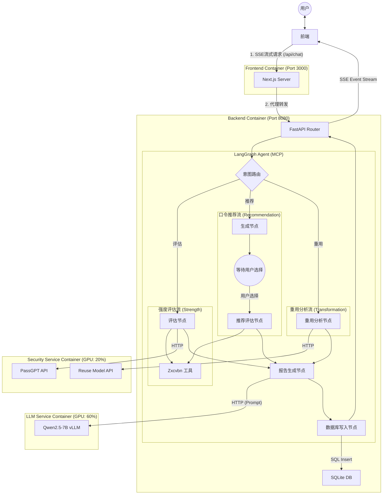

# 前端界面

## 登录注册界面
- [ ] 这个还是要尽快做一下，用交大邮箱注册，验证码、忘记密码等

## 侧边栏

收起状态下，
- [ ] Logo放最左上角
- [ ] Logo下方是新建对话、查看上传过的文件、询问记录三个按钮（仅icon）
- [ ] 最下方为用户头像，用户头像下方为侧边栏缩回伸出按钮
- [ ] 点击用户头像，出现设置、帮助、退出登录这些功能
- [ ] 设置包括头像、外观、模型API
- [ ] 设置这里还要考虑修改密码

伸出状态下，
- [ ] Logo放最左上角，如果左边有空位的话加上PassAgent的名字
- [ ] Logo下方是新建对话、查看上传过的文件、询问记录三个按钮（icon+文字说明）
- [ ] 历史记录项展示所有的历史记录
- [ ] 历史记录按时间排序（时间可展示）
- [ ] 历史记录提供模糊搜索功能
- [ ] 最下方是用户头像，用户头像的右侧为侧边栏缩回伸出按钮

## 主界面
- [ ] 欢迎使用 PassAgent🤗改成Logo+名称
- [ ] 上传文件功能在输入聊天框时要显示

## 对话界面
- [ ] 主要是要展示运行顺序，以及实现流式输出，这个可以采用LangGraph的SSE数据包实现，后续调研一下
- [ ] 每一个回复添加重新生成、复制、点赞、点踩以及导出到PDF的按钮

# 数据库设计

1. users（用户表）
- user_id (主键)
- email (唯一，交大邮箱)
- password_hash (加密密码)
- avatar_url (头像URL)
- theme (外观设置：light/dark)
- created_at (注册时间)
2. user_api_configs（用户API配置表）
- config_id (主键)
- user_id (外键 → users)
- model_type (qwen/deepseek/local)
- api_key (加密存储)
- model_name (具体模型名称)
- is_default (是否默认使用)
- created_at
3. sessions（会话表）
- session_id (主键)
- user_id (外键 → users)
- title (会话标题)，这一步可以通过LLM做
- created_at
- updated_at
4. messages（消息表）
- message_id (主键)
- session_id (外键 → sessions)
- user_id (外键 → users)
- content (消息内容)
- message_type (user/assistant)
- created_at
5. feedback（用户反馈表）
- feedback_id (主键)
- message_id (外键 → messages，唯一)
- user_id (外键 → users)
- feedback_type (like/dislike/null)
- created_at
6. uploaded_files（上传文件表）
- file_id (主键)
- user_id (外键 → users)
- session_id (外键 → sessions，可选关联)
- filename (原文件名)
- file_path (存储路径)
- file_size (文件大小)
- file_type (MIME类型)
- uploaded_at
7. password_analysis（密码分析记录表）
- analysis_id (主键)
- session_id (外键 → sessions)
- user_id (外键 → users)
- original_password_hash (原密码哈希)
- target_password_hash (目标密码哈希)
- hashcat_rule (生成的规则)
- strength_score (强度评分 0-100)
- is_leaked (是否泄露)
- analysis_type (transformation/strength/recommendation)
- created_at
- 这张表格打算根据不同analysis_type，提供对应不同的metadata进行说明

# 后端

MCP这块要改用langgraph框架，需要更新后端文件架构

# 5个需求
需求分类：BERT-wwm-ext (Whole Word Masking) 或 RoBERTa-wwm-ext

https://huggingface.co/hfl/chinese-roberta-wwm-ext
https://github.com/ymcui/Chinese-BERT-wwm

🛡️ Agent 功能需求清单 (User-Facing Features) v2.0
1. 口令强度评估 (Strength Assessment)
含义： 用户提供一个现有的文本口令，Agent 分析其安全性。
用户输入示例：
“帮我看看 123456 安全吗？”
“测试一下我的密码强度。”
Agent 行为： 计算熵值、检查字符组合、匹配常见弱口令列表，给出评分（弱/中/强）及改进建议。
主要4个功能：zxcvbn（熵值）、PCFG（结构分析）、passgpt（概率）、LLM（口令重用）
在此功能下还需要提供口令增强的建议，这个的具体做法还需要再考虑一下
3. 口令生成与推荐 (Password Generation)
含义： 用户需要一个新的、安全的文本口令。支持多种输入形式作为“种子”，生成既安全又包含用户个性化信息的口令。
输入形式支持：
纯文本助记符： 用户直接输入关键词（如“zly”, “2023”）。
多模态信息（图片/音频）： 用户上传图片（如宠物照、风景照）或音频（如一段话、环境音）。
用户输入示例：
“我要注册一个新账号，帮我生成个密码。”
“用这张猫的照片帮我生成一个密码。”（上传图片）
“根据这段录音生成一个口令。”（上传音频）
“我要注册 GitHub，帮我生成一个符合要求的密码。”（触发隐式爬虫/规则库）
Agent 行为：
多模态解析： 调用 Qwen2-Audio / Qwen2-VL (或 Qwen-Omni) 模型，将图片/音频内容转换为文本描述（如图片 -> "cat_sleeping_sofa"，音频 -> "hello_world"）。
生成逻辑： 将解析出的文本或用户输入的文本作为助记词，通过变换大小写、插入特殊符号、乱序等方式增强安全性。
合规适配： 如果识别到目标网站，自动加载该网站的密码策略进行适配。
4. 模糊记忆恢复 (Memory Recovery)
含义： 用户忘记了旧密码，但记得一些片段。Agent 帮助用户“拼凑”出可能的密码列表，而不是生成新密码。
用户输入示例：
“我忘了旧密码，只记得里面有 zly 和 2023。”
“帮我找回密码，好像是 admin 开头，后面是个年份。”
Agent 行为： 基于用户提供的片段，进行排列组合（不随意添加随机字符），生成一份“可能的密码候选列表”供用户尝试。
5. 口令泄露检查 (Leak Check)
含义： 检查用户的口令或账号是否出现在已知的互联网数据泄露事件中（基于 HIBP 等库）。
用户输入示例：
“查一下 password123 有没有泄露过。”
“我的邮箱 test@example.com 安全吗？”
Agent 行为： 查询泄露数据库，返回泄露次数或安全状态。
6. 图形口令设置 (Graphical Password) [独立模式]
含义： 提供一种非文本的口令设置方式，允许用户通过在图片或地图上选点来作为凭证（不涉及文本转换，位置即密码）。
用户输入示例：
“我想设置一个图形密码。”
“启动地图口令模式。”
“我想用图片做密码。”
Agent 行为： 识别到该意图后，唤起前端的图形交互组件（弹窗或 Webview），引导用户进行选点操作。
📝 意图分类标签更新
STRENGTH_CHECK (强度评估)
GENERATION (生成推荐 - 支持 文本/图片/音频 输入)
RECOVERY (记忆恢复)
LEAK_CHECK (泄露检查)
GRAPHICAL_MODE (图形口令 - 独立入口)

# 整体的流程

